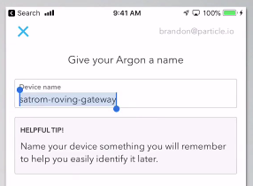

IMPORTANT: This is an older way to claim and configure your Photon 2. This method tends to have more bugs so it is advisable to try using https://setup.particle.io before this method. 

Assignment 0 – Installation with Particle App
=====================================

*Nothing to submit*

**Requirements**

-   Create Particle account
-   Install Particle Workbench
-   Install Fritzing
-   Add photon 2 device to your Particle account

\_______________________________________\_

Create Particle account
-----------------------

>   In this course, we will use an internet-enabled microcontroller,
>   specifically the Particle Photon 2. In order to communicate with the Photon 2
>   (e.g. to install new firmware code), we will use Particle’s cloud software.

-   Open the internet browser of your choice and visit the site:  
    <https://www.particle.io/>

-   Go to Login and create a new account

Install Particle Workbench
--------------------------

>   Workbench is the IDE we will use to write firmware code as well as to
>   install it on the device

-   Open the internet browser of your choice and visit the site:
    <https://www.particle.io/workbench/>

-   Download and install Particle Workbench

Install Fritzing
----------------

>   Fritzing is a program to create visual layouts of device projects.

-   ITP has paid for a Fritzing support license for the class. To download it, please go to the course Brightspace site and click on "Fritzing Download".

-   Download and install Fritzing, and then continue these instructions

Install Fritzing Library for Additional Parts
----------------

>   There are additional we will used in class that we need Fritzing parts for.

- Download the Photon 2 library for Fritzing:

  [https://github.com/reparke/Fritzing_Collection/archive/main.zip](https://github.com/reparke/Fritzing_Collection/archive/main.zip)

- Unzip the file (take note of the folder location)

- Open Fritzing

- On **Parts** panel on the right side of the screen, click the small dropdown menu and choose **Import…**

- Navigate to the folder with the file you downloaded and open `ITP_348_Parts.fzpz`

- Click the small dropdown menu on the **Parts** panel again and chose *Save Bin*

Add Photon 2 device to your Particle account
-----------------------------------------

>   This step must be completed after you receive the Photon 2 from the instructor.
>   Each Photon 2 device must be linked to Particle account.

-   Follow the instructions to claim your Photon 2 and link it to your account:

    <https://docs.particle.io/quickstart/photon 2/#1-set-up-your-photon 2>

-   Complete only step \#1 (setting up Photon 2) and do not proceed any further.

>   **Important Notes**

1.  During the setup process, the mobile app will ask if you want to set up mesh
    networking. Choose the option **Do not use in mesh networking**

1.  You may eventually need to connect it to multiple networks (e.g. at USC and
    where you live), but you will begin with a single Wifi network. When
    connecting to Wifi at USC, make sure to use **USC Guest Wireless**, not USC
    Secure Wireless

1.  During setup, you will be asked to provide a name for your Photon 2. This is
    the name that you will use in your projects to reference your device
    throughout the semester so make note of it

Deliverables
------------

- There is nothing to submit for this assignment.
