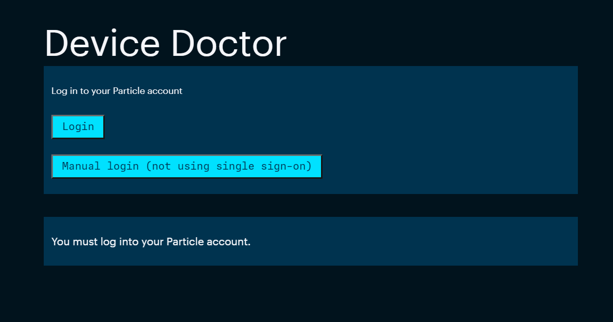
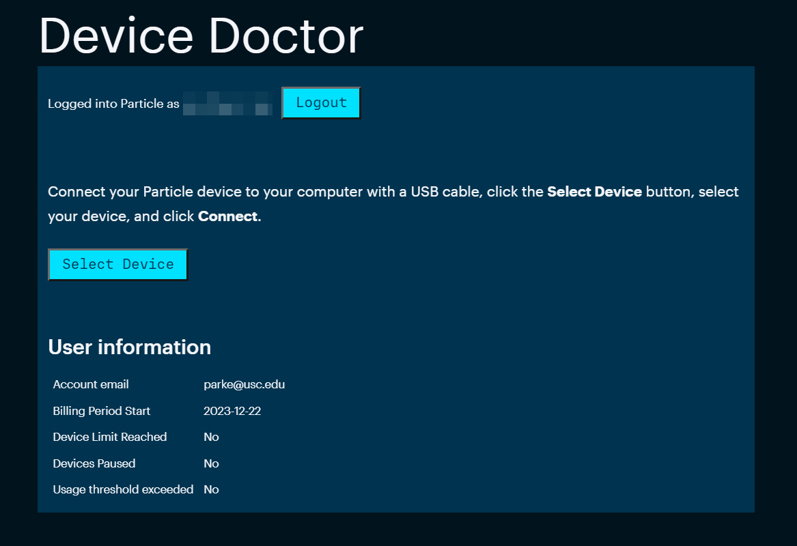
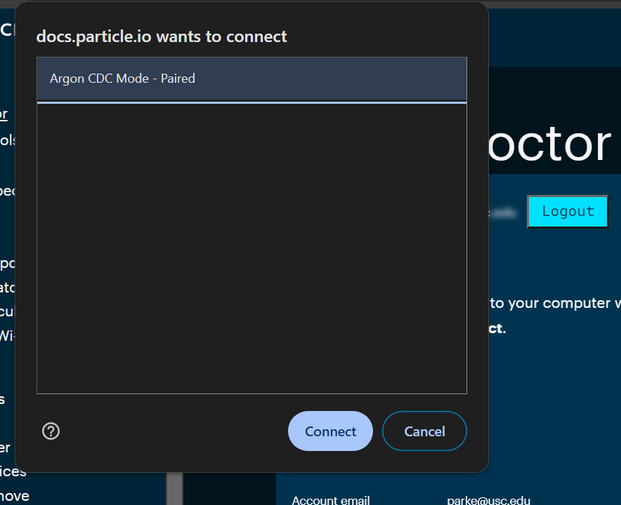
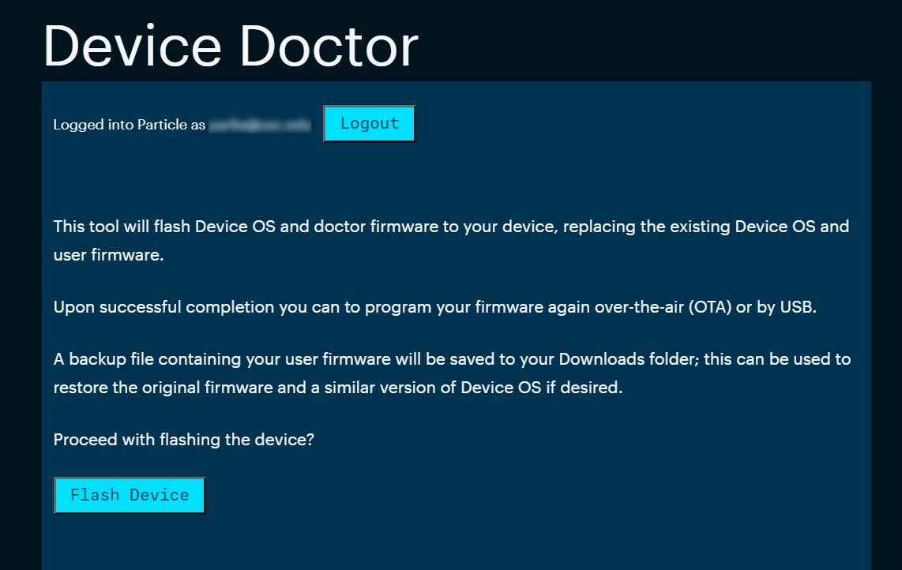
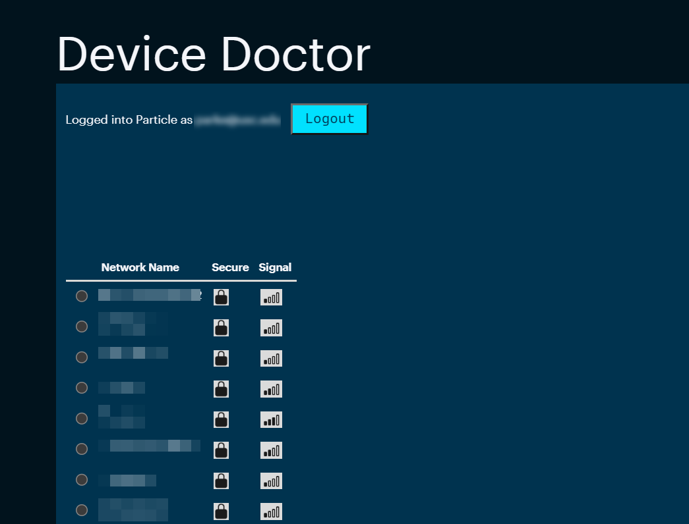
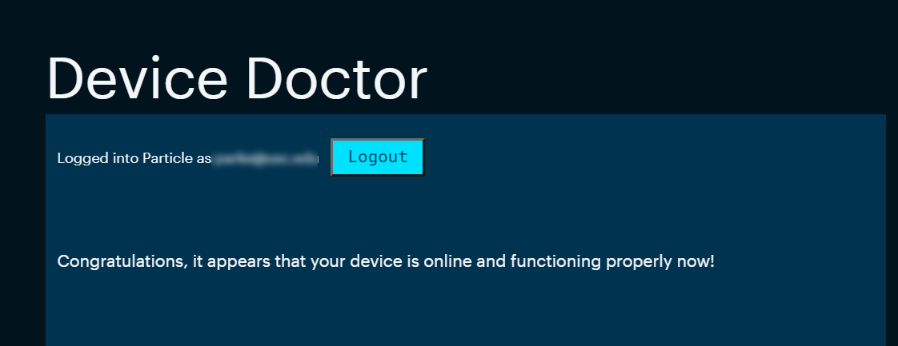

IMPORTANT: This is not the preferred to setup your Argon, but if you need to join a Wifi network without a password, you should use this approach since https://setup.particle.io doesn't work with empty passwords (as of 1/2024)

Assignment 0 – Installation and Setup
=====================================

*Nothing to submit*

**Requirements**

-   Connect Argon to Computer
-   Create Particle account
-   Install Particle Workbench
-   Install Fritzing
-   Add argon device to your Particle account

**IMPORTANT - Browser**

**You need to use the [Chrome](https://www.google.com/chrome/) browser to configure your Argon; you <u>can not</u> use Firefox or Safari.** 

\_______________________________________\_

## Connect your Particle Argon to your Computer

- Connect the antenna (discussed in class)
- Connect the Argon to your breadboard (discussed in class)
- Connect the micro USB cable to your computer

Create Particle account
-----------------------

>   In this course, we will use an internet-enabled microcontroller,
>   specifically the Particle Argon. In order to communicate with the Argon
>   (e.g. to install new firmware code), we will use Particle’s cloud software.

-   You need to use the [Chrome](https://www.google.com/chrome/) browser to configure your Argon and visit this site:
     https://setup.particle.io/

-   Go to **Login** and create a new personal account

Setup Your Device
-----------------------

>   Continue with setup in your web browser

- Go to **Select Device**

- In the popup window, select the Argon device and choose **Connect**

- Select **Flash Device**

- This process will take few minutes. As the Argon updates, it will blink different colors.
- Select your Wifi network. For open networks without a password (like USC Guest Wireless), leave the password blank.
  

- After a few moments, you should see this screen which means it completed successfully.

Install Particle Workbench
--------------------------

>   Workbench is the IDE we will use to write firmware code as well as to
>   install it on the device

-   Open Chrome and visit the site:
    <https://www.particle.io/workbench/>

-   Download and install Particle Workbench

Install Fritzing
----------------

>   Fritzing is a program to create visual layouts of device projects.

-   ITP has paid for a Fritzing support license for the class. To download it, please go to the course Blackboard site and click on "Fritzing Download".

-   Download and install Fritzing, and then continue these instructions

Install Fritzing Library for Argon
----------------

>   There are special components required to create Fritzing designs with the Argon.

- Download the Argon library for Fritzing:

  [https://github.com/reparke/Fritzing-Parts/archive/main.zip](https://github.com/reparke/Fritzing-Parts/archive/main.zip)

- Unzip the file (take note of the folder location)

- Open Fritzing

- On **Parts** panel on the right side of the screen, click the small dropdown menu and choose **Import…**

- Navigate to the folder with the file you downloaded and open `Particle_Mesh_Parts.fzpz`

- Click the small dropdown menu on the **Parts** panel again and chose *Save Bin*

Install Fritzing Library for Additional Parts
----------------

>   There are additional we will used in class that we need Fritzing parts for.

- Download the Argon library for Fritzing:

  [https://github.com/reparke/Fritzing_Collection/archive/main.zip](https://github.com/reparke/Fritzing_Collection/archive/main.zip)

- Unzip the file (take note of the folder location)

- Open Fritzing

- On **Parts** panel on the right side of the screen, click the small dropdown menu and choose **Import…**

- Navigate to the folder with the file you downloaded and open `ITP_348_Parts.fzpz`

- Click the small dropdown menu on the **Parts** panel again and chose *Save Bin*

Deliverables
------------

- There is nothing to submit for this assignment.
