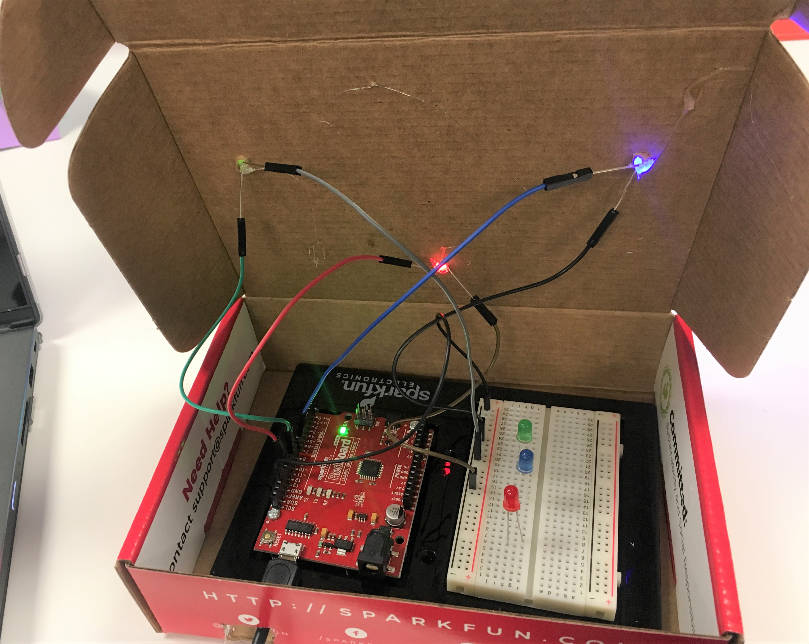
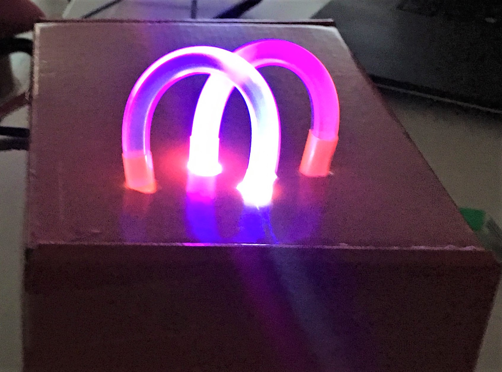
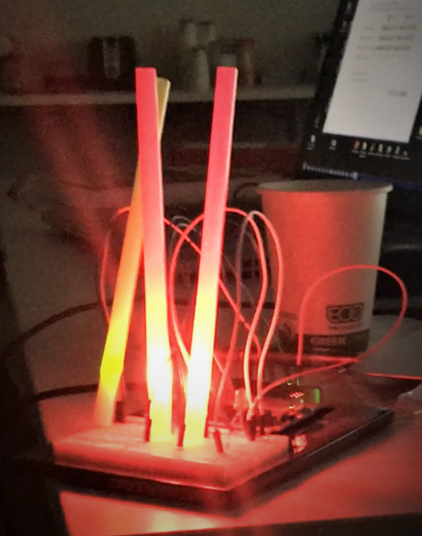

Assignment 2 – Light Sculpture
==============================

*[Submit on Blackboard](https://blackboard.usc.edu)*

Goals
-----

-   Connect LEDs to Argon

-   Create engaging art piece

## Overview

This assignment is to create a physical art sculpture using the Argon and LEDs. The specifics of what the sculpture looks like or what it does is entirely up to you. You can put LEDs on a box, on a card, inside straws or ping-pongs, etc. One suggestion is that you can use “extending” jumper wires (header-receptacle) to have the LEDs away from the breadboard. If you want to use these, ask the instructor.

Some example are below.

## Components

-   Argon

-   Breadboard

-   5 x LEDs (or more)

-   5 x 330 Ohm resistors

-   Jumper wire (standard header-header)

-   Creative supplies for sculpture (e.g. cardboard box, straws, glue sticks,
    felt, paper, ping-pong balls, etc.)

-   Optional: extension jumper wires (receptacle-header)

## Requirements

-   Connect at least five LEDs to Argon
-   Control LEDs on / off / blink from code

**Naming convention **

*(replace \# with the current assignment number)*

-   **Project Name**: `itp348_a#_lastname_firstname`

-   **Zip File** (project folder): `itp348_a#_lastname_firstname.zip`

## Video Submission Checklist

*To receive credit, your submitted video must clearly demonstrate the following:*

- [ ] Project enclosure
- [ ] 5 LEDs lights attached and functioning
- [ ] Your connected Argon / breadboard

Deliverables
------------

*[Submit on Blackboard](https://blackboard.usc.edu)*

1. A compressed file containing your project. Follow the guidelines for full
   credit.

   *Here are the instructions for submission*

   - Navigate to your project folder.

   - Include the *entire* folder in a zip file

   - Rename the zip file based on naming convention

   - Upload zip file to Blackboard site for our course

2. A photograph of your device connected to USB with the blue light on.

3. A video demonstrating your project functioning (either upload this to separate from the zip file, or upload to YouTube / Google Drive / Dropbox and provide the link in your submission). 

Grading
-------

| Item                                         | Points |
| -------------------------------------------- | ------ |
| Five LEDs used                               | 5      |
| Code to control LEDs                         | 5      |
| Appropriate resistors                        | 5      |
| 3d sculpture (not just lights on breadboard) | 5      |
|                                              |        |
| Total                                        | 20     |
