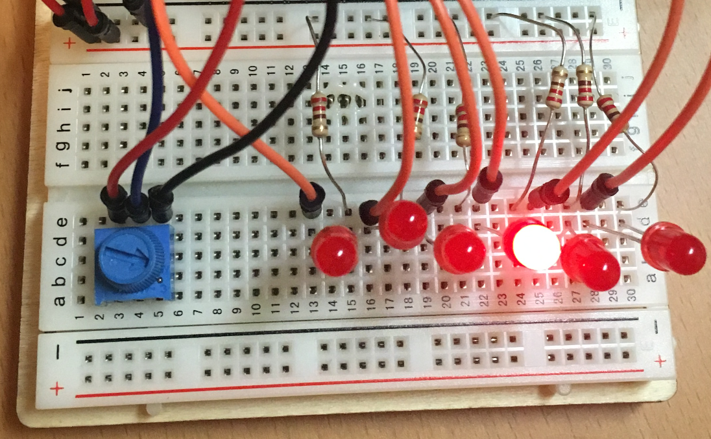

Assignment 3 – Scanning Light
=============================

*[Submit on Blackboard](https://blackboard.usc.edu)*

Goals
-----

-   Connect LEDs to Argon

-   Read analog input with a potentiometer

-   Control scanning LEDS with potentiometer

-   Use PWM to change LED intensity

## Overview

This assignment is to create variable scanning / oscillating light pattern on 5
LEDs. The scanning rate will be controlled with a potentiometer. This pattern is
often seen in TV and films such as [KITT from Knight
Rider](https://www.youtube.com/watch?v=WxE2xWZNfOc) and the [Cylons from Battlestar Galatica](https://youtu.be/-z-HQBfnwiA?t=5).

The light pattern will oscillate from right to left and back again. As the
potentiometer is turned, the lights will blink faster or slower. However, in
addition to the rate changing, the intensity will also change (more bright to
less bright.

Here is an example with 7 lights.

## Components

-   Argon

-   Breadboard

-   5 x LEDs

-   5 x 330 Ohm resistors

-   1 x 10k Ohm potentiometer

-   Jumper wire (standard header-header)

## Requirements

-   Connect five LEDs to Argon
-   Connect potentiometer and read value 
-   Within `loop`, use the potentiometer to control both the blink rate *and* the
    brightness
-   Blink rate: 
    -   The potentiometer value should be used to control the *delay* value between each light blinking
    -   Fully clockwise: the lights blink so fast they "seem" to all be on constantly
    -   Fully counterclockwise: the lights blink very slowly
-   Brightness: 
    -   Potentiometer controls the brightness of the lights using PWM
    -   Fully clockwise, the lights should be bright 
    -   Fully counter-clockwise: the lights should be very dim (**Note: the lights should by dim, but not turn off**)
-   Do **not** use a `while` loop inside the `loop` function. You can either use a counter to track the LEDs or a `for` loop 

### Bonus

-   Create an enclosure for your project that shows the LEDs and potentiometer and hides the breadboard.
-   Use a for loop to iterate through the LEDs (hint: this will require the use
    of an array, which is like a C++ list).

**Naming convention** 

*(replace \# with the current assignment number)*

-   **Project Name**: `itp348_a#_lastname_firstname`

-   **Zip File** (project folder): `itp348_a#_lastname_firstname.zip`

## Video Submission Checklist

*To receive credit, your submitted video must clearly demonstrate the following:*

- [ ] LEDs oscillating at least three cycles back and forth

- [ ] Slowly turning potentiometer clockwise 
  - [ ] LEDs blink faster and get brighter
- [ ] Slowly turning potentiometer counter-clockwise

  - [ ] LEDs blink slower and get dimmer
  - [ ] When fully counter-clockwise, lights should be dim but not off 

Deliverables
------------

*[Submit on Blackboard](https://blackboard.usc.edu)*

1.  A compressed file containing your project. Follow the guidelines for full
    credit.

    *Here are the instructions for submission*

    
    - Navigate to your project folder.
    
    - Include the *entire* folder in a zip file
    
    - Rename the zip file based on naming convention
    
    - Upload zip file to Blackboard site for our course
    
6.  A photograph of your device connected to USB with the blue light on.

3. A video demonstrating your project functioning (either upload this to separate from the zip file, or upload to YouTube / Google Drive / Dropbox and provide the link in your submission). 

Grading
-------

| Item                              | Points |
|:----------------------------------|--------|
|**Components**                    |      |
|5 LEDs wired with resistors | 1 |
|Potentiometer wired correctly | 1 |
|Components initialized properly | 1 |
|**Blink Rate** |  |
| LEDs oscillate in one direction and back | 4   |
| Potentiometer increases blink rate | 4 |
| **Brightness**                                               |      |
| Potentiometer increases brightness                           | 4 |
| When potentiometer is counter-clockwise, lights are dim but still on | 2 |
| **Looping**                                                  |  |
| Counter variable or `for` loop used (not while)              | 3 |
|                                   |        |
| Total                             | 20     |

**Credits**

- *Inspiration for project from* [Dr. Peter Dalmaris](https://www.udemy.com/course/arduino-step-by-step-2017-getting-started-projects/)
