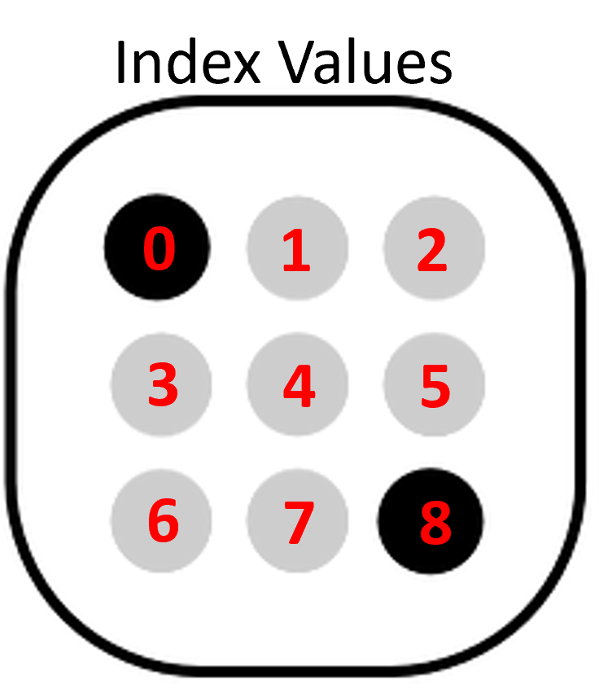
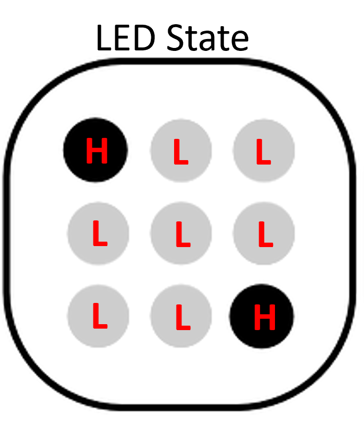

Assignment 4 – Dice
===================

*[Submit on Blackboard](https://blackboard.usc.edu)*

Goals
-----

-   Connect LEDs to Argon

-   Use push button for analog input

-   Use built-in libraries to generate random numbers

-   Use C++ arrays

## Overview

This assignment is to create an electronic die. When a button is pressed, the
die will be “rolled” and a new value will appear. The die roll will be simulated
by generating a random number 1-6

Here is a video overview about the assignment and the extra credit: [https://youtu.be/RqrFVTAiY8g](https://youtu.be/RqrFVTAiY8g)

Here is an example:

The die value can be represented by a 3x3 grid of LED lights as follows:

### Components

-   Argon

-   Breadboard

-   9 x LEDs

-   9 x resistors *(what value should you use?)*

-   1 push button

-   Jumper wire (standard header-header)

### Requirements

-   Create a Fritzing breadboard prototype layout of your design
-   Once you’re satisfied with the design, connect the device
-   The push button should be configured as a latch (i.e. pressing / holding the button only rolls the die once)

### ==Extra credit: Arrays==

-   Store the light pattern (on/off) for all six possible die rolls as an array. This can be done as a represented as a 3x3 matrix (2 dimensional array). However, an easier way to think about this is as a 9-element array
-   For example, the die roll of two looks like this
-   We can think each of the possible nine points on a 3x3 grid 
    
-   Each of these possible points can be thought of as an index in an array
  
-	Each position of the array will represent the state of the corresponding LED (`HIGH` or LOW)

-   **Hint #1:** It will be easier to create another array to store the which Argon pins correspond to each LED. Then you can use a `for` loop to quickly turn lights on 
-   **Hint #2:** Check out this resource on [generating random numbers](https://www.arduino.cc/reference/en/language/functions/random-numbers/random/) in Arduino

**Naming convention **

*(replace \# with the current assignment number)*

-   **Project Name**: `itp348_a#_lastname_firstname`

-   **Zip File** (project folder): `itp348_a#_lastname_firstname.zip`

## Video Submission Checklist

*To receive credit, your submitted video must clearly demonstrate the following:*

- [ ] Pressing button make light configuration change
- [ ] Pressing button makes a new random die value display. Push the button at least 6 times

Deliverables
------------

*[Submit on Blackboard](https://blackboard.usc.edu)*

1. Fritzing layout file

2. A compressed file containing your project. Follow the guidelines for full
   credit.

   *Here are the instructions for submission*

   - Navigate to your project folder.

   - Include the *entire* folder in a zip file

   - Rename the zip file based on naming convention

   - Upload zip file to Blackboard site for our course

3. A photograph of your device connected to USB with the blue light on.

4. A video demonstrating your project functioning (either upload this to separate from the zip file, or upload to YouTube / Google Drive / Dropbox and provide the link in your submission). 

Grading
-------

| Item                                    | Points |
| --------------------------------------- | ------ |
| **Fritzing layout**                     | 5      |
| **Components**                          |        |
| 9 LEDs connected correctly              | 5      |
| Button wired correctly                  | 5      |
| **Button press changes lights**         | 15     |
| **Extra Credit**                        |        |
| 6 Die LED patterns stored as arrays     | +3     |
| LED pin label constants stored in array | +2     |
|                                         |        |
| Total                                   | 30     |

**Credits**

-   Image by [Clker-Free-Vector-Images](https://pixabay.com/users/Clker-Free-Vector-Images-3736/?utm_source=link-attribution&amp;utm_medium=referral&amp;utm_campaign=image&amp;utm_content=26772)
    from [Pixabay](https://pixabay.com/?utm_source=link-attribution&amp;utm_medium=referral&amp;utm_campaign=image&amp;utm_content=26772)
    
-   Inspiration for project from [Dr. Peter
    Dalmaris](https://www.udemy.com/course/arduino-step-by-step-2017-getting-started-projects/)

