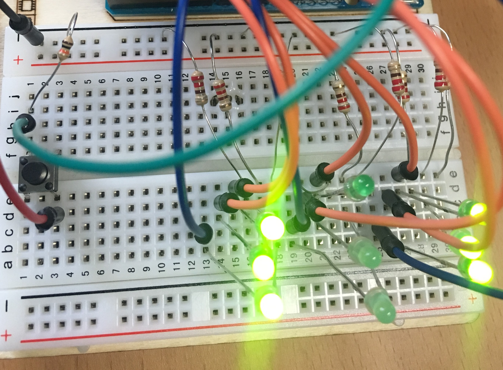
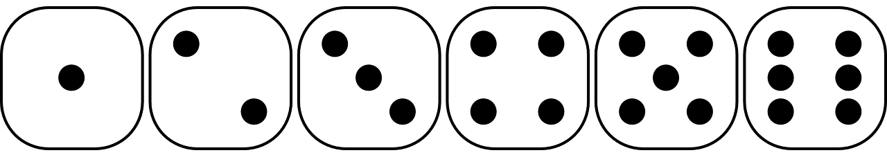

Assignment 4 – Dice
===================

*[Submit on Blackboard](https://blackboard.usc.edu)*

Goals
-----

-   Connect LEDs to Argon

-   Use push button for analog input

-   Use built-in libraries to generate random numbers

-   Use C++ arrays

**Overview**

This assignment is to create an electronic die. When a button is pressed, the
die will be “rolled” and a new value will appear. The die roll will be simulated
by generating a random number 1-6

Here is an example:

The die value can be represented by a 3x3 grid of LED lights as follows:

**Components**

-   Argon

-   Breadboard

-   9 x LEDs

-   9 x resistors *(what value should you use?)*

-   1 push button

-   Jumper wire (standard male-male)

**Requirements**

-   Create a Fritzing breadboard prototype layout of your design
-   Once you’re satisfied with the design, connect the device
-   When turned counter-clockwise, the lights should be very dim and blinking
    slowly
-   **Hint #1:** the state of each die value (which lights are on and off) can be
    represented as a 3x3 matrix (2 dimensional array / list. However, an easier
    way to think about this is as a 9-element array / list. You should create 6
    **const int** arrays that represent patterns for each die value.
-   **Hint #2:** Check out this resource on [generating random numbers](https://www.arduino.cc/reference/en/language/functions/random-numbers/random/) in Arduino

**Required naming convention** (replace \# with the current assignment number)

-   **Project Name**

    -   itp348_a\#_lastname_firstname

-   **Zip File** (include entire project folder)

    -   itp348_a\#_lastname_firstname.zip

Deliverables
------------

*[Submit on Blackboard](https://blackboard.usc.edu)*

1.  A compressed file containing your project. Follow the guidelines for full
    credit.

    *Here are the instructions for submission*

2.  Navigate to your project folder.

3.  Include the *entire* folder in a zip file

4.  Rename the zip file based on naming convention

5.  Upload zip file to Blackboard site for our course

6.  A photograph of your device connected to USB with the blue light on.

7.  A (very) short video demonstrating your project functioning

Grading
-------

| Item                                | Points |
|-------------------------------------|--------|
| Fritzing layout                     | 5      |
| 9 LEDS connected correctly          | 5      |
| Button press changes lights         | 10     |
| Die value patterns stored as arrays | 10     |
|                                     |        |
| Total                               | 30     |

Credits

-   Image by
    [Clker-Free-Vector-Images](https://pixabay.com/users/Clker-Free-Vector-Images-3736/?utm_source=link-attribution&amp;utm_medium=referral&amp;utm_campaign=image&amp;utm_content=26772)
    from
    [Pixabay](https://pixabay.com/?utm_source=link-attribution&amp;utm_medium=referral&amp;utm_campaign=image&amp;utm_content=26772)

-   Inspiration for project from [Dr. Peter
    Dalmaris](https://www.udemy.com/course/arduino-step-by-step-2017-getting-started-projects/)
