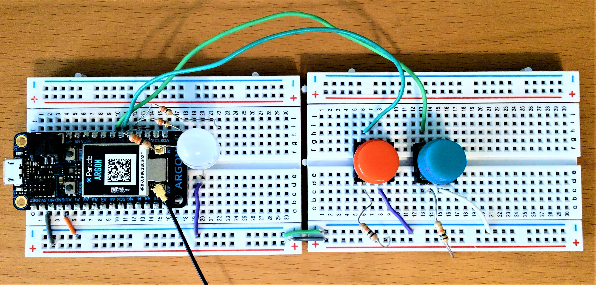

Assignment 5 – Button Timers
==================================

*[Submit on Blackboard](https://blackboard.usc.edu)*

Goals
-----

-   Control RGB LEDs

-   Use push button for digital input

-   Process timed events using `millis()`

## Overview

The assignment is create a device that supports multiple timers. There are two buttons (red and blue) which trigger different timers. The RGB LED will flash red and/or blue briefly each second to indicate which timers are active. When a timer goes off, the RGB LED will flash a random sequence of colors to indicate a timer has ended. The majority of all the timing will be controlled a multi-tasking approach with `millis()` instead of `delay()`.

At regular intervals, the device will publish how many times each timer has gone off.

Here is a video overview: [https://youtu.be/MuYajFfvIvk](https://youtu.be/MuYajFfvIvk) 

*Please note that the assignment requires red and blue buttons, but the video uses red and green buttons. Red and blue are preferred for contrasting colors because individuals with certain types of color blindness may have difficulty distinguishing between red and green.*

## Components

-   Argon

-   Breadboard

-   1 x RGB LED (and any associated resistors)

-   3 x push button (and any associated resistors)

-   Jumper wire 

## Requirements

-   Create a Fritzing breadboard prototype layout of your design
-   Once you’re satisfied with the design, build the device and create firmware
-   **Important: Most the timing in this assignment must use `millis()`. You will lose points for using `delay()` except where it is indicated**
-   Buttons 
    -   Should be programmed as as latches
    -   Pressing the red button when the red timer is inactive will start the red timer (same for blue button)
    -   Pressing the red button when the red timer is active will stop / reset the red timer (same for blue button)
-   Timers
    -   There are four timers
    -   Red timer: 7 seconds
    -   Blue timer: 11 seconds
    -   Status timer (how often the RGB LED blinks to indicate active timers): 1 second
    -   Publish timer: 20 seconds
-   It is recommended to code the device in stages, and test at each stage

### Stage 1: Button Latches 

-   Create the necessary variables and conditional logic to enable the red and blue button as latches

#### Testing Stage 1 

- Using Serial print statements, test that pressing each button individually triggers once

### Stage 2: Starting and Stopping Timers

- Create the necessary variables to track the last `millis()` time of the red and blue timers
- You will also need to track the state of whether the red timer is active, and whether the blue timer is active
- Logic (applied to blue button as well)
  - If red button is pressed and red timer is active, make the timer inactive
  - If red button is pressed and red timer is not active, start the timer 	

#### Testing Stage 2

- Using Serial print statements, test that pressing the red button sets the red timer to active and tracks the `millis()` time when the button is pressed.
- Test that pressing the red button when the red timer is active will set the red timer to inactive
- Do the same for the blue button and blue timer

### Stage 3: Handling Timers Ending

- Using `millis()` timing, create logic to check if the red timer (**7 seconds)** has elapsed
- If the red timer has elapsed, display the following sequence: 
  - Red
  - Random color
  - Red
  - Random Color
  - Red
- You are allowed to use 100 millisecond `delay()` to show each color
- Track the number of times the red timer has elapsed
- Repeat these steps for the blue button and blue timer (**11 seconds**). When the blue timer has elapsed, display the following sequence
  - Blue
  - Random color
  - Blue
  - Random Color
  - Blue

#### Testing Stage 3	

- Test pressing the red button will cause the RGB LED to flash the red timer sequence. Repeat for the blue button.
- Using Serial print statements, test that when the red timer elapses, the red timer counter increases. Repeat for the blue button.
- Press the red button to start the red timer, and press it again after a few seconds to stop the timer. Press the red button once more. The red timer take the full 7 seconds, and the Serial print statement should indicate only one timer elapsed. Repeat for the blue button
- Test that pressing the red button when the red timer is active will set the red timer to inactive

### Stage 4: Particle Publish

- Using `millis()` timing, create logic publish messages to the cloud every **20 seconds**
- You should send two messages similar to the following:
  - `Red timers elapsed: 4`
  - `Blue timers elapsed: 3`

#### Testing Stage 4	

- Open the [Particle console](https://console.particle.io
  ) 
- Press the red button and let the timer elapse. Check the appropriate message appears in the console.
- Repeat for the blue button.

### Stage 5: Timer Status

- Using `millis()` timing, create logic to use the RGB LED to display the active timers every **1 second** 
- When the red timer is active, briefly flash red (you are allowed to use 100 millisecond `delay()` to show each color)
- Repeat for the blue timer

#### Testing Stage 5	

- Press the red button to start the red timer. The RGB LED should flash red once per second. After 7 seconds, the ending light sequence should display, and the flashing should.
- Repeat for the blue button.
- Press the red button and then the blue button. The RGB LED should flash red and then blue once per second. 

### Extra Credit

- Remove all `delay()`
- Instead, use `millis()` to control the on/off blinking for the status indicator and ending timer

**Naming convention **

*(replace \# with the current assignment number)*

-   **Project Name**: `itp348_a#_lastname_firstname`

-   **Zip File** (project folder): `itp348_a#_lastname_firstname.zip`

## Video Submission Checklist

*To receive credit, your submitted video must clearly demonstrate the following:*

- [ ] Press red button starts the red timer and the RGB LED will flash red once per second
- [ ] Hold red button done to indicate only one press is registered
- [ ] After 7 seconds, the RGB LED will display the ending light pattern (red-random-red-random-red)
- [ ] After the ending sequence, the light will stop flashing
- [ ] Press red button starts the red timer so the RGB LED starts flashing red. Then press the red button again to stop the timer and flashing
- [ ] Press blue button starts the blue timer and the RGB LED will flash blue once per second
- [ ] Hold blue button done to indicate only one press is registered
- [ ] After 11 seconds, the RGB LED will display the ending light pattern (blue-random-blue-random-blue)
- [ ] After the ending sequence, the light will stop flashing
- [ ] Press blue button starts the blue timer so the RGB LED starts flashing blue. Then press the blue button again to stop the timer and flashing
- [ ] Press the red button and then press the blue button. The RGB LED should flash red and blue every 1 sec.
- [ ] Show the Particle console to indicate the red and blue timers are tracked

Deliverables
------------

*[Submit on Blackboard](https://blackboard.usc.edu)*

1. Fritzing layout file

2. A compressed file containing your project. Follow the guidelines for full
   credit.

   *Here are the instructions for submission*

   - Navigate to your project folder.

   - Include the *entire* folder in a zip file

   - Rename the zip file based on naming convention

   - Upload zip file to Blackboard site for our course

3. A photograph of your device connected to USB with the blue light on.

4. A video demonstrating your project functioning (either upload this to separate from the zip file, or upload to YouTube / Google Drive / Dropbox and provide the link in your submission). 

Grading
-------

| Item                                                         | Points |
| ------------------------------------------------------------ | ------ |
| **Fritzing layout**                                          | 5      |
| **Components**                                               |        |
| RGB LED configuration                                        | 2      |
| Button configuration                                         | 2      |
| **Stage 1: Button Latches**                                  |        |
| Latch configuration                                          | 5      |
| **Stage 2: Starting and Stopping Timers**                    |        |
| Red and blue buttons start timer                             | 2      |
| Red and blue buttons stop timers                             | 2      |
| **Stage 3: Handling Timers Ending**                          | 2      |
| Red timer runs for 7 seconds and stops                       | 2      |
| Red timer displays correct ending sequence                   | 2      |
| Blue timer runs for 11 seconds and stops                     | 2      |
| Blue timer displays correct ending sequence                  | 2      |
| **Stage 4: Particle Publish**                                |        |
| Red and blue elapsed timer are tracked (not counted when stopped) | 2      |
| Messages are published to console every 20 sec               | 2      |
| **Stage 5: Timer Status**                                    |        |
| Light flashes red when red timer is active                   | 2      |
| Light flashes blue when blue timer is active                 | 2      |
| **Extra credit**                                             | +3     |
|                                                              |        |
| Total                                                        | 34     |
