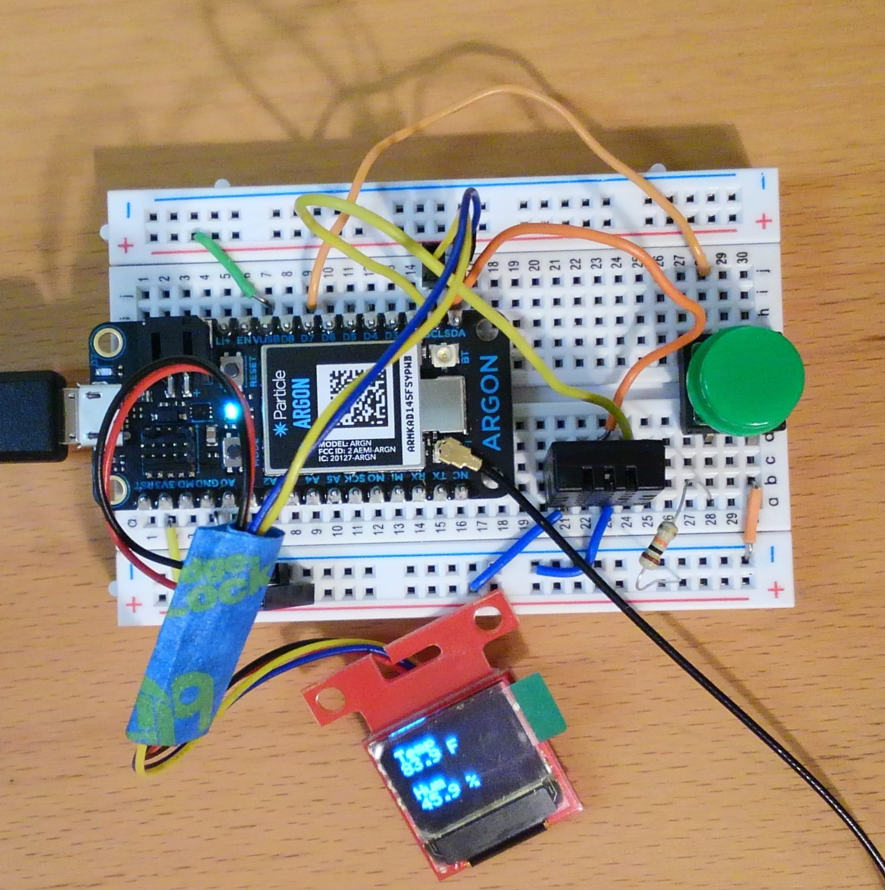
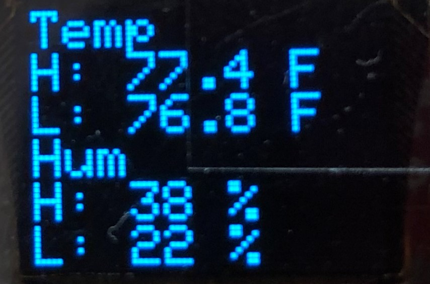
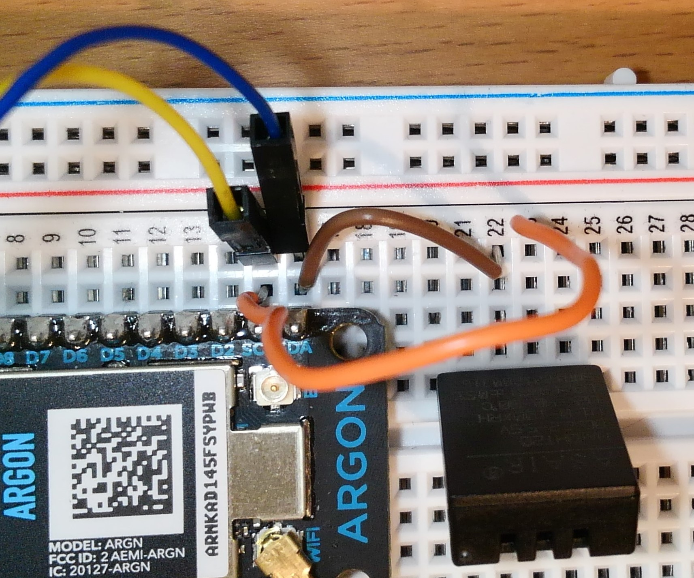

Assignment 6 – Environment Monitor and Dashboard
=========================================

[Submit on Brightspace](https://brightspace.usc.edu/)

Goals 
-----

-   Connect DHT20 and store sensor data
-   Display data on OLED
-   Publish events to Particle cloud
-   Subscribe to events and process data

## Overview

This assignment is to create a device that monitors your environment. The device will display current and historical information about your temperature and humidity via an OLED screen as well as via a cloud-based dashboard (Initial State).

Here is an example:
### Device



*This diagram uses an older microcontroller and may not represent the exact wiring you use in your assignment.*

### OLED Screen
 

### Dashboard


## Components

-   Photon 2
-   Breadboard
-   1 x micro OLED
-   1 x DHT20
-   1 x  push button (plus any necessary resistors)
-   Jumper wire

## Requirements

-   Create a Fritzing breadboard prototype layout of your design. Once you’re
    satisfied with the design, connect the device.
-   The device will read temperature and humidity from DHT 20 sensor
-   The device will display current temperature and humidity on OLED
-   When button is pressed, device will display high (max) and low (min) temperature and humidity values measured since device turned on via OLED
    -   The means when you are reading the temperature, you should be computing the highs and lows
-   Device will send current temperature and humidity to Initial State using Particle webhooks
-   Note: this assignment intentionally uses a sensor not used in class (DHT20). However, notes and examples are provided below
-   It is recommended to code the device in stages, and test at each stage.

### Note about Wiring

* Both the OLED and the DHT20 use the `SDA` and `SCL` pins on the Photon 2. 
* Connect the wires from the OLED and from the DHT20 to the same row on the Photon 2.
* In the example photo shown below, the blue and yellow wires are from the **OLED** and the orange and brown wires are from the **DHT20**
  

###  Stage 1:  Setup buttons and screens

-   The button will be a toggle / latch style button that will switch from displaying current temperature and humidity to displaying the minimum and maximum temperature and humidity
-   Connect the button and configure the toggle to switch between these two screens (aka states) 
-   You can use a `bool` or an `int` to distinguish between which screen is currently being shown

#### Testing Stage 1

- Use the serial monitor to make sure the button works as a latch
- Use the serial monitor to make sure the current screen changes

###  Stage 2: DHT20 

-   [DHT 20 notes and example](https://reparke.github.io/ITP348-Physical-Computing/lectures/weekX/lecture_dht20.html)
-   Using the notes and examples provided, measure the current temperature and humidity
-   Store the max and min of the temperature and humidity readings

#### Testing Stage 2

- Use serial monitor to display temperature and humidity values

###  Stage 3: OLED 

- Connect the OLED screen and import the library

- Using the class examples and library examples, display text for the two different screens

  **Screen 1: Current data**

  ```
  Temp
  77.0 F
  Hum
  22.4 %
  ```

  **Screen 2: Historical data**

  ```
  Temp
  H: 77.0 F
  L: 59.0 F
  Hum
  H: 22 %
  L: 19 %
  ```

- You can track the historical max and min by using global variables that are updated when values are read

- Hint: You can control how many decimals display in the output via when casting a float using `String`

  - Consider `float tempFahr = 59.299283`
  - `String(tempFahr, 3)` will display `59.299` with 3 decimal places
  - `String(tempFahr, 0)` will display `59` with 0 decimal places

#### Testing Stage 3

- Use serial monitor to display the same data as on the OLED to confirm that max and min are working 

### Stage 4: Dashboard setup

-   Go to [Initial State](https://www.initialstate.com/) and create a new bucket
-   Using the Initial State API URL, go to [Particle console](https://console.particle.io/) and configure webhooks
    -   Hint: The label that Initial State gives the data widget is determined by how you configure the webhook. Since we are need to send two different pieces of data, how many webhooks should you create?
-   In your firmware, publish the current temperature and humidity to Initial State.

#### Testing Stage 4

- Go to [Particle console](https://console.particle.io/) (or use Particle app) to confirm events are being published
- If events are NOT being published in the console, there is an issue with the code.
- If events are being published in console but don't appear in Initial State, then there is a problem with the webhooks

### Stage 5: Configuring Dashboard

-   You should have at least four widgets in your dashboard as shown above
    * Current temperature as a gauge
    * Current humidity as a gauge
    * Historical temperature as a graph
    * Historical humidity as a graph
-   For each of these four widgets used, you should set appropriate minimums and maximums based on the type of data displayed

**Naming convention **

*(replace \# with the current assignment number)*

-   **Project Name**: `itp348_a#_lastname_firstname`

-   **Zip File** (project folder): `itp348_a#_lastname_firstname.zip`

## Fritzing Part for Qwiic OLED

For your Fritzing layout, you can just use a standard OLED part. However, if you want to access the official part, you can download from [here](https://github.com/sparkfun/Fritzing_Parts/raw/main/products/14532_sfe_Qwiic_OLED_Breakout.fzpz).

To install the new part, you can complete the following steps

- Open Fritzing
  - On **Parts** panel on the right side of the screen, click the small dropdown menu and choose **Import …**
- Navigate to the folder with the file you downloaded the file and open it

- If you want to save the mesh library for future use, click the small dropdown menu on the **Parts** panel again and chose **Save Bin**

Video Submission Checklist
------------

- [ ] OLED screen showing current data
- [ ] Button pressed trigger OLED historical data
- [ ] Initial State dashboard receiving data

Deliverables
------------

*[Submit on Brightspace](https://brightspace.usc.edu)*


1. Fritzing layout file

2. A compressed file containing your project. Follow the guidelines for full
   credit.

   *Here are the instructions for submission*


   - Navigate to your project folder.

   - Include the *entire* folder in a zip file

   - Rename the zip file based on naming convention

   - Upload zip file to Brightspace site for our course

3. A photograph of your device connected to USB with the cyan light on (indicating it is connected).
4. **==A screenshot of your Initial State dashboard.==**
5. A video demonstrating your project functioning (either upload this to separate from the zip file, or upload to YouTube / Google Drive / Dropbox and provide the link in your submission). 

Grading
-------

| Item                                    | Points Possible |
| --------------------------------------- | --------------- |
| Fritzing layout                         | 5               |
| Stage 1a: Buttons toggling              | 5               |
| Stage 1b: Tracking and changing screens | 5               |
| Stage 2: DHT 20                         | 10              |
| Stage 3: OLED                           | 10              |
| Stage 4: Dashboard setup                | 10              |
| Stage 5: Configuring dashboard          | 5               |
| Total                                   | 50              |
