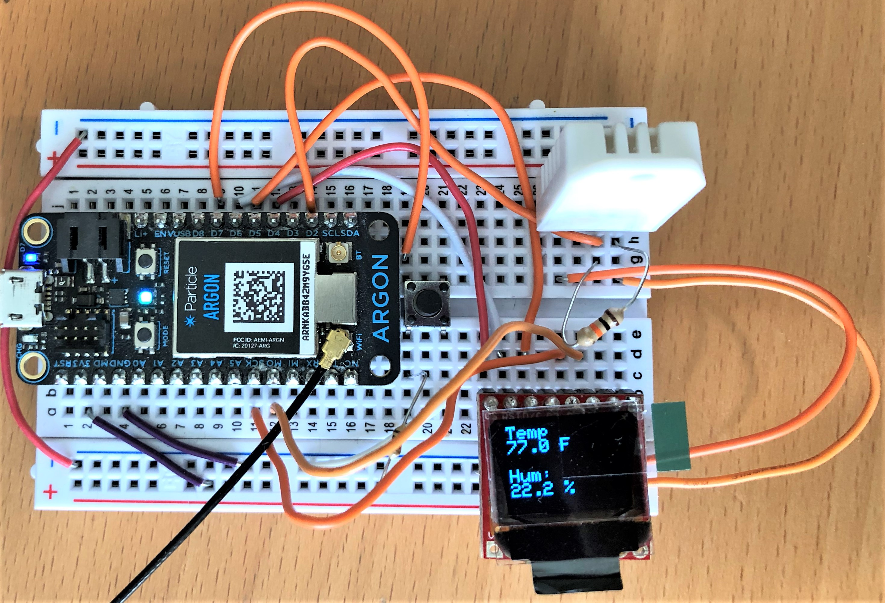
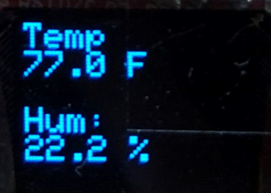
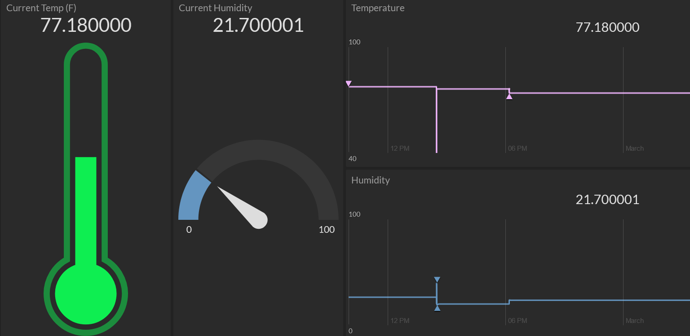

Assignment 7 – Environment Monitor and Dashboard
=========================================

[Submit on Blackboard](https://blackboard.usc.edu/)

Goals 
-----

-   Connect DHT11 and store sensor data
-   Display data on OLED
-   Publish events to Particle cloud
-   Subscribe to events and process data

## Overview

This assignment is to create a device that monitors your environment. The device will display current and historical information about your temperature and humidity via an OLED screen as well as via a cloud-based dashboard (Initial State).

Here is an example:
### Device

### OLED Screen
 

### Dashboard


## Components

-   Argon
-   Breadboard
-   1 x micro OLED
-   1 x DHT11
-   1 x  push button (plus any necessary resistors)
-   Jumper wire

## Requirements

-   Create a Fritzing breadboard prototype layout of your design. Once you’re
    satisfied with the design, connect the device.
-   The device will read temperature and humidity from DHT 11 sensor
-   The device will display current temperature and humidity on OLED
-   When button is pressed, device will display high (max) and low (min) temperature and humidity values measured since device turned on via OLED
    -   The means when you are reading the temperature, you should be computing the highs and lows
-   Device will send current temperature and humidity to Initial State using Particle webhooks
-   Note: this assignment intentionally uses a sensor not used in class (DHT11). However, notes and examples are provided below
-   It is recommended to code the device in stages, and test at each stage.

###  Stage 1:  Setup buttons and states

-   The button will be a toggle / latch style button that will switch from displaying current temperature and humidity to displaying the minimum and maximum temperature and humidity
-   Connect the button and configure the toggle to switch between these two states (you can use the serial monitor to make sure the states change).
-   Use a `enum` to define the two states

###  Stage 2: DHT11 

-   [DHT 11 notes and example](https://reparke.github.io/ITP348-Physical-Computing/lectures/weekX/lecture_dht.html)
-   Using the notes and examples provided, measure the current temperature and humidity (test by displaying to serial monitor)
-   Store the max and min of the temperature and humidity readings (test via serial monitor)

###  Stage 3: OLED 

- Connect the OLED screen and import the library

- Using the class examples and library examples, display text for the two screen states

  - Current data

    ```
    Temp
    77.0 F
    Hum
    22.4 %
    ```
  - Historical data

    ```
    Temp
    H: 77.0 F
    L: 59.0 F
    Hum
    H: 22 %
  L: 19 %
    ```
    

- Hint: You can control how many decimals display in the output via when casting a float using `String`

  - Consider `float tempFahr = 59.299283`
  - `String(tempFahr, 3)` will display `59.299` with 3 decimal places
  - `String(tempFahr, 0)` will display `59` with 0 decimal places

### Stage 4: Dashboard setup

-   Go to [Initial State](https://www.initialstate.com/) and create a new bucket
-   Using the Initial State API URL, go to [Particle console](https://console.particle.io/) and configure webhooks
    -   Hint: The label that Initial State gives the data widget is determined by how you configure the webhook. Since we are need to send two different pieces of data, how many webhooks should you create?
-   In your firmware, publish the current temperature and humidity to Initial State.

### Stage 5: Configuring Dashboard

-   You should have at least four widgets in your dashboard as shown above
    * Current temperature as a gauge
    * Current humidity as a gauge
    * Historical temperature as a graph
    * Historical humidity as a graph
-   For each of these four widgets used, you should set appropriate minimums and maximums based on the type of data displayed

Deliverables
------------
1.	Fritzing diagram
2.	Workbench project with firmware source code
3.	Photos (must be clear) should show:
   * Device
   * Initial State dashboard
4.	Video demonstrating all the functionality of your project and should include
   * OLED screen showing current data
   * Button pressed trigger OLED historical data
   * Initial State dashboard 

## Submission Instructions

*Please follow the guidelines below for full credit.*

* Navigate to your project folder.
* Include the *entire* folder in a zip file
* Rename the zip file based on naming convention
* Upload zip file to Blackboard site for our course
* Separately, upload your video Blackboard (or submit the link to a video hosted elsewhere)

**Required naming convention** (replace \# with the current assignment number)

-   **Project Name**
    -   `itp348_a#_lastname_firstname`
-   **Zip File** (include entire project folder)
    -   `itp348_a#_lastname_firstname.zip`

Grading
-------

| Item                           | Points Possible |
| ------------------------------ | --------------- |
| Fritzing layout                | 5               |
| Stage 1a: buttons toggling     | 5               |
| Stage 1b: `enum` and states    | 5               |
| Stage 2: DHT 11                | 10              |
| Stage 3: OLED                  | 10              |
| Stage 4: Dashboard setup       | 10              |
| Stage 5: Configuring Dashboard | 5               |
| Total                          | 50              |
