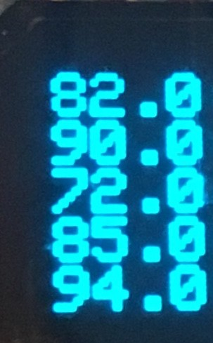

Assignment 7 – Crowdsourced Environment Monitor
=========================================

[Submit on Blackboard](https://blackboard.usc.edu/)

Goals 
-----

-   Connect TMP36 and store sensor data
-   Display data on OLED
-   Publish events to Particle cloud
-   Subscribe to events and process data

## Overview

This assignment is to create a public temperature feed for ITP 348. You will
send from your home as public event to the Particle cloud. You will then use an OLED to display two screens: 1) feed of the most recent temperatures from all students, and 2) your own temperature along with the average and max of all the temperatures.

Here is an example:

## Components

-   Argon
-   Breadboard
-   1 x micro OLED
-   1 x TMP36
-   1 x  push button (plus any necessary resistors)
-   Jumper wire

## Requirements

-   Create a Fritzing breadboard prototype layout of your design. Once you’re
    satisfied with the design, connect the device
-   It is recommended to code the device in stages, and test at each stage

###  Global variables

-   You can create other variables as needed, but these are required
-   `double temperatures[20]` to store the most recent public temperatures.
    Since the argon has limited memory, we are only storing the 20 most recent
    temperatures. Once the 20th temperature has been stored, we will overwrite
    the 1st position. This is a technique known as a **circular buffer**
-   `int currentIndex` to store which position to be written next

###  Stage 1: Temperature sensor

-   Connect the temperature sensor
-   Use necessary conversion formulas to calculate temperature in Fahrenheit
-   Display it on serial monitor to verify

### Stage 2: Publishing events

-   Publish the temperature as a **PUBLIC** event
-   For the event name, you must use the following format  

    `ITP348-ENVIRO/XXX` *replace XXX with your 3 letter initial*s

-   Check the Particle console to make sure the event is publishing properly

### Stage 3: Subscribing and storing events

-   Subscribe to the event: `ITP348-ENVIRO` (this will include any event beginning
    with `ITP348-ENVIRO`)
-   You will create what is called a **circular buffer**. Basically, when the
    first event arrives, you will store the name and temperature in index 0, and
    increment the `currentIndex`. This will continue until `currentIndex`
    reaches the max size of 20, and then it will reset to 0
-   To store the temperature, you can use the C++ function `atof()`, which
    takes a `char *` as input and returns a `double`. For example,

    `double num = atof(data)`, *where data is a* `char *`

-   It is recommended (not required) that you use the event handler to update
    the array of temperatures, but display the actual temperatures in `loop()`

### Stage 4: Displaying events on OLED

-   Connect a button and the OLED
-   In `loop()`, use the button to switch between two “screens” of your device.

#### Stats Screen

-   The OLED should display your current temperature, the average of the most recent public temperatures, and the maximum of the most recent  temperatures.
-    These values should be automatically updated as new temperatures arrive

#### Temperature Feed Screen

-   The OLED should display the most recent temperatures (you will only be able
    to fix up to 6). This should be automatically updated as new temperatures
    arrive.

## Extra Credit

-   In addition to storing and displaying the recent temperatures, also store
    and display the three letter usernames associated with each temperature (see
    picture). Here are some suggestions:
-   Create `String names[20]` array to store the names of the most recent
    events
-   In the event handler, in order to store the name, first convert the `char
    *` to a `String`. Then use the [`substring`](https://www.arduino.cc/reference/en/language/variables/data-types/string/functions/substring/) method to select certain characters from the event name, which can be stored in the array
-   Here is an example of the extra credit feed screen

Deliverables
------------
1.	Your Workbench project with firmware source code
2.	A short video demonstrating all the functionality of your project

## Submission Instructions

*Please follow the guidelines below for full credit.*

* Navigate to your project folder.
* Include the *entire* folder in a zip file
* Rename the zip file based on naming convention
* Upload zip file to Blackboard site for our course
* Separately, upload your video Blackboard (or submit the link to a video hosted elsewhere)

**Required naming convention** (replace \# with the current assignment number)

-   **Project Name**
    -   `itp348_a#_lastname_firstname`
-   **Zip File** (include entire project folder)
    -   `itp348_a#_lastname_firstname.zip`

Grading
-------

| Item                           | Points Possible |
| ------------------------------ | --------------- |
| Fritzing layout                | 5               |
| Stage 1: temperature sensor    | 10              |
| Stage 2: publishing event      | 5               |
| Stage 3: subscribing to events | 10              |
| Stage 4: displaying data       | 15              |
| Total                          | 45              |
