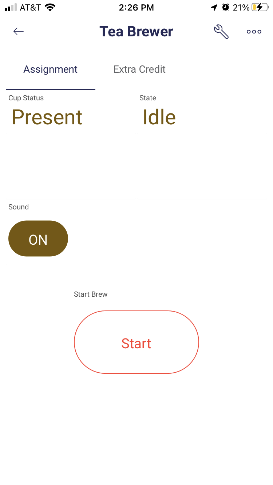
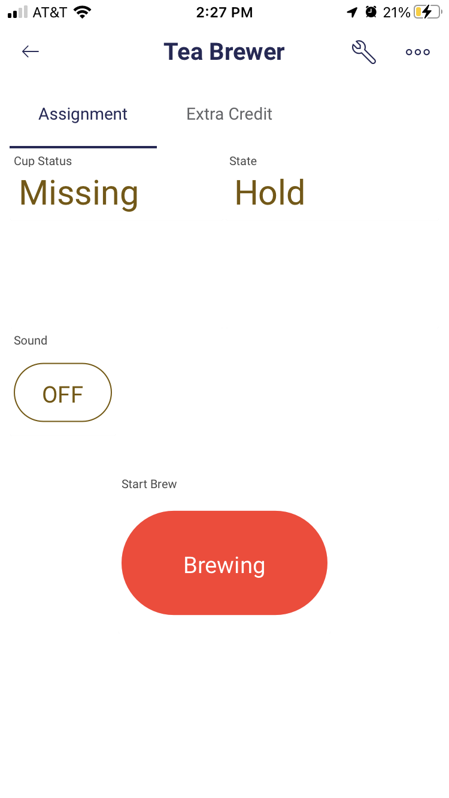
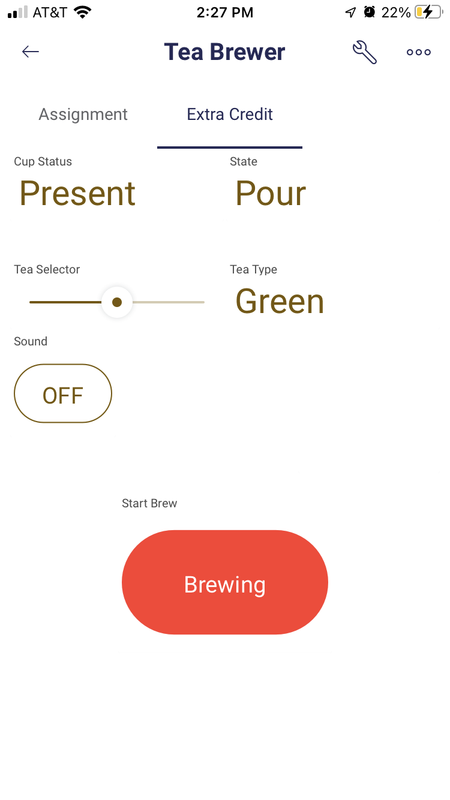
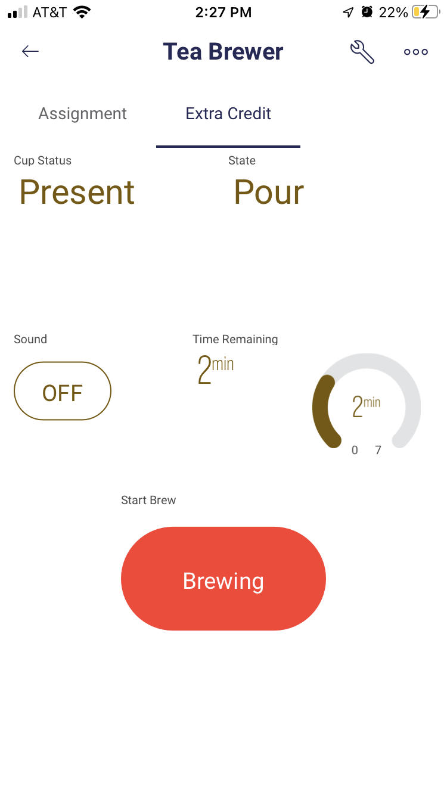

Assignment 8 – State Machine Tea Brewer with Blynk
==========================

[Submit on Blackboard](https://blackboard.usc.edu/)

Goals
-----

-   Create and navigate state machines
-   Connect speaker and play tones
-   Build Blynk app to control interface

## Overview

This assignment is to create a device that simulates brewing tea using state machines and a Blynk interface. The state machine machine logic will control how the device moves through the tea brewing states, and feedback and control will be available through the Blynk app. When brewing is finished, a song will optionally play on the Argon through a speaker.

Here is a video overview: [https://youtu.be/lqQhFIVWDR0](https://youtu.be/lqQhFIVWDR0)

### Device


*Note: The red button in the photo was used for testing only. You don't need to include it or use it in your project*

### Blynk App



## Components

-   Argon
-   Breadboard
-   1 x speaker
-   1 x magnetic switch


## State Machine Logic

There are 5 states in the brewing process. Note that we will use **seconds** in places of **minutes**

1. **Idle**: nothing is happening until button is pressed to start brewing
2. **Heat**: water is heating up (takes 6 seconds)
3. **Steep**: tea is submerged in water (takes 3 seconds)
4. **Hold**: intermediate stage between **Steep** and **Pour**. Allows device to make sure magnetic switch is closed. If switch is open, device stays in **Hold**
5. **Pour**: liquid pours into cup (takes 4 seconds)

### State Transition Table

| State | Duration   | Input                                                   | Next State |
| ----- | ---------- | ------------------------------------------------------- | ---------- |
| Idle  | indefinite | Brew_Active == true                                     | Heat       |
| Heat  | 6 sec      | Brew_Active == false                                    | Idle       |
| Heat  | 6 sec      | (Brew_Active== true) and (Heat_Time >= Goal_Heat_Time)  | Steep      |
| Steep | 3 sec      | Brew_Active == false                                    | Idle       |
| Steep | 3 sec      | (Brew_Active == true) and (Brew_Time >= Goal_Brew_Time) | Hold       |
| Hold  | indefinite | Brew_Active == false                                    | Idle       |
| Hold  | indefinite | ((Brew_Active == true)  and (Cup_Present == false)      | Hold       |
| Hold  | indefinite | (Brew_Active == true)  and (Cup_Present == true)        | Pour       |
| Pour  | 4 sec      | Brew_Active == false                                    | Idle       |
| Pour  | 4 sec      | (Brew_Active == true) and (Pour_Time >= Goal_Pour_Time) | Idle       |

 *Brew_Active is based on the Blynk start button; Cup_Present is based on the magnetic switch*

## App Functionality


### Cup Status

* Displays if the magnetic switch status

  * Switch closed means cup is present and brewing can continue
  * Switch open means cup is missing and pouring should not proceed

  


### State status

* Displays name of current state

  


### Sound start / stop button

* Pressing on will enable a song to play at the end of the **Pour** state
* Pressing off will disable song 
* This should be configured as a **switch** in the Blynk app


### Brewing start / stop button

* Pressing start will start the brewing process. When brewing process is complete, button will switch to inactive
* Pressing button during brew process will automatically stop brewing 
* This should be configured as a **switch** in the Blynk app


## Blynk Datastreams

| Name                | Pin  | Type    | Values                                  | Data FROM | Data TO |
| ------------------- | ---- | ------- | --------------------------------------- | --------- | ------- |
| `String Cup Status` | `V2` | String  | `Present`, `Missing`                    | argon     | app     |
| `Button Start Brew` | `V3` | integer | `0`, `1`                                | app       | argon   |
| `Text State`        | `V4` | String  | `Idle`, `Heat`, `Steep`, `Hold`, `Pour` | argon     | app     |
| `Button Sound`      | `V5` | integer | `0`, `1`                                | app       | argon   |


## Requirements

-   Create a Fritzing breadboard prototype of your design. No sample is provided so it is up to you to layout the components
-   Once you are are finished, build the device
-   It is recommended to code the device in stages, and test at each stage

### Stage 1: Create State Machine States and Transition Logic

-   Create an `enum` to represent the 5 states
-   Create `updateNextState()` function with conditional logic to transition to different states.  Transitions will be based on a combination of 
    -   current state
    -   time in current state
    -   brew process state  
    -   magnetic switch state
-   Within `updateNextState()`, call a custom function `updateNextStateDuration()` which sets the appropriate duration for the next state every time a transition is about to happen

#### Testing Stage 1 

- Using Serial print statements, test that device progresses through all states with no timers. Don't worry about Blynk interface yet--manually set brewing process to be active
- Then test if device can progress through states with correct timing
- Finally test magnetic switch to make sure that device stays in **Hold** stage if cup is missing

### Stage 2: Connect Blynk, Set Up Datastreams, and Design Blynk App

- Install the `blynk` library in your code

- Create a Blynk project and set up the required datastreams based on the table above

- Connect your code to the Blynk template

- Using the guide above, create the appropriate app elements to allow for user interaction

- Connect each screen element to the appropriate datastream

#### Testing Stage 2

- Flash your project, and open the Blynk app. Make sure that the blank template opens

### Stage 3: Enable communication between Blynk app and Argon

- There are two app elements that send information from the app to the argon
  - `Button Start Brew`
  - `Button Sound`
- Write the code that receives the infomation from the app and updates your code variables as necessary

#### Testing stage 3

- Use Serial print statements to make sure that values are being updated properly
- Make sure that your device stays idle until start button is pressed. Once it is pressed, device should move through each state. If button is pressed while brewing is happening, brewing should stop and device should return to **Idle**

### Stage 4: Enable communication between Argon and app

- There are two app elements that receive information from the app
  - `Text State`
  - `String Cup Status`
- Write the code that the sends the appropriate infomation to the app
- Remember that all updates FROM argon TO app should take place in the `loop()` function inside a `millis()` block

#### Testing Stage 4

- Make sure that state label changes as device moves through states
- Make sure that cup status updates as magnetic switch is opened and closed

### Stage 5: Play Song

- Create a melody that will play when the **Pour** state finishes. Melody should at least 16 notes. You can use the list of musical notes and frequencies (or do something different).
- Recommendation: Store melody notes in a array such as `int melodyNotes[16]` and note durations in array such as `int melodyNotesDuration[16]`. Note that `16` is just an example number of notes. You have have more notes in your song

#### Testing Stage 5

- Make sure that when **Pour** state finishes, your melody plays
- Make sure that Blynk app button enables / disables a variable that allows song to play or not

**Naming convention **

*(replace \# with the current assignment number)*

-   **Project Name**: `itp348_a#_lastname_firstname`

-   **Zip File** (project folder): `itp348_a#_lastname_firstname.zip`

## Video Submission Checklist

*To receive credit, your submitted video must clearly demonstrate the following:*

- [ ] Pressing brew button
- [ ] States transitioning
- [ ] Sound on / off button working
- [ ] Sound of melody playing

Deliverables
------------

*[Submit on Blackboard](https://blackboard.usc.edu)*


1. Fritzing layout file

2. A compressed file containing your project. Follow the guidelines for full
   credit.

   *Here are the instructions for submission*


   - Navigate to your project folder.

   - Include the *entire* folder in a zip file

   - Rename the zip file based on naming convention

   - Upload zip file to Blackboard site for our course

3. A photograph of your device connected to USB with the blue light on.
4. ==A screenshot of your custom Blynk app==
5. ==A screenshot of your custom datastream table from website==
6. A video demonstrating your project functioning (either upload this to separate from the zip file, or upload to YouTube / Google Drive / Dropbox and provide the link in your submission). 

Grading
-------

| Item                                                         | Points |
| ------------------------------------------------------------ | ------ |
| Fritzing layout                                              | 5      |
| **Stage 1: Create State Machine States and Transition Logic** | **30** |
| `enum` models                                                | 5      |
| State transition logic / correct state changes               | 10     |
| State duration logic / correct state durations               | 10     |
| Magnetic switch holds brew process                           | 5      |
| **Stage 2: Connect Blynk, Set Up Datastreams, and Design Blynk App** | **4**  |
| Datastreams correct configured                               | 2      |
| Blynk user interface app elements                            | 2      |
| **Stage 3: Enable communication between Blynk app and Argon** | **6**  |
| `Button Start Brew` starts and stops brewing process         | 2      |
| `Button Sound` enables / disables sound playing              | 2      |
| **Stage 4: Enable communication between Argon and app**      | **6**  |
| `Text State` changes with correct state                      | 2      |
| `String Cup Status` updates                                  | 2      |
| **Stage 5: Play Song**                                       | **4**  |
| Song melody and duration is stored correctly and at least 16 notes | 2      |
| Song plays at end of **Pour** state                          | 2      |
|                                                              |        |
| Total                                                        | 51     |

## Recommendation #1: Music Notes as Constants

* You can play all tones directly as frequencies for this assignment
* However, it can be helpful to create melodies with musical notes instead of frequencies. 
* The following code file lists the musical notes as frequencies:
  [pitches.h](pitches.h) 
* Download `pitches.h` to the `src` folder for your project.
* In your main `.ino` sketch, you can then include this file and use the constants to play musical notes.
* Example

```c++
#include "pitches.h"

// example
tone(D6, NOTE_D4, 500);	//play the D note above middle C
```

## Recommendation #2: Blynk Starting Template Code

* You can adapt the Blynk code we used in class, or you can start with this empty Blynk template. Make sure to install the `blynk` library
* [blynk_start_template.ino](blynk_start_template.ino)


---


## Extra Credit Idea #1: Tea Selector 

- For extra credit, you will add the ability for the user to choose different types of tea. When the user changes a slider on the Blynk, it will change the length of the **Steep** stage

### State Transition Table

| State | Tea Type | Length in Steep State |
| ----- | -------- | --------------------- |
| Steep | Green    | 2 seconds             |
| Steep | Black    | 3 seconds             |
| Steep | Herbal   | 4 seconds             |


### Blynk App

 

### Tea Type Selector and Tea Display

* When slider is moved, 
  * Tea selection moves from 0, 1, or 2
  * Status should be updated with name of tea




- To set this up, add two new app elements: value display and gauge


- Add two new datastreams

| Name              | Pin  | Type    | Values                                                   | Data FROM | Data TO |
| ----------------- | ---- | ------- | -------------------------------------------------------- | --------- | ------- |
| `Slider Tea Type` | `V0` | integer | `0` for black tea, `1` for green tea, `2` for herbal tea | app       | argon   |
| `Text Tea Type`   | `V1` | String  | `Black`, `Green`, `Herbal`                               | argon     | app     |


---


## Extra Credit Idea #2: Time Remaining

- For extra credit, you can add a countdown timer that shows the remaining time in each stage




- To set this up, add two new app elements: value display and gauge


- Add one new datastream

| Name             | Pin  | Type    | Values                 | Data FROM | Data TO |
| ---------------- | ---- | ------- | ---------------------- | --------- | ------- |
| `Time Remaining` | `V6` | integer | `0` as min, `7` as max | argon     | app     |

- In your code, track the time remaining and send to app
