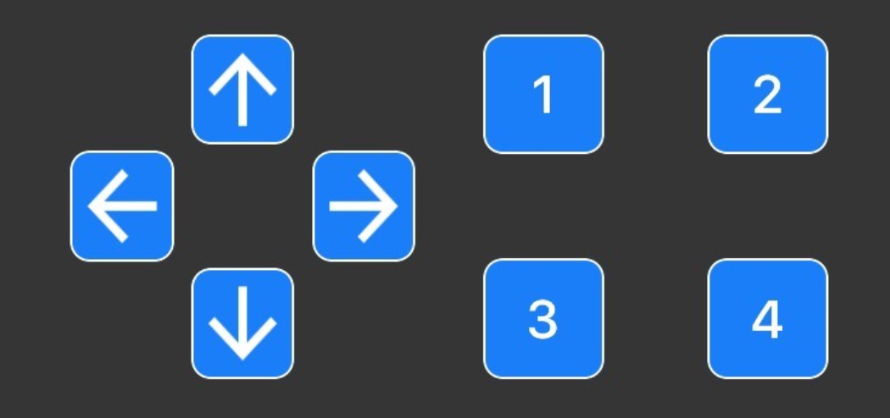

Assignment 9 – Bluetooth Car
============================

[Submit on Blackboard](https://blackboard.usc.edu/)

Goals
-----

-   Connect car chassis and motors
-   Control car via Bluetooth

## Overview

This assignment is to build and customize a small car. You will them program the car to be controlled via Bluetooth with a smartphone 

Here is a video overview: [https://youtu.be/BB8cKghUftI](https://youtu.be/BB8cKghUftI)

## Components

-   Photon 2
-   Breadboard
-   Car chassis
-   2 x DC hobby motors
-   LiPo battery
-   Decorative elements to distinguish your car

## Starting Code

* Starting code is provided for you which handles all the Bluetooth connections for you

* Download the starting project here: [starting project link](https://reparke.github.io/ProjectZip/#/home?url=https:%2F%2Fgithub.com%2Freparke%2FITP348-Physical-Computing%2Ftree%2Fmain%2F_assignments%2Fa09_bluetooth_car%2Fble_car_start)
* There are two files in the `src` folder
  * `particle_ble_setup.h` Handles all the Bluetooth communication. You can mostly leave this file unchanged
  * `ble_car_setup.ino` This is the project source code. Most of your changes here will be in `onDataReceived`

## Requirements

-   No Fritzing diagram is needed. Wiring diagram and plans are provided in the
    lecture notes.
-   Create the sketch to drive the car and enable communication with Bluefruit
    app. We will create the basics of driving functions and Bluetooth
    communication in class. It will be up to you to make any changes or
    optimizations
-   Add some element(s) that distinguish your car. These can be blinking lights
    or something more elaborate.

#### Stage 1 - Building Car

* Build physical car by following these [build instructions](guide_build_chassis)

#### Stage 2 - Programming Car

* Here is an video overview of this stage: [https://youtu.be/BB8cKghUftI](https://youtu.be/BB8cKghUftI)
* Install the [Adafruit Bluefruit](https://learn.adafruit.com/bluefruit-le-connect) app to your phone
* Download the starting code provided above

* Program your car to respond to input from the [Bluefruit Control Pad](https://learn.adafruit.com/bluefruit-le-connect/controller#control-pad-2923571) to drive

* Use the four directional arrows to make your car go forward, reverse, turn left, and turn right
* There are multiple approaches to make the car move (e.g. how sharply to turn, how quickly to turn, etc.)

**Naming convention **

*(replace \# with the current assignment number)*

-   **Project Name**: `itp348_a#_lastname_firstname`

-   **Zip File** (project folder): `itp348_a#_lastname_firstname.zip`

## Competition - Best Car

* Upload a short video to **==YouTube==** showing your car's design **and** your car driving in a figure-8 pattern (driving and turning)

-   Students will vote anonymously for the best car based on design and steering
-   A prize will be awarded to the winner

## Video Submission Checklist

*Upload video to ==**YouTube**==. To receive credit, your submitted video must clearly demonstrate the following:*

- [ ] Close up of the design of your car
- [ ] Car driving in a figure-8 pattern

Deliverables
------------

*[Submit on Blackboard](https://blackboard.usc.edu)*

1. A compressed file containing your project. Follow the guidelines for full
   credit.

   *Here are the instructions for submission*

   - Navigate to your project folder.

   - Include the *entire* folder in a zip file

   - Rename the zip file based on naming convention

   - Upload zip file to Blackboard site for our course

2.  **==Upload to Blackboard:==** A photograph of your customized car connected to the battery with the cyan light on.
3.  ==**Upload to YouTube:**== video demonstrating your car being controlled over Bluetooth and driving in a figure-8 pattern. 
    **Important: please check "Not specifically made for kids"**

Grading
-------

| Item                             | Points |
| -------------------------------- | ------ |
| **Car customization**            | 5      |
| **Car structure**                | 5      |
| **Driving and Bluetooth sketch** | 5      |
| **Steering / handling**          | 5      |
|                                  |        |
| Total                            | 20     |

