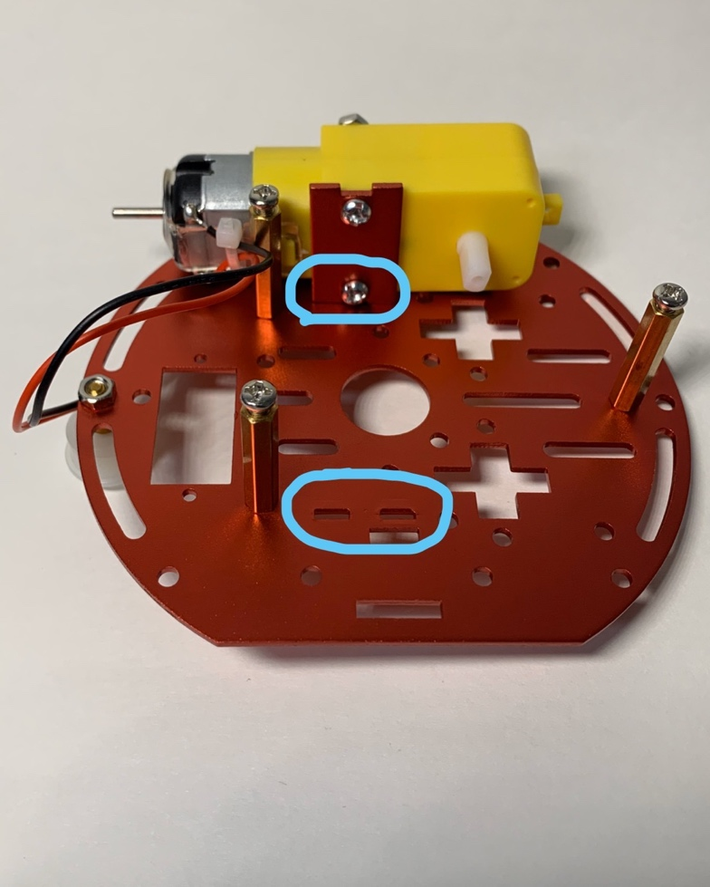
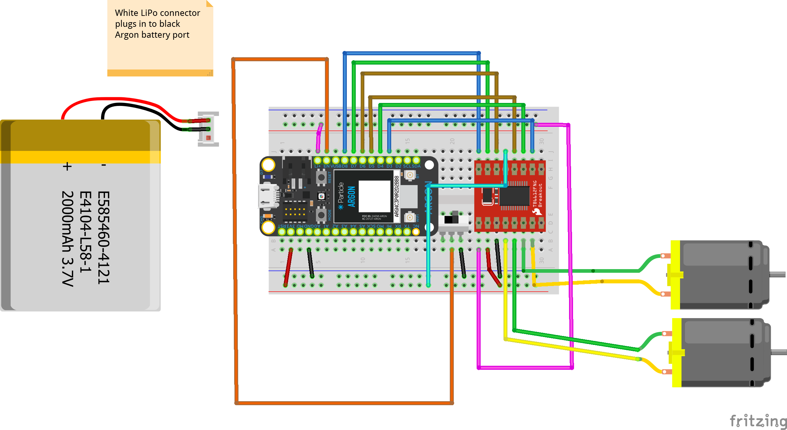

## ITP 348: Car Chassis Setup

## Items You will Need

1.  Screwdriver
2.  2 DC Gear Motors
3.  1 Ball Caster and 1 Hex Jam Nut
4.  4 Standoffs and 8 Small Screws
5.  Bottom and Top Plates with DC Motor Brackets
6.  2 Wheels and 2 Screws
7.  4 Long Screws and 4 Hex Jam Nuts

## Instructions

* Follow the steps in this guide to assemble the
* The following video can be helpful in assembling the chassis: [Two-Layer Chassis Assembly](https://youtu.be/L7-98Ejmb4M)
* The following 

<!--[Pictures of installation](https://learn.sparkfun.com/tutorials/assembly-guide-for-sparkfun-jetbot-ai-kit/1-circular-robotics-chassis-kit-two-layer-assembly) (only relevant through half of the first page)-->

## Part 1: Building Chassis

### Step 1: Attach Caster

Screw the Ball Caster to the Bottom Plate

### Step 2: Attach Standoffs

Screw on 3 of the Standoffs to the Bottom Plate using 6 of the screws.

*Top View*

*Bottom View*

### Step 3: Attach Motor Brackets

Screw the DC Motor Brackets to the DC Motors using the Long Screws and Hex Nuts

### Step 4: Align Brackets

Align the Top Plate with DC Motor Brackets and Standoffs attached to the Bottom
Plate

### Step 5: Attach Top Plate

Screw the Top Plate to the standoffs.

*Note: Make sure DC Motor wires are on the inside of the chassis pointing
inwards not outward*

### Step 6: Attach Wheels

Screw on Wheels to DC Motors and add the wheel rubber tires.

## Part 2: Wiring

### Step 7: Attaching the Battery

* The battery can be attached to either the top or bottom of the chassis, but to avoid damaging it, it is recommended to attach the battery to the top of the chassis
* The breadboard can then be attached to the battery

*==Important: If you are working on another assignment concurrently, consider building the this project on a different breadboard==*

### Step 8: Build Circuit with Motor Controller

#### Motor Controller Wiring Guide

| Motor Controller | Argon | --   | Motor Controller | Argon |
| ---------------- | ----- | ---- | ---------------- | ----- |
| PWMA             | D8    |      | VCC              | 3v3   |
| AIN2             | D7    |      | GND              | GND   |
| AIN1             | D6    |      | VM               | Li+   |
| BIN1             | D5    |      | STBY             | 3v3   |
| BIN2             | D4    |      |                  |       |
| PWMB             | D3    |      |                  |       |

#### Wiring Diagram

* Note the diagram below uses two mini breadboard. This was because the diagram because the switch was move to keep the diagram readable.
* If you prefer, you use a single mini breadboard instead. You can do this by moving the switch onto the first breadboard between motor controller and the Argon

## References

* [Sparkfun](https://www.sparkfun.com/products/13853)
* [Particle](https://docs.particle.io/datasheets/wi-fi/argon-datasheet/)
