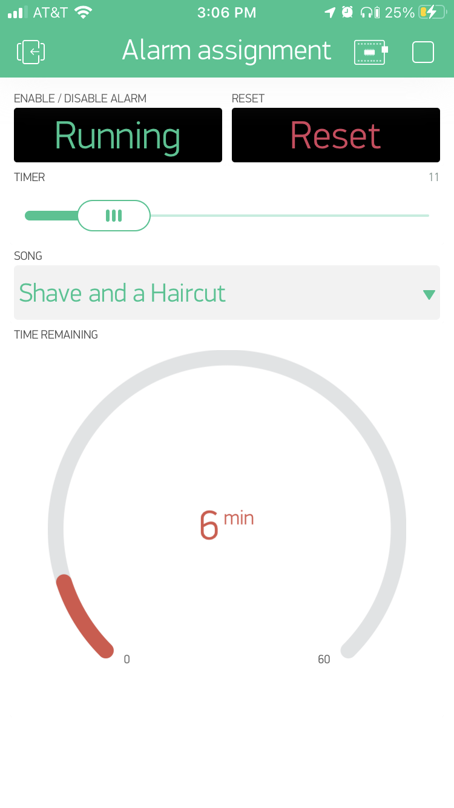
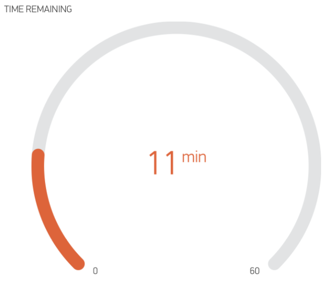

<!-- Make sure this assignment has two weeks between (car build is ok in between) -->

Assignment 9 – Timer with Blynk
==========================

[Submit on Blackboard](https://blackboard.usc.edu/)

Goals
-----

-   Connect speaker and play tones
-   Build Blynk app
-   Use Blynk app to set timers

## Overview

This assignment is to create a timer device which uses a Blynk app to configure the timer. The user can select a timer length and song from the Blynk app, and the Argon will play 1 of 3 songs through a speaker.

### Device


### Blynk App



## Components

-   Argon
-   Breadboard
-   1 x speaker
-   1 x LED
-   Jumper wire

## App Functionality


### Enable / Disable Button

* When pressing app button

  * Running: starts alarm countdown based on slider value; turns on LED
  * Stopped: pauses alarm countdown and stores remaining time (e.g. if the timer was 5 min and 2 min are remaining, Argon will store that 2 min are remaining); turn off LED

* Other changes

  * When alarm goes off, button should go back to STOPPED and LED turns off

  


### Reset button

* When pressing app button

  * Alarm countdown stops
  * Timer is reset to 0
  * LED turns off

  


### Alarm timer

* When slider is moved, 
  * Argon should store the desired timer length (use seconds instead of minutes)
  * Time remaining should be updated to reflect timer length


### Song selection

* Displays 3 different song choices
* When song is selected, Argon should store the desire song choice




### Time remaining

* Displays amount of time remaining in the alarm
* Should be updated automatically when user chooses a time with the slider
* Should be updated automatically when timer is counting down
* Should reset to 0 when user presses reset button

-   

## Requirements

-   Create a Fritzing breadboard prototype of your design. No sample is provided so it is up to you to layout the components
-   Once you are are finished, build the device
-   It is recommended to code the device in stages, and test at each stage

### Stage 1: Create melodies

-   Connect the speaker and LED
-   Create three different “songs” for the alarm. Each should have distinct melodies (at least 16 notes). You can use the list of musical notes and frequencies (or do something different).
-   Recommendation: Store melody notes in a array such as `int melodyNotes1[16]` and note durations in array such as `int melodyNotesDuration2[16]` . Use similar arrays for melody #2 and #3. Note that `16` is just an example number of notes. You have have more notes in your song
-   Test your melodies by playing through the melodies
-   You can test these songs by playing the melody in the `millis()` timer block within `loop()`

### Stage 2: Design and Configure Blynk App

* Create appropriate virtual pins for the following 5 Blynk elements. Feel free to add to these
* **App components**
  * Enable / Disable
    * Type: styled button
    * Mode: switch
  * **Reset**
    * Type: styled button
    * Mode: push
  * **Timer Duration**
    * Type: horizontal slider
    * Output: 1 to 60
  * **Song Selection**
    * Type: menu
    * Menu items: include the names of your three melodies
  * **Time Remaining**
    * Type: gauge
    * Input: 0 to 60

### Stage 3: Configure timer duration slider

* When user moves the slider in app, Argon should store the desired alarm duration (use seconds instead of minutes)
* Hint: Consider carefully how to store the alarm time. You can store the time to next alarm. However, the user can also pause the alarm, meaning you also need to consider how much time is remaining

### Stage 4: Configure song selection

* When the users chooses a song, Argon should store the desired song (1 of 3 choices)

### Stage 5: Configure enable / disable button

* When button is pressed, trigger the alarm countdown
* Consider what should happen when alarm is started, and what should happen / be updated when alarm is paused
* Hint: The `BLYNK_WRITE` should only be used to update the value of certain variables. The actual "countdown" process takes place inside `loop()`

### Stage 6: Configure cancel button

* When button is pressed, 

  * Alarm countdown stops
  * Timer is reset to 0
  * LED turns off

### Stage 7: Complete actual alarm countdown in`loop()`

* Using the `millis()` timer, check if alarm has time has arrived
* Update gauge
* Alarm should start, pause, and reset based on Blynk buttons

### Stage 8: Playing songs

* When alarm is trigged, play songs

**Naming convention **

*(replace \# with the current assignment number)*

-   **Project Name**: `itp348_a#_lastname_firstname`

-   **Zip File** (project folder): `itp348_a#_lastname_firstname.zip`

## Video Submission Checklist

*To receive credit, your submitted video must clearly demonstrate the following:*

- [ ] Starting alarm timer in Blynk app
- [ ] Pausing alarm timer
- [ ] Alarm timer gauge counting down
- [ ] Song playing

Deliverables
------------

*[Submit on Blackboard](https://blackboard.usc.edu)*


1. Fritzing layout file

2. A compressed file containing your project. Follow the guidelines for full
   credit.

   *Here are the instructions for submission*


   - Navigate to your project folder.

   - Include the *entire* folder in a zip file

   - Rename the zip file based on naming convention

   - Upload zip file to Blackboard site for our course

3. A photograph of your device connected to USB with the blue light on.
4. ==A screenshot of your custom Blynk app==
5. A video demonstrating your project functioning (either upload this to separate from the zip file, or upload to YouTube / Google Drive / Dropbox and provide the link in your submission). 

Grading
-------

| Item                                                | Points |
| --------------------------------------------------- | ------ |
| Fritzing layout                                     | 5      |
| Stage 1: Create melodies                            | 5      |
| Stage 2: Design and Configure Blynk App             | 5      |
| Stage 3: Configure timer duration slider            | 5      |
| Stage 4: Configure song selection                   | 5      |
| Stage 5: Configure enable / disable button          | 5      |
| Stage 6: Configure cancel button                    | 5      |
| Stage 7: Complete actual alarm countdown in`loop()` | 15     |
| Stage 8: Playing songs                              | 5      |
| Total                                               | 55     |

## Recommendation #1: Music Notes as Constants

* You can play all tones directly as frequencies for this assignment
* However, it can be helpful to create melodies with musical notes instead of frequencies. 
* The following code file lists the musical notes as frequencies:
  [pitches.h](pitches.h) 
* Download `pitches.h` to the `src` folder for your project.
* In your main `.ino` sketch, you can then include this file and use the constants to play musical notes.
* Example

```c++
#include "pitches.h"

// example
tone(D6, NOTE_D4, 500);	//play the D note above middle C
```

## Recommendation #2: Blynk Starting Template Code

* You can adapt the Blynk code we used in class, or you can start with this empty Blynk template. Make sure to install the `blynk` library
* [blynk_start_template.ino](blynk_start_template.ino)