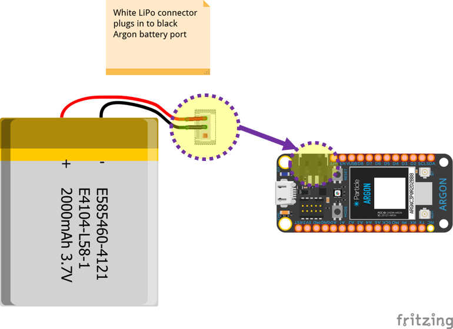

Assignment 10 – Bluetooth Car part 2
============================

[Submit on Blackboard](https://blackboard.usc.edu/)

Goals
-----

-   Control car via Bluetooth

## Overview

This assignment is to control the car via Bluetooth with a smartphone and complete your car customizations.

Here is a video overview: [https://youtu.be/BB8cKghUftI](https://youtu.be/BB8cKghUftI)

## Components

-   Argon
-   Breadboard
-   Car chassis
-   2 x DC hobby motors
-   LiPo battery
-   Decorative elements to distinguish your car

### Motor Controller Wiring Guide

| Motor Controller | Argon | --   | Motor Controller | Argon |
| ---------------- | ----- | ---- | ---------------- | ----- |
| PWMA             | D8    |      | VCC              | 3v3   |
| AIN2             | D7    |      | GND              | GND   |
| AIN1             | D6    |      | VM               | Li+   |
| BIN1             | D5    |      | STBY             | 3v3   |
| BIN2             | D4    |      |                  |       |
| PWMB             | D3    |      |                  |       |

### Wiring Diagram

### LiPo Battery Connection

## Starting Code

* Starting code is provided for you which handles all the Bluetooth connections for you

* Download the starting project here: [starting project link](https://minhaskamal.github.io/DownGit/#/home?url=https://github.com/reparke/ITP348-Physical-Computing/tree/main/_assignments/a10_bluetooth_car_program/ble_car_start)
* There are two files in the `src` folder
  * `argon_ble_setup.h` Handles all the Bluetooth communication. You can mostly leave this file unchanged
  * `ble_car_setup.ino` This is the project source code. Most of your changes here will be in `onDataReceived`

## Requirements

-   No Fritzing diagram is needed. Wiring diagram and plans are provided in the
    lecture notes.
-   Create the sketch to drive the car and enable communication with Bluefruit
    app. We will create the basics of driving functions and Bluetooth
    communication in class. It will be up to you to make any changes or
    optimizations
-   Add some element(s) that distinguish your car. These can be blinking lights
    or something more elaborate.

**Naming convention **

*(replace \# with the current assignment number)*

-   **Project Name**: `itp348_a#_lastname_firstname`

-   **Zip File** (project folder): `itp348_a#_lastname_firstname.zip`

## Competitions

### **Best designed car**

-   Submit a photo of your car to **==Blackboard==**
-   Students will vote anonymously for the best designed car
-   A prize will be awarded to the winner

### **Best steering and driving**

-   Upload a short video to **==YouTube==** of your car driving in a figure-8 pattern (driving and turning)
-   Students will vote anonymously for the car that drives / handles the best
-   A prize will be awarded to the winner.

## Video Submission Checklist

*To receive credit, your submitted video must clearly demonstrate the following:*

- [ ] Car driving in a figure-8 pattern (this should be upload to ==**YouTube**==)

Deliverables
------------

*[Submit on Blackboard](https://blackboard.usc.edu)*

1. A compressed file containing your project. Follow the guidelines for full
   credit.

   *Here are the instructions for submission*

   - Navigate to your project folder.

   - Include the *entire* folder in a zip file

   - Rename the zip file based on naming convention

   - Upload zip file to Blackboard site for our course

2.  **==Upload to Blackboard:==** A photograph of your customized car connected to the battery with the blue light on
3.  ==**Upload to YouTube:**== video demonstrating your car being controlled over Bluetooth and driving in a figure-8 pattern

Grading
-------

| Item                             | Points |
| -------------------------------- | ------ |
| **Driving and Bluetooth sketch** | 5      |
| **Steering / handling**          | 5      |
| **Car customization**            | 5      |
|                                  |        |
| Total                            | 15     |

