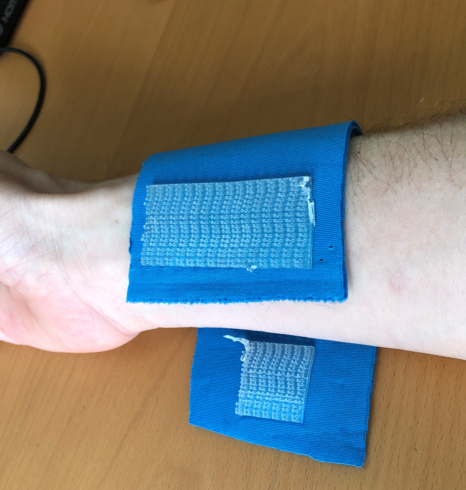
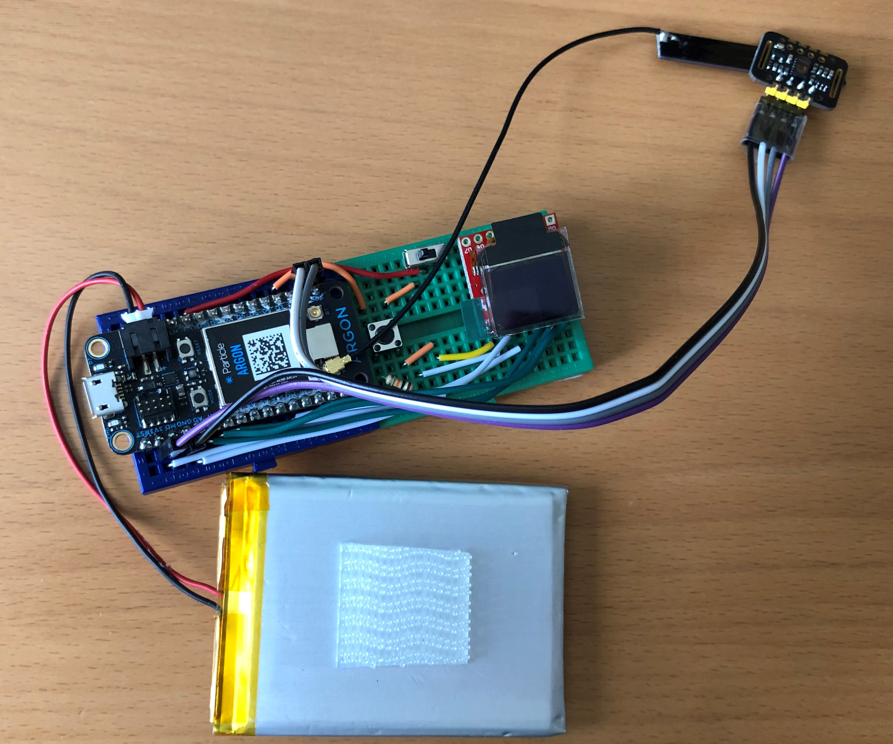

## Smart Watch Assembly ==need to modify this to use velcro==

### Items You will Need: 

1. Scissors
2. Strip of loop-side (soft) Velcro (2" x 14")
3. Strip of hook-side (rough) Velcro (1/2" x 2")
4.  Breadboard
5. LiPo battery
6. Argon

### STEP 1:

Cut the fabric to go around your wrist. The neoprene will need to wrap around your wrist so make it longer at first to test. The strip should comfortably wrap around your arm **without stretching**. 



### STEP 2:

Cut velcro strips. You will need 6 pieces of velcro

* 5 - 1"x1" squares
* 1 - 2"x1" strip 

### STEP 3:

Attach velcro to the top of the neoprene. Before attaching the velcro on the top of the neoprene, wrap the neoprene strip around your wrist so that it is stretched and snug, but comfortable. Take note of there the "center" is so you can attach the Argon here later.

On the "top" of the neoprene, affix a 1"x1" square of velcro in the location you determined to be the "center." 

Second, attach the 2"x1" strip at the end of the strip. Match the picture below so that the long strip is on the right.

*Top View*


### STEP 4:

Attach velcro to the "bottom" of the neoprene. Flip the neoprene over so that the long velcro strip you attached in *Step 3* is now on right, under side. Now attach a 1"x1" square of velcro about 1/2" from the end from the left. This piece will attach the watch to your wrist 

*Bottom View*


### STEP 5:

Attach velcro to LiPo battery (may have been done in a previous project). Place a 1"x1" square of velcro in the center on top and bottom of the battery.




### STEP 6:

Attach velcro to bottom of breadboard (may have been done in a previous project). Carefully peel off adhesive covering on bottom of breadboard (**don't take off actual foam-like adhesive**) and place** a 1"x1" square of velcro on the bottom of the breadboard.


### Step 7

Wire the components. Below are two diagrams for wiring. The second design uses a switch and is optional.

*OLED Wiring*

```c++
MicroOLED --------------- Argon
  GND ------------------- GND
  VCC ------------------- 3.3V
  D1/MOSI --------------- MO
  D0/SCK ---------------- SCK
  D2  ------------------- unused
  D/C ------------------- A0 (can be changed)
  RST ------------------- A1 (can be changed)
  CS  ------------------- A2 (can be changed)
```

*Additional Wiring*

```c++
Button: D3
Switch: 
  Pin 1 -- GND
  Pin 2 -- EN
```


*Fritzing design*


*Fritizing design with switch*


### Completed Assembly


## Credits

* Diagrams made with [Fritzing](https://fritzing.org/home/)