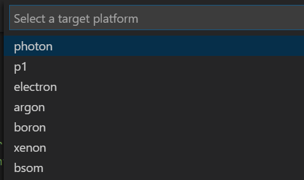

Assignment 1 – Basic Blink
==========================

Goals
-----

-   Test software installation

-   Test device configuration

**Requirements**

-   Connect to additional Wifi networks (optional)

-   Create a Workbench project

-   Setup project settings

-   Flash firmware to device

### Connect to additional Wifi networks

-   The Argon can remember the settings for multiple Wifi networks (just like a
    phone). If you need to configure for a different network than the one you
    first connected it, first connect the Argon via USB to your computer and
    open Workbench

-   Go to **View \> Command Palette**

-   Type **Particle: Launch CLI**

-   In the new window, type  
    **particle serial wifi --port COM4 –verbose**

-   Follow the instructions to connect to the new Wifi

### Create Workbench Project

-   Follow the instructions to create a Workbench project:  
    <https://docs.particle.io/quickstart/workbench/#create-a-project>

-   Complete only the first step (do not move onto **Compile Project**

### Setup device settings

-   In Workbench, Go to View \> Command Palette

-   Type **Particle: Configure Project for Device.**

>   Configure Device

-   Select the device OS version you want to like to build for. It is
    recommended to use the latest stable version (this means the highest
    numbered version *without* **rc** or **beta** in the name). This means you
    are using the newest version of the operating system that is not being test
    (and so presumably it does not have bugs or errors). In the picture below,
    the latest stable version has been noted.

>   Configure Device

-   Select the type of device to you want to build for. For our course, we will
    always use **argon**

-   Enter the name of the device you want to flash to. This will be the name
    gave your device when you initially connected it to your Particle account.

>   Configure Device

### Flash Firmware to Device

-   In the INO file that opened when you created a project, paste the following
    code:

>   First Project

-   In the Command Palette, type **Particle: Cloud Flash**

-   It may take a few minutes to successfully complete. When the firmware has
    been successfully installed, you should see the light on the device near the
    USB port blinking blue.

>   https://www.cnx-software.com/wp-content/uploads/2018/12/Xenon-D7-LED.jpg

Deliverables
------------

1.  A compressed file containing your project. Follow the guidelines for full
    credit.

    *Here are the instructions for submission*

2.  Navigate to your project folder.

3.  Include the *entire* folder in a zip file

4.  Rename the zip file so it follows this convention: *A\#.lastname.firstname*

5.  Upload zip file to Blackboard site for our course

6.  A photograph of your device connected to USB with the blue light on.

Grading
-------

| Item         | Points |
|--------------|--------|
| Project code | 5      |
| Device photo | 5      |
|              |        |
| Total        | 10     |
