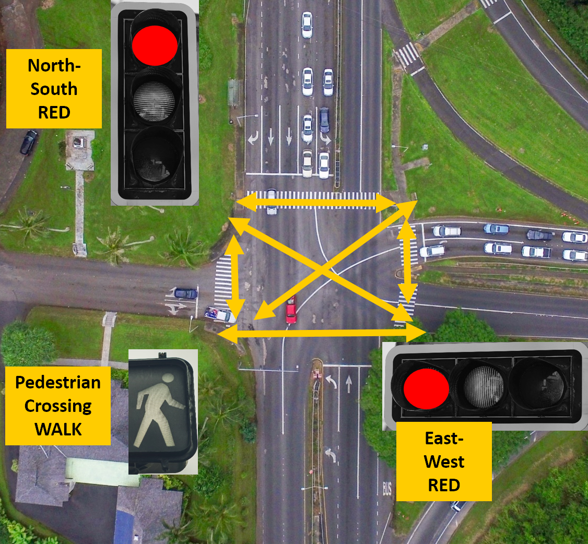

<!-- headingDivider: 2 -->

# State Machines
## In class Lab - Stoplight and Pedestrian Signal

 

## In class Lab - Stoplight and Pedestrian Signal

* We are going to build a stoplight for a two way intersection with a diagonal pedestrian crossing (meaning all traffic stops)
  * also known as a pedestrian scramble
* Green lights, red lights, and the walk signal will stay on for 5 sec (`LONG_LIGHT_DURATION`)
* Yellow lights and the don't walk signal will stay on for 2 sec (`SHORT_LIGHT_DURATION`)
* Here is how this type of intersection works

## 

## 

## 

## 

## 

## In class Lab - Stoplight and Pedestrian Signal

* Download starting code
  * Go to [https://bit.ly/ProjectZip](https://bit.ly/ProjectZip)
  * Paste the following link into the top right
  
  `https://github.com/reparke/ITP348-Physical-Computing/tree/main/_exercises/week07/stop_light_rgb_leds_start`

* Wire device as shown below

## Wiring Diagram

## Components
* 2 RGB LEDs
* 1 red LED (substitute if you don't have one)
* 1 white LED (substitute if you don't have one)
* 8 x 330 Ohm resistors

## Wiring Pin Guide

| LED                   | Argon Pins |
| ---------------------------- | ---- |
| NorthSouth RGB LED - Red | D2     |
| NorthSouth RGB LED - Green | D3      |
| NorthSouth RGB LED - Blue | D4      |
| WestEast RGB LED - Red |   A5   |
| WestEast RGB LED - Green |    A4 |
| WestEast RGB LED - Blue | A3  |
| Don't Walk Red LED |  D5  |
| Walk White LED |  D6   |

## Lab Stages
1. Create cycle with only North-South stop lights
2. Add Pedestrian Walk / Don't Walk lights into cycle
3. Make Don't Walk light blink when it is on
4. Add West-East stop light into cycle

* We will work through stage 1 together
* You will work in pairs implement stages 2-4, and we will review together as a class after each stage

## General Approach

* We will need to create a way to represent the states using `enum`
* We will need to track state transitions with **variables** for state
* We will need to control timing with `millis()`

* What does `loop()` do
  * calculate new state
  * output traffic signal LEDs based on state
  * independently flash walk signal *(later)*

## Credits

* [Bill Siever](http://siever.info) - [CS132 FSM](http://siever.info/cse132/guides/intro-to-FSMs.html)  (Washington University at St. Louis) 
* [Bill Siever](http://siever.info) - [CS132 Delta Timing](http://siever.info/cse132/weeks/3/)  (Washington University at St. Louis) 
* [USC EE109 State Machines](http://bits.usc.edu/files/ee109/)
* Photo by Laurie Parke
* Photo by [Michael Olsen](https://unsplash.com/@mganeolsen)</a> on [Unsplash](https://unsplash.com/)
* Photo by [Free To Use Sounds](https://unsplash.com/@freetousesoundscom?utm_source=unsplash&utm_medium=referral&utm_content=creditCopyText) on [Unsplash](https://unsplash.com/?utm_source=unsplash&utm_medium=referral&utm_content=creditCopyText)
* Photo by [NON](https://unsplash.com/@non_creation?utm_source=unsplash&utm_medium=referral&utm_content=creditCopyText) on [Unsplash](https://unsplash.com/?utm_source=unsplash&utm_medium=referral&utm_content=creditCopyText)