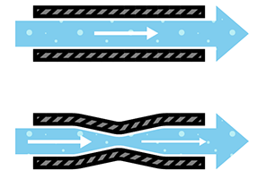
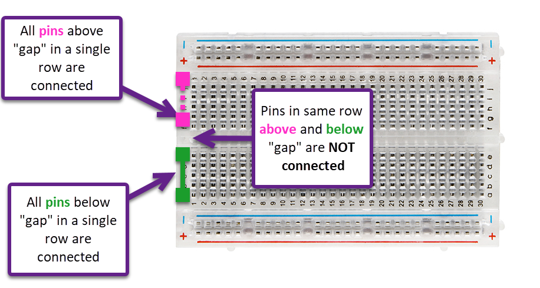
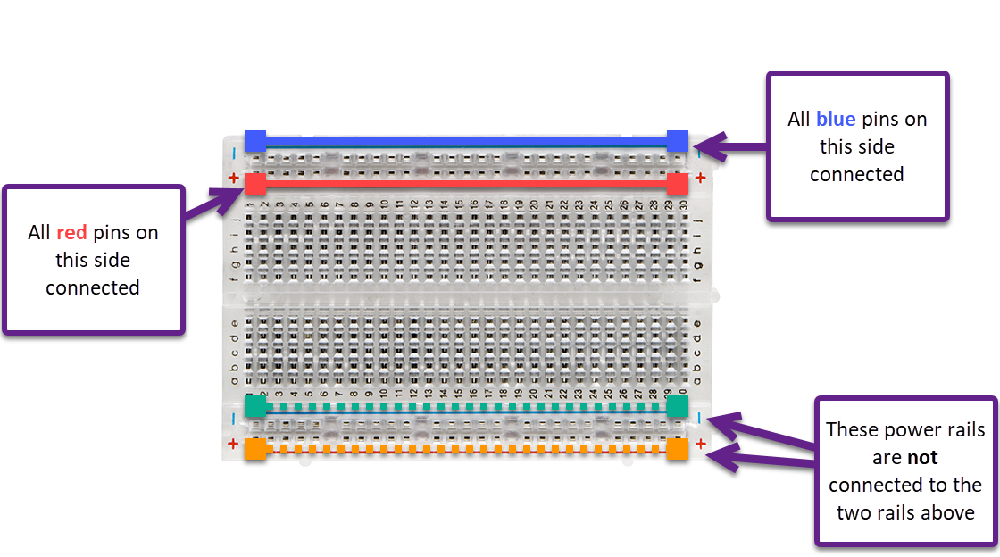
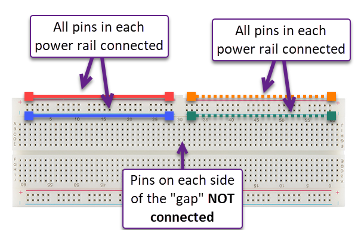

<!-- headingDivider: 2 -->

# Electricity

## How We Approach Electricity

* Electricity can be beautifully described with physics and mathematics
* However, we will focus on building an intuitive understanding and applying principles to build devices
  * There will be some basic math, but that is not our focus
* Rules of Thumbs

## Electricity Analogies

	

## Common Analogy

* Electricity can be thought of as water flowing down a pipe

* The higher the water falls from, the greater the pressure

* More water can flow (and flow faster) through a larger and smoother pipe

* Water can be stored in a container (like a battery)

## Common Analogy

* The "pressure" (or height) of the water is the ***voltage***
  * Measured in units called **volts (V)** 
  * Higher voltage means more potential energy
  * Our circuits will typically consider voltages **0v - 5v**

## Common Analogy

* The "rate of flow" of the electricity is the ***current***
  * Measured in units called amperes or **amps (A)**
  * Higher amperage means electrons are flowing faster
  * In equations, current with be denoted with the letter **I**
* Note: 1 A is a lot! Our projects will consider smaller values such as **0.2 A.**
  * Instead, we will say 0.2 A is 200 **milli**amps (mA)

## Compare

Consider two straws. Which has greater flow?




## Resisting the Flow

* The narrower pipes restrict or **resist** the flow of water
* The measure of how well something resist or allows electricity is **resistance** 
  * Measured in units called **Ohms (Ω)**
  * More Ohms means more resistance, which means less current (flow)

## Resistors

* Resistors conduct electricity, but are used to restrict / slow the flow of current
* They can be connected either direction
* We measure values from 0Ω to 10,000Ω
  - 10,000 Ohms is 10 **kilo**Ohms (10 KΩ)


## Accessibility Note

* Resistor values are determined visually by color bands
* Unfortunately resistor labeling is not accessibly designed
* To support students who are color blind or have difficulty distinguishing colors, here are [resources for support](https://reparke.github.io/ITP348-Physical-Computing/reference/general/reading_resistors_color_blind.html)

## Key Concepts

* Electrons are negatively-charged particles
* Electricity is the flow of **electrons** from **positive** to **negative **(flow of energy)
* Electronics is the study of devices that control / interact with the flow of electricity

## Circuits

* Electricity will only flow if there is a **circuit** 
* A circuit is a complete loop from a positive voltage source to a negative (lesser) source, through a conductive material


## Voltage as Difference

* When we describe voltage, we are measuring the **difference** between two points
* In the water analogy, water could fall from 500 ft to 400 ft, or from 100 ft to 0 ft
  - In both cases, water fell a difference of 100 ft, but the *reference point* changed
* In a circuit, we commonly call the reference point **Ground (GND)** and say it is **0V**

* In homes and buildings, **ground** is literally connected to the earth

## Voltage Source

* In our circuits, we will use a voltage source to provide energy potential
  - USB power: 5v (also stepped down to 3.3v which the Photon 2 uses)
  - 9V battery: 9v
  - Rechargeable lithium battery: 3.7v
* Our circuits will have a positive voltage (e.g. 3.3v or 5v) and ground voltage (0v)
* We will consider that current flows from the positive part of the circuit to the negative

## Ohm's Law

* There are only a couple electrical laws that we need to know
* There is a relationship between **voltage (V)**, **current (I)**, and **resistance (R)**

```mathematica
V = I * R   
or Voltage = Current * Resistance
```

* Rule of thumb: As resistance increases, the current decreases

## Example


1.) The voltage source is 9v. If we have a resistor that is 300 Ohms, what is the current?
2) The voltage source is 9v and you want to provide a current of 9mA. What size resistor should we use?

<!-- 1. 30 mA; 2. 1kOhm -->

## Building our Circuits on Breadboard

* We will use **breadboards** to connect our circuits
* The **power rails**  (on the long ends of the board) are all connected together
* On the interior, each group of 5 pins are connected

<!-- Open Fritzing to show connected pins -->


## Inside a Breadboard

- Breadboards are built with rows and columns of connected pin sockets
- Underneath each row and column are strips of metal that form electrical connections 


## Breadboard Connections



## Breadboard Connections


## Important Note

- Different size breadboards are mostly identical, but note that the power rails are not connected the entire length of the board




## Credits

- <a href="https://www.flickr.com/photos/59275783@N04/47522354472/">Mabacam</a> Flickr via <a href="http://compfight.com">Compfight</a> <a href="https://creativecommons.org/licenses/by-nc-nd/2.0/">cc</a> 
- <a href="https://www.flickr.com/photos/161816492@N07/47312501852/">PickComfort</a> Flickr via <a href="http://compfight.com">Compfight</a> <a href="https://creativecommons.org/licenses/by/2.0/">cc</a> 
- <a href="https://www.flickr.com/photos/160866001@N07/46688229715/">verchmarco</a> Flickr via <a href="http://compfight.com">Compfight</a> <a href="https://creativecommons.org/licenses/by/2.0/">cc</a> 
- <a href="https://www.flickr.com/photos/34327409@N04/47730722082/">Craig Walkowicz</a> Flickr via <a href="http://compfight.com">Compfight</a> <a href="https://creativecommons.org/licenses/by-nc-sa/2.0/">cc</a> 
- Images created with [Fritzing](https://fritzing.org/home/)

