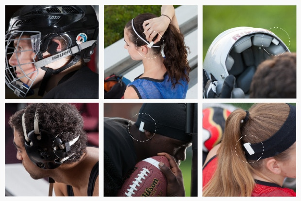
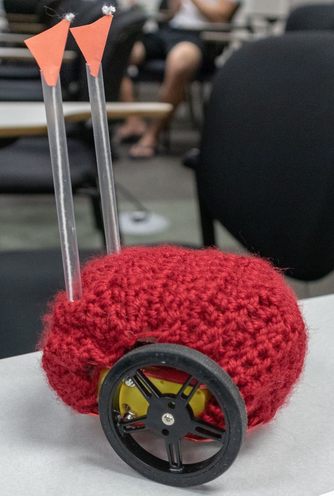
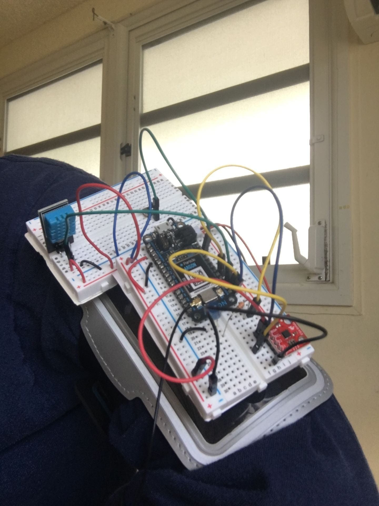
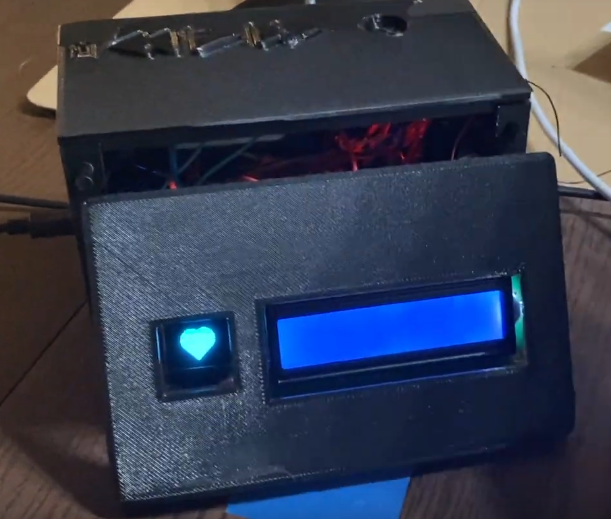
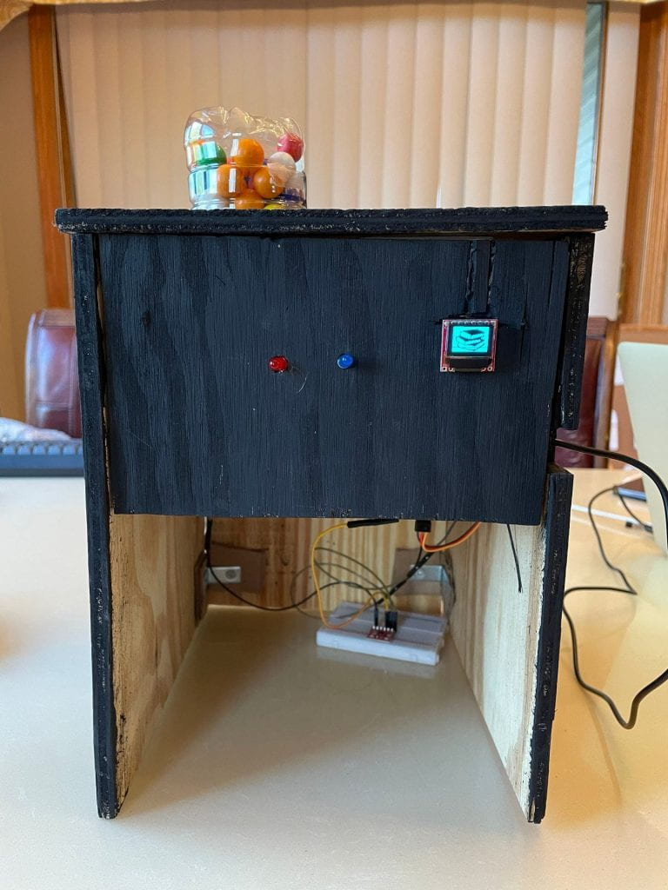

<!-- headingDivider: 2 -->

# Introduction to Making Smart Devices

## Introduction to Making Smart Devices

- What are smart devices?

- What is "making"?

## Making Smart Devices

*"Making and the maker movement is the physical manifestation of all your academic learning - how you apply your education to real-world problems* 

--Dr. Dorothy Jones-Davis

* Interacting with "smart" devices in the environment
* Involves programming, electronics, 3d printing, wearables, networking, interaction design

## What is IoT (Internet of Things)?

* Internet
  - connect to the internet to send and receive data
* Things
  - "smart" devices that are programmed interact with environment 

## Why learn this? 

* Jobs (2020 data)
  - 4.5 million Internet of Things (IoT) developers
    - 57% annual growth rate
  - 26 billion Internet nodes (excl. phones, tablets, and computers)
    - 30 fold increase from 2009
* 2025: projected 42 billion IoT devices globally 
* Cross-discipline
  - CS, EE, data analytics, product design, entrepreneurship, making

## Why learn this?

* Industry opportunities
  * Companies and organizations are using open source tools to build devices (even NASA has used Arduino)
  * Companies are looking for people who know these technologies

## Why learn this?

* Hardware entrepreneurship
  - Cost of manufacturing is within reach of small amount of funding
  - Entrepreneurs are partnering with places like Sparkfun to build out their ideas 
  - Tools and open-source platforms mean you can build a prototype without an engineering degree

## Why learn this?

Empowering and fun

- "We are on the verge of machines that can think, and we are carrying magic wands in our pocket but most people see them as read-only" -- Jeff Branson, educator and engineer

## Examples: Gadgets
- Mi.Mu / Imogen Heap (https://youtu.be/3QtklTXbKUQ?t=660)
- Form - AR swim googles

## Examples: Education
  - Lumi - teach piano
  - Cubetto - learn programming without a screen
 

## Examples: Health
  - UFO - beauty mask
  - Jolt - concussion sensor for athletes
 

## Examples: Social Good
  - Grillo - early earthquake warnings in rural Mexico and Chile
  - ReWalk - exoskeleton to help people with spinal cord injuries

## Hardware

|                                                              |                                                              |
| ------------------------------------------------------------ | ------------------------------------------------------------ |
| 1. Basic prototype                                           | 2. PCB prototype                                             |
|  |  |
| 3. Manufacturing                                             |                                                              |
|  |                                                              |

   

## Communication 

* WiFi and Cellular
* Bluetooth Low Energy (BLE)
  - Ex: Communication between smart watch and phone; wireless headphones
  - Range: ~1200+ ft
* Near-Field Communication (NFC) 
  - Ex: Contact-less payment like Apple Pay
  - Range: 4 inches

## Our focus in this class

* building electronic prototype
* creating the software code
* communicating with / controlling device via internet  

## Past Student Work

|  |  |
| ------------------------------------------------------------ | ------------------------------------------------------------ |
|                                                              |                                                              |

## Past Student Projects

|  |  |
| ------------------------------------------------------------ | ------------------------------------------------------------ |
|                                                              |                                                              |
|                                                              |                                                              |

## Past Student Projects 
|  |  |
| ------------------------------------------------------------ | ------------------------------------------------------------ |
|                                                              |                                                              |

## Past Student Projects

|  |  |
| ------------------------------------------------------------ | ------------------------------------------------------------ |
|                                                              |                                                              |

## Reference

- [More ITP 348 Projects](https://robparke.com/tag/itp348_projects/)
- [AI - IoT](https://www.visualcapitalist.com/aiot-when-ai-meets-iot-technology/)

## Credits

- [Tim Gotimer / ITP](https://itp.usc.edu)

