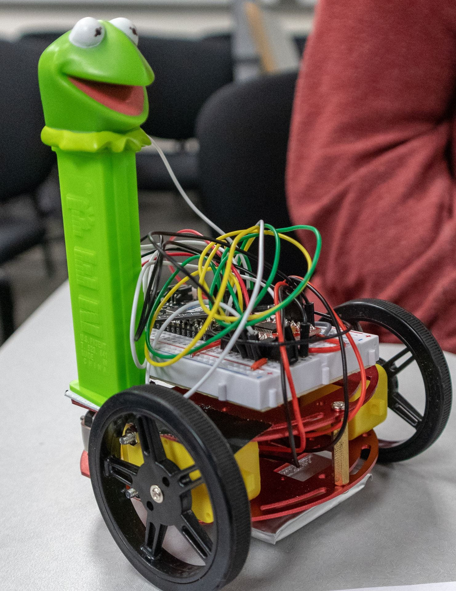

<!-- headingDivider: 2 -->

# Introduction to IoT

## What is physical computing?

## What are smart devices?

## Physical computing
* "Physical Computing is an approach to learning how humans communicate through computers that starts by considering how humans express themselves physically" --Tom Igoe
* Interacting with "smart" devices in the environment
* Involves programming, electronics, 3d printing, wearables, networking, interaction design

## Why learn this? 

* Jobs
  - 2020: 26 billion Internet nodes (excl. phones, tablets, and computers)
    - 30 fold increase from 2009
  - 2020: 4.5 million Internet of Things (IoT) developers
    - 57% annual growth rate
* Cross-discipline
  - CS, EE, data analytics, product design, entrepreneurship, making

## Why learn this?

* Hardware entrepreneurship
  - Cost of manufacturing is within reach of small amount of funding
  - Tools and open-source platforms mean you can build a prototype without an engineering degree
* Empowering and fun
  - "We are on the verge of machines that can think, and we are carrying magic wands in our pocket but most people see them as read-only" -- Jeff Branson, educator and engineer

## Examples: Gadgets
- Mi.Mu / Imogen Heap (https://youtu.be/3QtklTXbKUQ?t=660)
- Form - AR swim googles

## Examples: Education
  - Lumi - teach piano
  - Cubetto - learn programming without a screen
 

## Examples: Health
  - UFO - beauty mask
  - Jolt - concussion sensor for athletes
 

## Examples: Social Good
  - Grillo - early earthquake warnings in rural Mexico and Chile
  - ReWalk - exoskeleton to help people with spinal cord injuries

## What is IoT?

## Internet of Things

## Internet of Things

* Internet
  - connect to the internet to send and receive data
* Things
  - "smart" devices that are programmed interact with environment 

## Hardware

|                                           |                                                      |
| ----------------------------------------- | ---------------------------------------------------- |
| 1. Basic prototype                        | 2. PCB prototype                                     |
|  |  |
| 3. Manufacturing                          |                                                      |
|        |                                                      |

   

## Communication 

* WiFi and Cellular
* Bluetooth Low Energy (BLE)
  - Ex: Communication between smart watch and phone; wireless headphones
  - Range: ~1200+ ft
* Near-Field Communication (NFC) 
  - Ex: Contact-less payment like Apple Pay
  - Range: 4 inches

## Our focus in this class

* building electronic prototype
* creating the software code
* communicating with / controlling device via internet  

## Past Student Work - Tournament

|  |  |
| ------------------------------------------------------------ | ------------------------------------------------------------ |
| Winner tournament race (Ben Boggs)                           | Winner best customization (Kristen Rhodes)                   |

[Video](https://www.youtube.com/watch?v=YC2htefRHk4&feature=emb_title)

## Past Student Projects

|  |  |
| ------------------------------------------------------------ | ------------------------------------------------------------ |
|                                                              |                                                              |

## Past Student Projects

|  |  |
| ------------------------------------------------------------ | ------------------------------------------------------------ |
|                                                              |                                                              |

## Credits

- [Tim Gotimer / ITP](https://itp.usc.edu)
