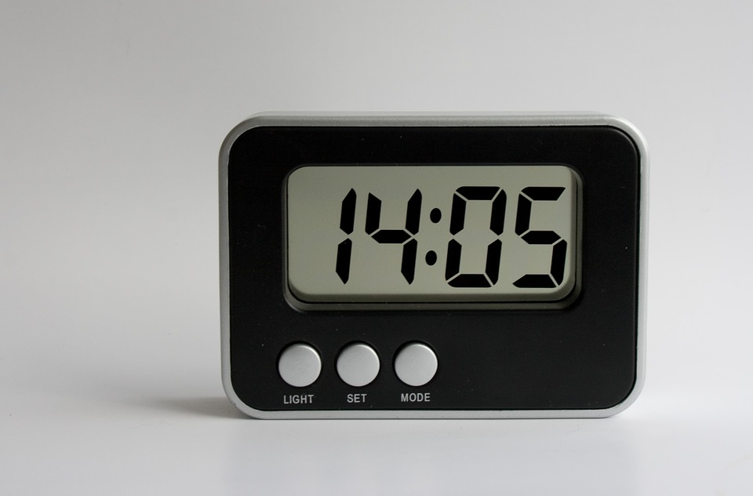
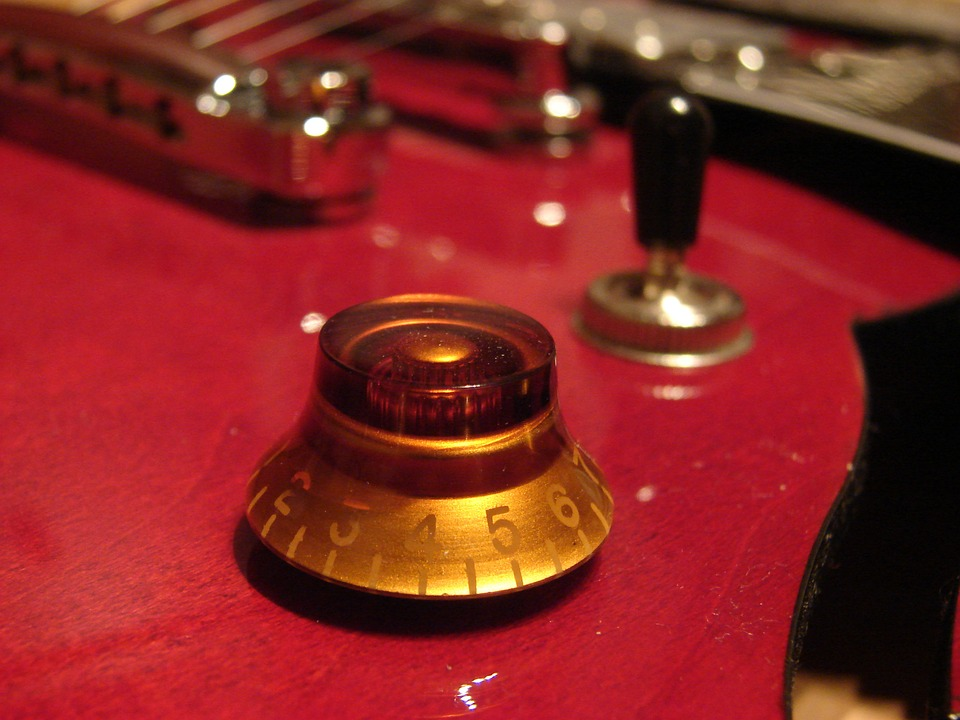
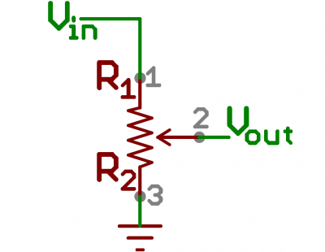
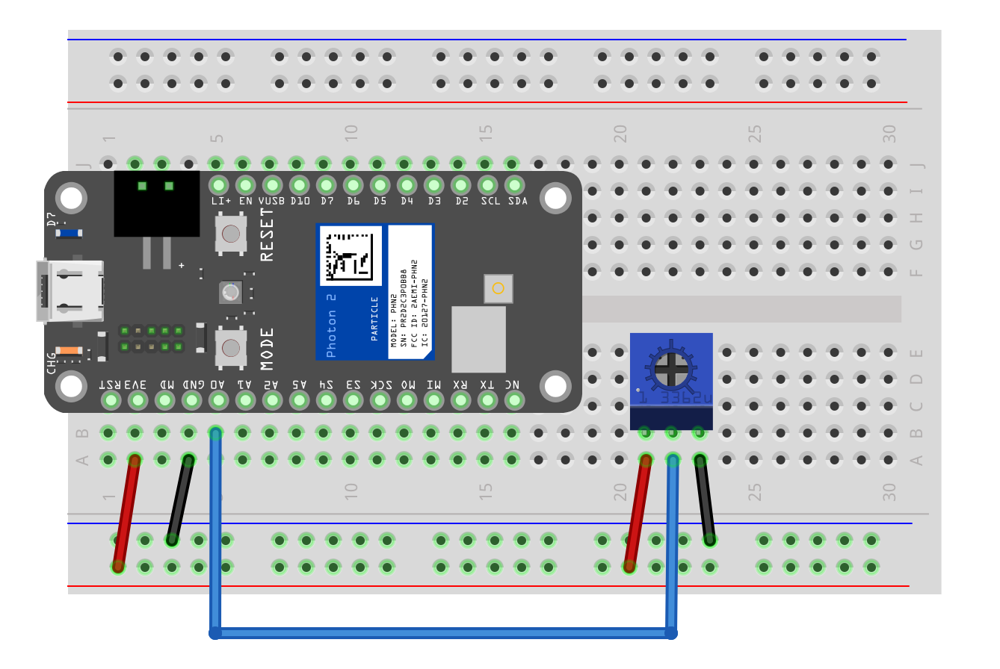

<!-- headingDivider: 2 -->

# Analog Input

## Plan

* Analog vs. digital
* Potentiometer
* Voltage dividers
* Reading analog input


## Analog vs. Digital
 


## Analog vs. Digital

| Analog                                                       | Digital                                                      |
| ------------------------------------------------------------ | ------------------------------------------------------------ |
|  |  |
| **infinite** variations / states                             | **discrete** (or **finite**) states                          |


## Potentiometer (Pot)


* Variable resistor with 3 pins
  - power, ground, **wiper**

## Potentiometer (Pot)
  

* **Wiper** pin connects to circuit
  - As wiper moves, resistance varies from 0 Ohms to max (e.g. our kit has 10K Ohms pots)


## Where do we find pots?

## Where do we find pots?



* Also car stereo knobs, dimming light switches, etc.


## How a Potentiometer Works




## How a Potentiometer Works


* **Vout** is the wiper (middle pin; connects to Photon 2 analog input)
* Inside the potentiometer is a resistor
* As the knob moves, the wiper divides the resistor, and the ratio of resistance between ***Vin-and-Wiper*** and ***Wiper-and-Gnd*** varies
* This is called a **variable voltage divider** *(more on this later)* 


## Question


* With a 10K Ohm pot, if the wiper is exactly halfway, what is the resistance between **Vout** and **Gnd**?

<!-- middle: 5K Ohms; 
top: 10K ohms because it is the R between Vout and Gnd
-->

## Voltage Dividers


* Photon 2 input pins can measure **voltage**, not **resistance**
* By connecting **Vin** (3.3v), **Gnd**, and **Vout** (wiper), we can now vary the **voltage** difference ***Vin-and-Wiper*** and ***Wiper-and-Gnd***

## Voltage Dividers


* If the wiper is exactly halfway, what is the voltage between **Vout** and **Gnd**?
* If the wiper is all the way to the top, what is the voltage between **Vout** and **Gnd**?

<!--  middle: 1.67v because the wiper is "seeing" halfway through the drop of 3.3v across the entire resistor; 
bottom: 0v because Vout and Gnd are directly connected;
top: 3.3v because vout is connected to 3.3v, which is being dropped over 10K resisor;-->

## Voltage Divider

* As those resistances changes, so does the **voltage** difference between ***Vin-and-Vout*** and ***Vout-and-Gnd***
* This is known as a **voltage divider**
    
  
  <!-- 
   -->


## Setting up Analog Input

Syntax

```c++
const int PIN_POT = A0;		//input pin
int potValue = 0;			//value from read

void setup() {
    pinMode(PIN_POT, INPUT);
}

```

* Pins A0-A5 are analog input
* *Technically, analog pins are **input by default** but I like to do this for clarity and consistency*

## Reading Analog Input

Syntax

```c++
void loop() {
    potValue = analogRead(PIN_POT);
}
```


## Wiring Diagram 



* Using **Vin=3.3v** and a 10k potentiometer, what do you expect for the range of values of **potValue**?

<!-- we would expect a range of 0-3.3v, but we will see with
ADC that that is not what we get
-->

## Credit

- [Pixabay](https://pixabay.com/photos/potentiometer-guitar-electric-guitar-482082/)
- [Pixabay](https://pixabay.com/vectors/variable-resistance-resistors-36565/)
- [Sparkfun](https://learn.sparkfun.com/tutorials/resistors#types-of-resistors)
- [Sparkfun](https://learn.sparkfun.com/tutorials/voltage-dividers)
- Diagrams created with [Fritzing](https://fritzing.org)