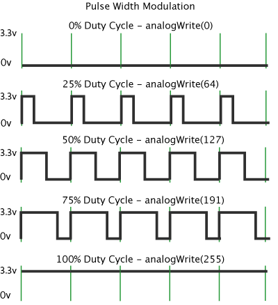

<!-- headingDivider: 2 -->

# Pulse Width Modulation

## Analog Output

* Goal
    - Produce analog outputs (e.g. make an LED half as bright, rather than off or on)

* Problem
    - Argon does **not** have analog outputs (and neither do many microcontrollers)

* Solution
    - We will fake it!

## Pulse Width Modulation (PWM)

* PWM is a technique we use to simulate analog outputs
* Basically, we switch a digital ouput on/off very quickly *(modulate)*
* Also specify how long the output is **on**, and how long it is **off** *(pulse width)*
* The result is the "effective" output voltage can be varied (since the signal is switching between high and low)

## Example



<!-- Point out: 0v and 5v (3.3V for argon), different percentage duty cycles; ignore analogWrite for now -->

## Key Terms

* Square wave: a digital output that switches repeatedely from high (3.3v) to low (0v)
* Pulse width: how long the signal is high (usually in milliseconds)
* Duty cycle: percentage of one "cycle" that a signal is at 3.3v
* Period: time for one on/off cycle to complete (usually in milliseconds)
* Frequency: how many times per second the on/off cycle repeats (Hz)

## Key Terms Illustrated


<!-- point out
* Square wave: a digital output that switches repeatedely from high (3.3v) to 0v
* Pulse width: how long the signal is high (usually in milliseconds)
* Duty cycle: percentage of time that a signal is at 3.3v
* Period: time for one on/off cycle to complete (usually in milliseconds)
* Frequency: how many times per second the on/off cycle repeats (Hz)
-->


## Questions

* What is the output voltage of an Argon pin?
* What is the effective output voltage using PWM with 50% duty cycle?
* What is the effective output voltage using PWM with 25% duty cycle?
* What is the effective output voltage using PWM with 0% duty cycle?


## Why does this work?


<!-- The on/off switching happens very fast so the output device "perceives" the effect of an average (integration) of the output voltage -->


## Using PWM

* Only certain pins support PWM
* Pins D2-D8 can be used as PWM output pins
* *Pins A0-A5 can also be used*

## Writing Analog Output with `analogWrite` 

Syntax

```c++
analogWrite(PIN_NUMBER, VALUE);
//VALUE: 0-255
```

* You can control the pulse width with `VALUE`
* We discussed duty cycle as 0%-100%, but `VALUE` is 0-255
  - Why?

<!-- we are using digital values to simulate analog values -->

## Example 

```c++
analogWrite(LED_PIN, 127);	//50% duty cycle, or 1.67v

analogWrite(LED_PIN, 192);	//75% duty cycle, or 2.45v

analogWrite(LED_PIN, 0);	//0% duty cycle, or 0v
```

## Credits

- [The Arduino.cc Team](https://commons.wikimedia.org/wiki/File:Pwm_5steps.gif)