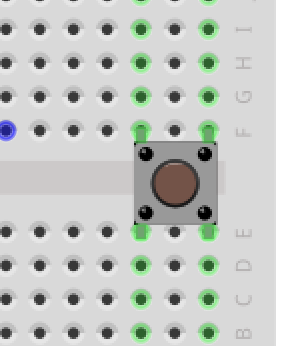
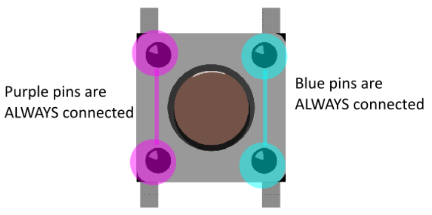

<!-- headingDivider: 2 -->

# Push Buttons

## Push Buttons

* Momentary switches that make (or break) electrical contact when pressed
* "Normally open" buttons complete a circuit when pressed *(this is what is in the kit)*
* "Normally closed" buttons break a circuit when pressed *(we won't use these in class)*

## Push Button Orientation

 

* Buttons have four pins and are designed to go across the center of the breadboard

## Push Button Connections (Normally Open)

* In the picture, each set of pins "vertically across" from each other are **always** connected (purple and blue)
* Each set of pins "horizontally next to" each other are **not connected** until the button is presed

## Push Button Connections (Normally Open)

* When button is pressed, all four pins are connected (yellow pins)

## Goal

* We want to use the button to send a binary (on/off) signal
* Since this is a digital input, we can use **HIGH** (3.3v) and **LOW** (gnd)

## First Version

## First Version - Problem

* When button is pressed, input pin is connected to gnd (LOW)
* When button is open, is it LOW or HIGH?

## Floating Input

* When an digital input is neither exactly LOW (0v) or HIGH (3.3v), we say it is **floating**
* This means it is somewhere between 0-3.3v
* Should 2.4v be LOW or HIGH?
* Let's fix this

## Second Version

## Second Version Problem

* When button is open, we have HIGH (fixed)
* When button is pressed, we connect power (3.3v) to gnd (**BAD!**)

## Final Version

## Final Version - With Pull-Up Resistor

* We use a large resistor (10k) to "pull-up" the input to 3.3v when the button is open (HIGH)
* When the button is pressed, the input goes to gnd (LOW), and we no longer have short-circuit from power to ground

## IMPORTANT

* **ALWAYS USE A PULL-UP RESISTOR WITH BUTTONS**
* Otherwise you can damage the Argon permanently

<!-- Pull down resistors to ground are fine too. Pull ups are more common for historical reasons (required more current for TTL logic). May also reduce interferance from noise since cutoff between HIGH (3.3v) and LOW (0v) is not 1.67v but much lower so better to have "default" state further from the cutoff -->

## Exercise 1
  

1. Turn LED on **only** while button pressed
2. Toggle LED on and off **after each time** button is pressed
3. Connect 3 LEDs (`D3`, `D4`, `D5`) and turn all on and off at once
4. Then turn lights on and off in a sequence (e.g. (3 states)

## Exercise 2

  

1. Turn on red LED on **only** while button pressed
2. Toggle red LED on and off **after each time** button is pressed
3. Generate 1 new random color each time button is pressed
4. Make each button press move LED through a sequence of colors

## Credit

- [Sparkfun](https://learn.sparkfun.com/tutorials/switch-basics/momentary-switches)
- [SVG]()
- Images created with [Fritzing](https://fritzing.org/home/)
