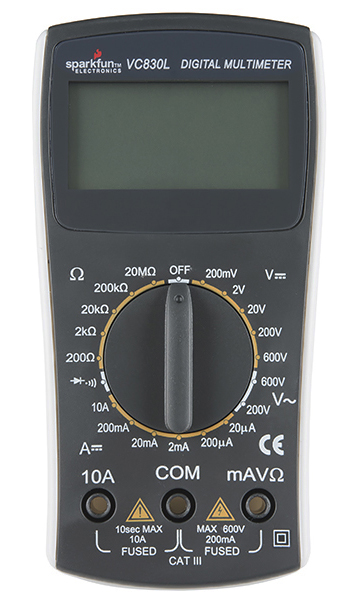
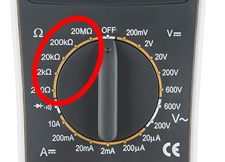

<!-- headingDivider: 2 -->

# Multimeters

## Digital multimeters (DMM)

* Allow you to measure the electrical properties of your circuit
* Measure voltage, resistance, continuity, and current
* Some multimeters can measure capacitance and temperature

## General Multimeter Setup

1) Plug in probes (black goes to common, red goes the appropriate ports)
   * For our class, we will be measure milliamps, ohms, and V so use right port
2) Turn knob to appropriate zone
3) Follow specific steps for type of measurement

## Setting Multimeter to Measure Resistance

## Notes about Measuring Resistance

* Resistance should be measured **outside** the circuit
* Always remove the resistor before measuring

## How to Measure Resistance

1) Remove the resistor from circuit 
2) Touch one probe to each end of the resistor
3) Adjust the knob until a valid reading appears
   * If meters reads **OL**, **1**, or **0**, then adjust the knob

## Exercise

* Use multimeter to measure the resistance of your potentiometer

## Setting Multimeter to Measure DC Voltage

## Notes about Measuring DC Voltage

* Voltage is measured with the circuit is operating with electricity
* Connect the multimeter in **parallel** with the component you want to measure

## How to Measure DC Voltage

1) Touch the black probe to ground
2) Touch the red probe to the place in the circuit you want to measure
3) Adjust the knob until a valid reading appears
   * If meters reads **OL** or **1**, adjust the knob

## Exercise

* Connect potentiometer to 3.3v and ground.
* Measure voltage at pin 2 as your turn the knob

## Setting Multimeter to Measure Continuity

## Notes about Measuring Continuity

* Continuity checks if two points are connected (e.g. if they are connected by a wire)
* When each probe is touching two places that are connected, the multimeter will beep
* Continuity can only be checked when the circuit is **off** (no electricity)
* Useful to find out if a wire has broken or there is a short circuit somewhere

## How to Measure Continuity

1) Touch the black probe to one point in the circuit
2) Touch the red probe to another point in circuit 
3) If the multimeter beeps, the two points are connected
   * If there is no beep, the points are not connected

## Other Uses

* In our class, we will not typically measure current or AC voltage, but these are included for reference

## Setting Multimeter to Measure DC Current

## Notes about Measuring DC Current

* Current is measured with the circuit is operating with electricity
* Connect the multimeter in **series** with the component you want to measure
* This means **breaking** the circuit and inserting the multimeter in line (**series**) with the  circuit
* There are two ports for measuring current depending on amperage
  * Our devices have 10 A and 200 mA

## How to Measure DC Current

1) "Break" the circuit at the point you want to measure current
2) Touch the black probe to one point of the broken connection
3) Touch the red probe to the other point in circuit

## Setting Multimeter to Measure AC Voltage

## Notes about Measuring AC Voltage

* AC voltage is **dangerous** and **potentially fatal if mishandled**
* While it is possible possible to measure AC voltage with the handheld multimeter, it is safer to use a device called a **non-contact tester**

## Credit

- [Sparkfun](https://learn.sparkfun.com/tutorials/how-to-use-a-multimeter/)
- Images created with [Fritzing](https://fritzing.org/home/)

