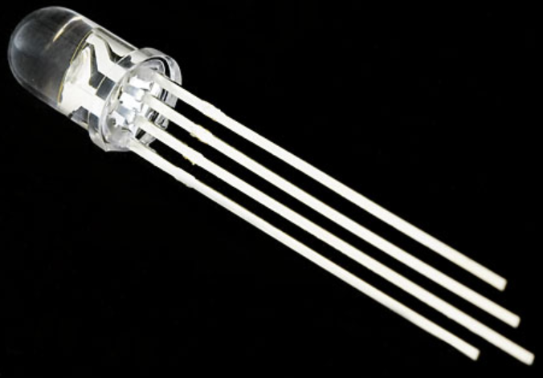
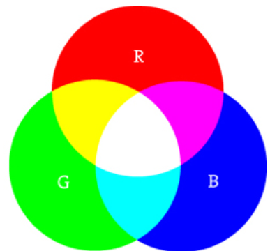
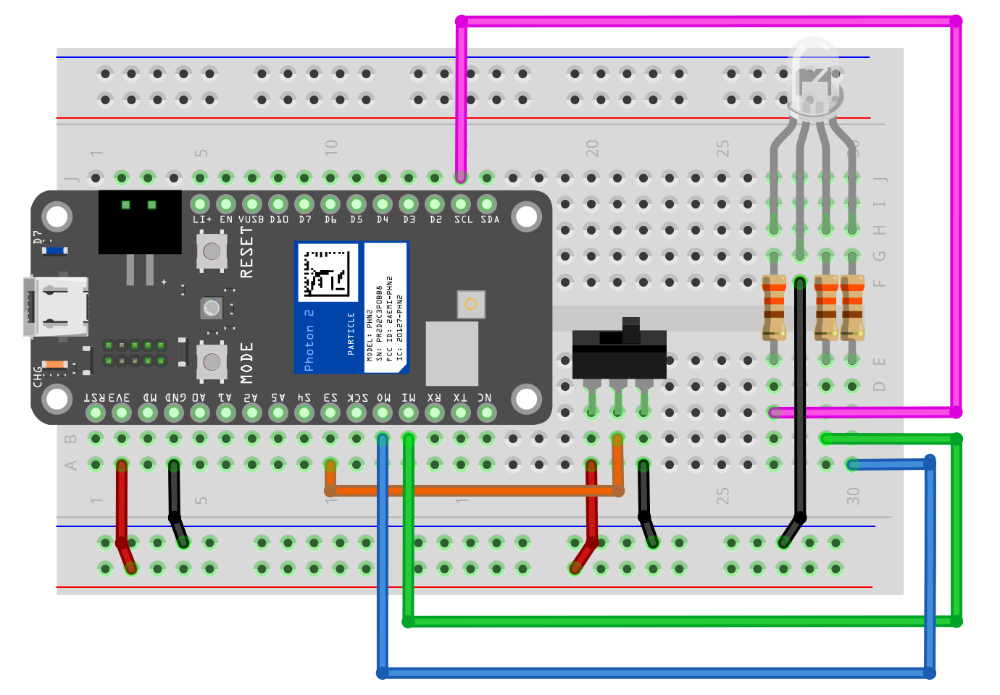

<!-- headingDivider: 2 -->

# RGB LEDs

## Three LEDs in One!

* RGB LEDs combine three separate LEDs in one package
  - Red LED
  - Green LED
  - Blue LED
* These **primary colors** can be controlled separately to create a multitude of color possibilities

## Pins

* RGB LEDs have four pins
* Three pins to each of R, G, B *(shorter pins)*
* One pin serves as either common anode or common cathode *(longer pin)*

## Recall: Current Flow in LED

* LEDs allow current to flow **in only one direction**
* Positive voltage applied to the **anode**
* **Cathode** connected to Ground

## Current Flow in RGB LEDs 

* RGB LEDs operate in general same way
* Current flows from anode to cathode
* Positive voltage on anode causes LED to turn on
* But there is a small catch to beware of...
  - There are two types of RGB LEDs

## Common Cathode Wiring

* R, G, B pins are **anode** (*positive*)
* Connect **cathode** (longer pin) to **Ground** (*negative*)
* Output **HIGH** (3.3v) on anode turns on, **LOW** turns off
* **This is what we use in class**

## Common Cathode Wiring

## Common Cathode RGB LEDs

* ...are **physically** the opposite of regular LEDs
  * Regular LED: **anode** is longer pin
  * Common cathode RGB LED: **cathode** is longer pin
* ...are wired the same as regular LEDs
  * Connect anode to Photon 2
  * Output **HIGH** to turn on

## Common Anode Wiring

* R, G, B pins are **cathode** (*negative*)
* Connect **anode** (longer pin) to 3.3v (*positive*)
* Output **LOW** on anode to turn on LED; output **HIGH** (3.3v) to turn off

## Common Anode Wiring

## Common Anode RGB LEDs

* ...are **physically** the same as regular LEDs
  * LED: **anode** is longer pin
  * Common anode RGB LED: **anode** is longer pin
* ...are wired the opposite as regular LEDs
  * Connect anode to power
  * Output **LOW** to turn on

## Color Mixing

* Check out [https://htmlcolorcodes.com/]( https://htmlcolorcodes.com/ ) to see how R, G, and B mix to create colors

##### R + G + B = ?

## Color Mixing with RGB LEDs

* R + G + B **≠** W
* Due to variations in manufacturing and resistor tolerances

## Lab 1

## Lab 1 steps

- **Stage 1:** Create a latch so the on-board LED turn on and stays on when the button is pressed, and the on-board LED turns off and stays off when the button is pressed again 
- **Stage 2:** Change the firmware so when the button is pressed, the following light sequence is displayed on the RGB LED
  - red for 1/2 sec
  - green for 1/2 sec
  - blue for 1/2 sec
  - orange for 1/2 sec
- **Stage 3**: Change the firmware so when the button is pressed, a random color is show on the RGB LED

## Lab 2

## Lab 2 steps

1. Wire an RGB LED 
2. Wire potentiometer
3. Create code to allow potentiometer to control only the brightness of the red LED, and have the blue and green LED always on
4. Then, allow the potentiometer to control the brightness of all LEDs

## Lab 3

## Lab 3 steps

1. Wire an RGB LED 
2. When switch is to one direction, display your favorite color
3. When switch is other direction, display a random color
4. Rewrite sketch using `displayColor(r, g, b)` and `displayRandomColor()`
5. Import `rgb-controls` library to animate colors

## Credit

- <a href="https://creativecommons.org/licenses/by-sa/3.0" title="Creative Commons Attribution-Share Alike 3.0">CC BY-SA 3.0</a>, <a href="https://commons.wikimedia.org/w/index.php?curid=755036">Source</a>
- [Sparkfun](https://learn.sparkfun.com/tutorials/pulse-width-modulation)
- Images created with [Fritzing](https://fritzing.org/home/)

