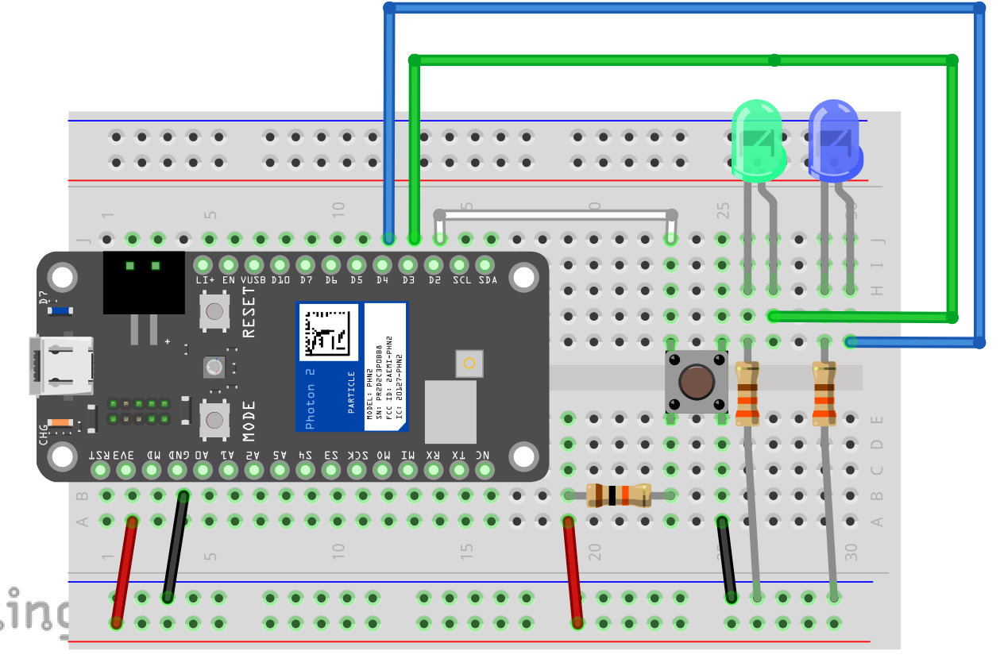
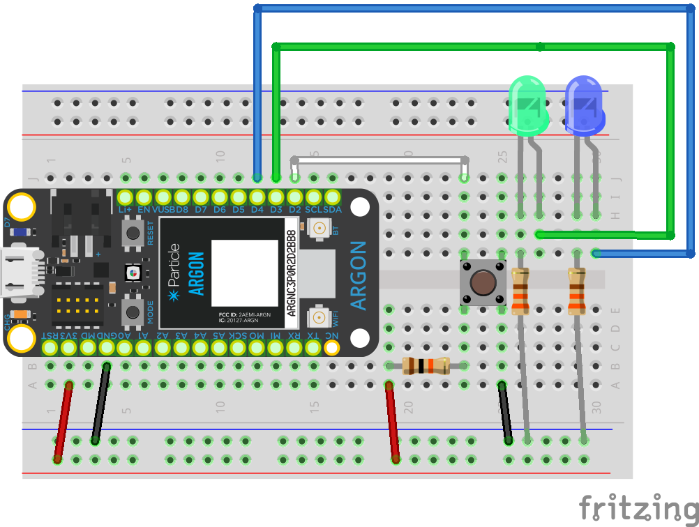

<!-- headingDivider: 2 -->

# Multi-Tasking: Delay

## First, a Clarification

* We've learned about creating a button / latch toggle
```c++
int currButtonVal = digitalRead(PIN_BUTTON);
if (currButtonVal == LOW && prevButtonVal == HIGH) {
    // code to execute on button press goes here
}
prevButtonVal = currButtonVal;
```
* Latches allow us to react to single button presses
* Multi-tasking code is solving a different problem 


## Consider


What is your phone doing right now while you're not using it?
<!-- doing background tasks, and also waiting -->


## Review: Basic  LED Blink

```c++
void setup() {
  pinMode(D7, OUTPUT);
}

void loop() {
  digitalWrite(D7, HIGH);   
  delay(1000);  //what is happening during the 1 sec delay?       
       
  digitalWrite(D7, LOW);     
  delay(1000);                       
}
```

## Questions

1. How do we get two LEDs to each blink on/off at 1 sec intervals?
2. How do we get one LEDs to blink on/off at 1 sec interval, and the second LED to blink at 2 sec intervals?
3. How do we get one LEDs to blink on/off at 1.442 sec interval, and the second LED to blink at 3.83 sec intervals?

## Delay Problems

* `delay()` is **blocking**
  * This means the Photon 2 is essentially paused and can't do anything else
* We need to be able to synchronize events and **multi-task** just like our computers and phones
* This means in the time between the LED turning off and turning on, the Photon 2 can do other things


## Step 1: Let's Use the Clock

* `millis()` is a function that returns the "relative current time" 
  * Number of **milliseconds** that have elapsed since the Photon 2 last turned on / reset
* We can call `millis()` at different points in time to compare the passage of time
* When a specific time has elapsed, we can take an action


## Note about `millis()` and `long`

* The "on" time is returned as an `long`

* `long` is like an `int` but has a larger capacity

* Normally `long` stores 32 bit numbers (positive and negative)

* range of `long`: -2,147,483,648 to 2,147,483,647

  

## Note about `millis()` and `unsigned long`

  * However, the "on" time will never be negative

  * We can specify a variable as `unsigned` which means the lowest value is **0** 

  * range of `unsigned long`: 0 to 4,294,967,295

  * Syntax

    ```c++
    unsigned long currentTime = millis();
    ```

     

## Step 2: Track the Current State

* **State** represents any variables or relevant data about our device at the current moment
* You decide what states are relevant for your program
  * E.g. `AcceptingPayment`, `ReceivingData`, `DishesDry`, `AlarmOff`
* For a single LED, the states are either **ON (HIGH)** or **OFF (LOW)**

## Our New Plan

* if `ledState `== **LOW** AND interval is over
  * then `ledState `= **HIGH**
  * update time
  * turn on LED
* if `ledState `== **HIGH** AND interval is over
  * `ledState `= **LOW**
  * update time
  * turn off LED

## Visual Representation


## Code: Blink LED without Delay
```c++
unsigned long prevMillis = 0;	//last time we checked time
int ledState = LOW;					//initial state
int interval = 300;
void loop() {
  unsigned long curMillis = millis();     //current time
  //check if (now - previous) is more than our interval
  if (curMillis - prevMillis >= interval) {   
    prevMillis = curMillis;      //if YES, update previous
    if (ledState == LOW) {           //if LED ON, now it is OFF
      ledState = HIGH;                                
    } else {						//if LED ON, now it is OFF
      ledState = LOW;
    }
    digitalWrite(LED_PIN, ledState);
  }
```

## Code: More Concise Blink LED without Delay

```c++
unsigned long prevMillis = 0;	//last time we checked time
int ledState = LOW;					//initial state
int interval = 300;
void loop() {
  unsigned long curMillis = millis();     //current time
  //check if (now - previous) is more than our interval
  if (curMillis - prevMillis >= interval) {   
    prevMillis = curMillis;      //if YES, update previous
    ledState = !ledState; //toggle true / false
    digitalWrite(LED_PIN, ledState);
  }
  
```

## Lab






## Lab Goals

* Blink **LED1** every **300 ms**
* Blink **LED2** every **146 ms**
* Create toggle button (latch) to turn **ON BOARD** on at **rising edge** and off again at the **rising edge**
* Track the number of times the button is pressed
* Publish the number of button presses to cloud every **10000 ms** 
* Extra Challenge
  * Change **LED1** to be *on* for 300 ms and *off* for 700 ms
  * Change  code so that when the toggle button is pressed, **LED2** starts blinking every 146 **milliseconds**, and when the toggle button is pressed again, **LED2** stops blinking


##  Stages to Build

1. Use `delay` to blink **LED1** every 300 ms and then check for a button press (not a toggle); display Serial message if button pressed 
2. Use `millis()` to fix blocking in #1 (we'll do #1 and #2 together)
3. Use `millis()` to blink **LED2** every 146 ms
4. Enable toggle button to turn **ON BOARD LED** on and off on the **rising edge**
5. Track number of button presses and use `millis()` to publish number of button presses every **10000 ms**

## Starting Code

```c++
const int PIN_BUTTON = D2;
const int PIN_LED1 = D3;
const int PIN_LED2 = D4;

void setup()
{
  pinMode(PIN_BUTTON, INPUT);
  pinMode(PIN_LED1, OUTPUT);
  pinMode(PIN_LED2, OUTPUT);
  Serial.begin(9600);
}

void loop()
{
  digitalWrite(PIN_LED1, HIGH);
  delay(300);
  digitalWrite(PIN_LED1, LOW);
  delay(300);
  digitalWrite(PIN_LED1, HIGH);
  delay(300);
  digitalWrite(PIN_LED1, LOW);
  delay(300);
}

```

