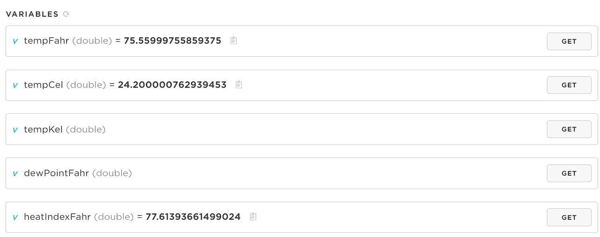

<!-- headingDivider: 2 -->

# Cloud Communication


## Review: What is the Cloud?

<!-- basically servers connected to the internet all around the world; not one single computer, but many different machines, services, and companies -->

## Internet of Things

- Things
  * "smart" devices that are programmed interact with environment 
- Internet
  * connect to the internet to send and receive data

## IoT Cloud Platforms

* Various services that allow you to enhance your device with internet capability

## Examples of IoT Cloud Services

* Update device code and firmware
* Receive status messages (like we do with Serial monitor)
* Read the values of variables
* Control device / execute function calls
* Store data from device (e.g. the hourly temperature for the past 6 months)
* Run analytics (e.g. how often does one of my 4,000 device fail)
* Manage device with publicly-accessible web/mobile 

## IoT Cloud Platform Companies

* Very competitive and growth space
* Established firms: Google Cloud Platform, Microsoft Azure, Amazon Web Services
* Startups: Particle, Losant, Ubidots
* Various: Thingspeak (Mathworks), IFTTT

## Particle Cloud Features

* Update device code and firmware
* Receive status messages (like we do with Serial monitor)
* Read the values of variables
* Control device / execute function calls

## Particle Cloud Does NOT

* Store data from device 
  * Ex. the hourly temperature for the past 6 months)
* Run analytics
  * Ex. how often does one of my 4,000 device fail)
* Manage device with publicly-accessible web/mobile 

## Particle Cloud

* Argon has built in support for connecting to Particle Cloud
* Particle Cloud is essentially free (very generous free tier)
* Basically acts as a real-time communication system
  * i.e. the current temperature, but not temperature from last Tuesday
* For data storage and analysis, we will use a different service later in the course

## Quick Note

* All the features we will discuss are not unique to Particle Cloud
* It is possible to read variables and execute functions from most companies' platforms
* The syntax and mechanisms will vary from Particle Cloud, but the concepts are transferable

## Key operations in Particle Cloud

* **Accessing data (cloud variables)**
* Control device (cloud functions)
* Publishing (events part 1)
* Subscribing (events part 2)

## Cloud Variables

* Register / expose a variable in your Argon code so it can be accessed online
* This does **not** publish the value of the variable automatically
* Cloud is notified variable exists, and it is retrieved only when requested
* Up to 20 variables may be registered

## Cloud Variables Process

1. Declare global variable (must be `int`, `double`, `String`, `bool`)
2. Call `Particle.variable` within `setup()` to register the variable

## Cloud Variable Syntax

```c++
Particle.variable(<<REGISTERED_NAME>>, <<ACTUAL_VARIABLE>>);
```

Example

```c++
double f;			//declare global variable
String lightValue;	//declare global variable
void setup() {
  Particle.variable("lightValue", photoSensor);	//register variable
  Particle.variable("tempFahr", f);				//register variable
```

## Accessing Cloud Variables - [Particle Console](https://console.particle.io)



## Accessing Cloud Variables - App


## Accessing Cloud Variables - REST

* Variables can be accessed by any device or service via REST

* REST is very common protocol for sharing data across the internet

* REST call syntax

  `GET /v1/devices/{DEVICE_ID}/{VARIABLE}`

## Lab

* Create cloud variables for both photoresistor value and light level (dark, ambient, bright)


## Documentation

* [Particle Cloud API](https://docs.particle.io/reference/device-os/firmware/argon/#cloud-functions)
* [Publishing Events](https://docs.particle.io/reference/device-os/firmware/argon/#particle-publish-)
* [Cloud Variables](https://docs.particle.io/reference/device-os/firmware/argon/#particle-variable-)
* [Cloud Functions](https://docs.particle.io/reference/device-os/firmware/argon/#particle-function-)
* [Subscribing to Events](https://docs.particle.io/reference/device-os/firmware/argon/#particle-subscribe-)
