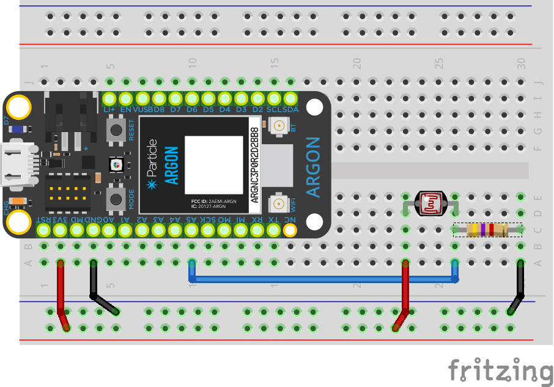

<!-- headingDivider: 2 -->

# Photoresistor

## Part 1: Understanding a photoresistor 

* Working in breakout groups, answer the following questions

## Part 1: Calibrating in Hardware

1. A photoresistor is device whose resistance varies with the amount of light present. Which input function will we use? `analogRead` or `digitalRead`? __

2. Based on that, what is the range of values the argon will read when using the photoresistor.

   * What is the maximum value the argon will read?  __ <!-- 4095 -->
   * What is the minimum value the argon will read?  __ <!-- 0 -->

   ## Part 1: Understanding a photoresistor 

3. With the photoresistor <u>not</u> connected to the argon, use multimeter to measure resistance of photoresistor under the following conditions.

   * Resistance in ambient (normal) room light: __ <!-- 2k -->
   * Resistance in bright light (cell phone light): __ <!-- 500 -->
   * Resistance in darkness: __ <!-- 9k -->

## Part 1: Understanding a photoresistor 

4. Connect photoresistor to **3.3v** and **GND** as shown below. 
    

## Part 1: Understanding a photoresistor 

5. Voltage in ambient room light: __ <!-- 3.3v -->

6. Voltage in bright light (cell phone light): __ <!-- 3.3v -->

7. Voltage in darkness: __ <!-- 3.3v -->

8. What do you notice? __ <!-- The voltage is always the same-->

9. Why do you think this is? <!-- The resistance varies, but the voltage drop is always the same by KVL -->

##  Part 2: Discuss

* What do you learn? 
* Did this work as you expected?

## Photoresistors

* A **potentiometer** is also a variable resistor (like a photoresistor).
* Even though **resistance** varied, we were able to "see" voltage change with potentiometer
* Why was that?
   <!-- The pot has three terminal which creates a voltage divider; there are two different "resistors" and we are measure the ratio of the two -->_

* Is there a way we could use a similar approach to measure voltage changes with the photoresistor? __ <!-- use a fixed second resistor -->

## Review: Potentiometers and Voltage Dividers

* Inside the potentiometer is a resistor
* As the knob moves, the wiper divides the resistor, and the ratio of resistance between ***Vin-and-Wiper*** and ***Wiper-and-Gnd*** varies
* As the proporational resistance changes, so does the proportional **voltage** difference ***Vin-and-Wiper*** and ***Wiper-and-Gnd***

## Photoresistor solution

## Photoresistor solution

* Use a fixed resistor (usually 4.7k*) in series with photoresistor
* Connect one end of photoresistor to 3.3v, and the end to the resistor
* Connect the other end of the resistor to ground
* Use the Argon to measure the voltage in the middle 
* **4.7k is not a magic value. It a reasonably good value for normal lighting conditions*

## Lab

## Lab

* Work in breakout groups
* Read and display the voltage between the photoresistor and resistor.
* Measure it based on different lighting conditions: normal room light, covering the sensor with your hand, shining
* Display on the serial monitor if you room light **dark**, **light**, or **ambient**

## Credit

- [Sparkfun](https://www.sparkfun.com/products/9088)
- [Sparkfun](https://www.sparkfun.com/products/9806)
- Images created with [Fritzing](https://fritzing.org/home/)
