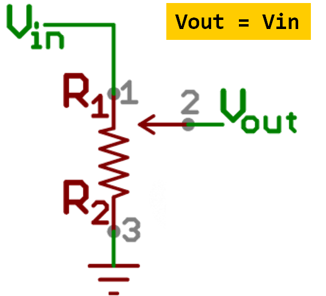

<!-- headingDivider: 2 -->

# Measuring Light with Photoresistors

## Learning Objectives
* Describe what a photoresistor measures and what it is used for
* Understand voltage divider concept behind photoresistor operation
* Implement a device using photoresistor
* Calibrate photoresistor with appropriate values in firmware

## Photoresistors

* Measures light levels
* Contains a photosensitive **variable resistor**
* Changes in light level causes a change in resistance
* Also called photocells or photodetectors

## Notes about Photoresistors

| Useful for                                                   | Not Useful for                                             |
| ------------------------------------------------------------ | ---------------------------------------------------------- |
| Detect relative change in light level                        | Detecting absolute light level                             |
| Knowing when to brighten / darken a display screen screen (e.g. phone) | Comparing light level across different devices and sensors |

## Wiring a Photoresistor

* Consider wiring a photo resistor to 3.3v and ground
* Measure voltage
* The resistance will vary with light, but what is the problem?

## What happens in bright light?

* Bright light --> resistance decreases
* Analog input reads 3.3v

## What happens in darkness?

* Darkness --> resistance increases
* Analog input **still** reads 3.3v
* ?

## Why is this happening?

<!-- We are always measure the pin connected to 3.3v so reading won't change -->

## Review: Potentiometers

* A **potentiometer** is also a variable resistor (like a photoresistor).
* When the potentiometer's **resistance** varied, we were able to "see" (read) a voltage change (unlike with the photoresistor)
* Why was that?
  <!-- The pot has three terminal which creates a voltage divider; there are two different "resistors" and we are measure the ratio of the two -->
* Could we use a similar approach? <!-- use a fixed second resistor -->

## Review

* Potentiometers have **3 pins**: 3.3v, GND, and a wiper can move across a fixed resistor
* **Vout** represents the voltage at wiper
* As the knob moves the wiper across the resistor,  the ratio of resistance between ***Vin-and-Vout*** and ***Vout-and-Gnd*** varies

## Review

* As those resistances changes, so does the **voltage** difference between ***Vin-and-Vout*** and ***Vout-and-Gnd***
* This is known as a **voltage divider**
    
  

## Photoresistor solution

## Photoresistor solution

* Use a fixed resistor (usually 4.7k*) in series with photoresistor
* Connect one end of photoresistor to 3.3v, and the end to the resistor
* Connect the other end of the resistor to ground
* Use the Photon 2 to measure the voltage in the middle 

**\*** *4.7k is not a magic value. It a reasonably good value for normal lighting conditions*

## Exercise

## Lab (with breakout groups)

* Read and display the value from between the photoresistor and resistor.
* Measure it based on different lighting conditions: normal room light, covering the sensor with your hand, shining
* Part 1: 
   * Display on the serial monitor if you room light **dark**, **light**, or **ambient**
   * Display a different LED color based on the light states
   * Hint: how will you determine what type of light is present?
* Part 2:
   * Set the LED to specific color
   * Use the values from the photoresistor to control the brightness of the LED. For example, use PWM to brighten / darken the light based on the photoresistor values. You will need to convert / scale the photoresistor values to the PWM values

## Credit

- [Sparkfun](https://www.sparkfun.com/products/9088)
- [Sparkfun](https://www.sparkfun.com/products/9806)
- Images created with [Fritzing](https://fritzing.org/home/)
