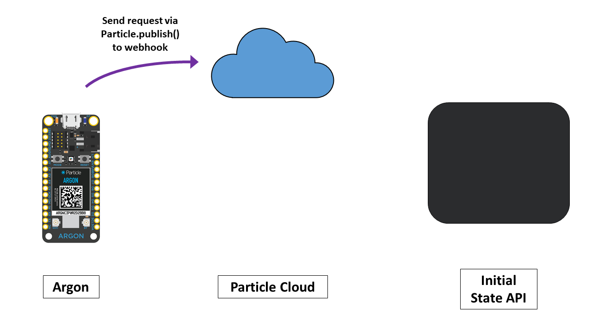
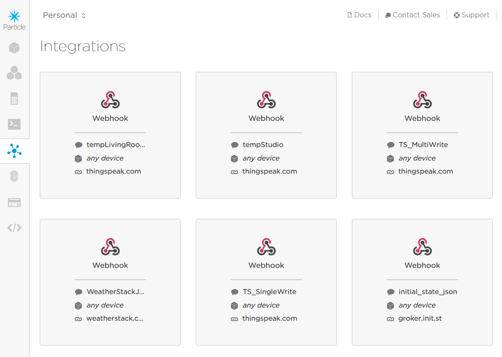

<!-- headingDivider: 2 -->

# APIs and Webhooks

## Big Idea

* We want our device to interact with services all over the internet--e.g. permanently store all heart rate data in the cloud, retrieve the weather forecast tomorrow, etc.

* **APIs** provide the mechanism we use to communicate with these other services

* **Webhooks** are created in the Particle cloud to connect our Argon to an API online 

  

## APIs (Application Programming Interface)

* A specification used as an interface between different pieces of software
* Allows code we write to connect to other services, gather data, etc.
* Usually related to a software library
* May also be related to a software framework
* May also be an implementation of a protocol
* Publishing APIs has allowed web communities to create an open architecture for sharing content and data between communities and applications

## Examples of APIs

* Weather data - [https://weatherstack.com](https://weatherstack.com)
* Dictionaries - [Merriam-Webste](https://dictionaryapi.com/)
* Transit data - [Bay Area Rapid Transit](http://api.bart.gov)
* Useful lists of public APIs
  * [https://github.com/toddmotto/public-apis](https://github.com/toddmotto/public-apis)
  * [https://github.com/abhishekbanthia/Public-APIs](https://github.com/abhishekbanthia/Public-APIs)

## General Process to Interacting with Data from API

* Identify API you want to use (make account if necessary)
* Create a Particle **webhook** that interacts with the API
  * A **webhook** is trigger we create at the Particle Cloud
  * When we send data to a webhook, it causes the Particle Cloud to perform an action we defined
* Note: this describe **sending data only**. We will discuss later in the semester how to receive data

## 

## 

## 

## Creating a Webhook

Go to [Particle Cloud Console Integrations](https://console.particle.io/integrations) > Webhook

## Credit

- [Webhooks by DioT Labs](https://diotlabs.daraghbyrne.me/docs/working-with-data/webhooks)

