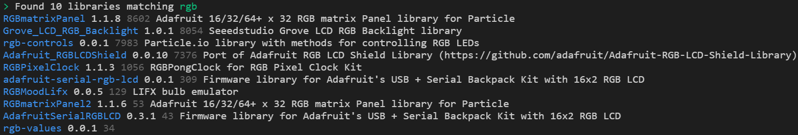

<!-- headingDivider: 2 -->

# C++ Functions and Libraries

## Function Review

## Functions: Return Values

```c++
returnType functionName (parameterType parameterName, ...) { ...}
```

* Functions can may or may not return a value
* Always specify the return type before the function name

## Functions: Return Values

```c++
double thisFunctionReturnsADouble() { ... }
```

* `void` means the function **does not** return a value 

```c++
void setup() { ... }
```

## Functions: Input Parameters

```c++
returnType functionName (parameterType parameterName, ...) { ...}
```

* Functions can may or may not take an input parameters

## Functions: Input Parameters

```c++
double squareRoot(int num) {...}

int sumNumbers(int num1, int num2) {...}

void loop() {...}
```

## Libraries

* Libraries are pre-written C++ files that you can add to your project

* They provide additional features you can use (e.g. animating LEDs)
* They are also use to simplify communicating with complex sensors (e.g. small screens)

## Step 1: Finding Libraries (Generally)

* Search the internet
* Search the [Particle community](https://community.particle.io/)
* Search Arduino forums

`particle library <thing you're looking for>`

* *Note: Most Arduino libraries are compatible with Argon, but not all, so looking on Particle forums is preferable*

## Step 1: Finding Libraries Workbench

* In order to install a library, you need to add it via Workbench
* Open project
* Go to **View \> Command Palette**
* Type **Find Libraries**
* In the new window, type  
  **rgb** *(or whatever you are searching for)*

## Step 1: Finding Libraries in Workbench



## Step 1: Finding Libraries in Workbench


<!--Read the description, look at the number of users -->

## Step 2: Installing Libraries in Workbench

* Open project
* Go to **View \> Command Palette**
* Type **Install Libraries**
* In the new window, type the exact name of the library  
  **rgb-controls** *(or whatever you are searching for)*

## Step 3: Including Library


## Step 3: Including Library

* At the top of your sketch, add the library to your code

```c++
#include "rgb-controls.h"
```

* Use the example sketches included with the library as a guide to get started