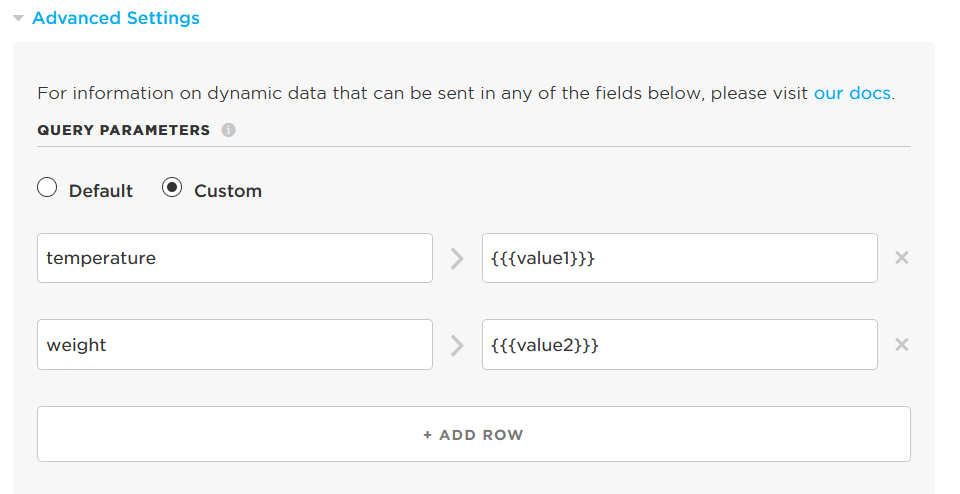

<!-- headingDivider: 2 -->

## 


## Example 1: Send Single Data Point from Photon 2 to Initial State

**Photon 2 code**

```c++
double temp;

void loop() {
  temp = 89;		//just example; temp should come from sensor
    
  // Trigger the integration
  String json = "{\"value1\":90, \"value2\":100}";
  Particle.publish("initial_state_single", json, PRIVATE);
  delay(60000);	//use delay or millis to avoid publishing too frequently
}
```

