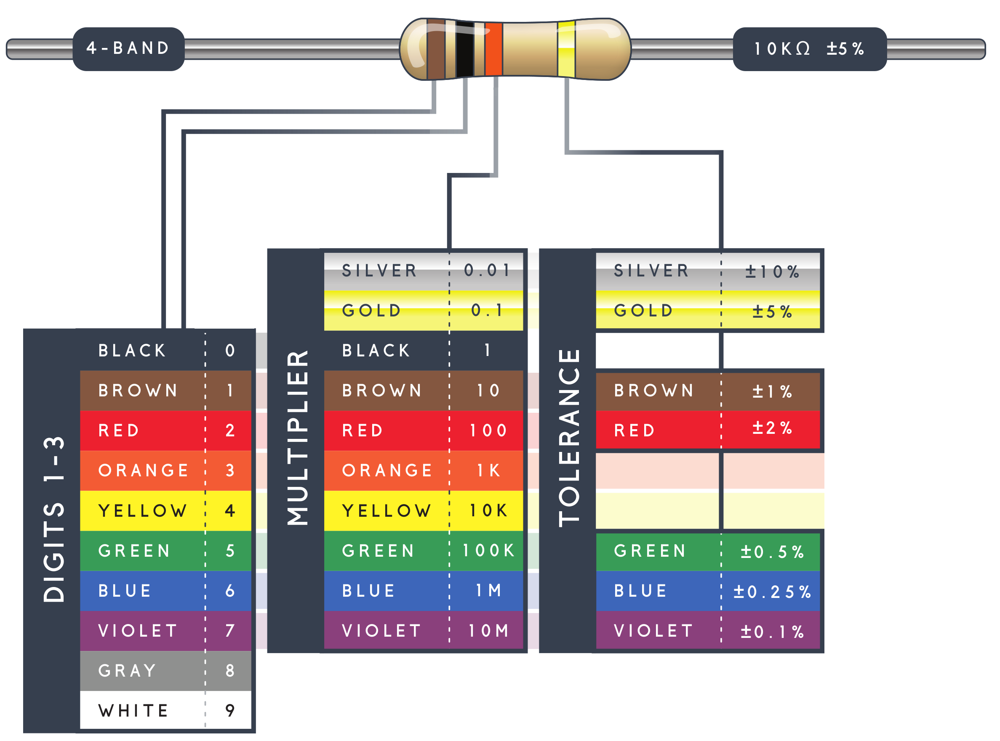

<!-- headingDivider: 2 -->

# Resistors Bands

## Resistor Labels

* The color codes indicate the resistance in Ohms (and sometimes how precise they are)
* There are 4 bands (colors), 5 band, and 6 band resistors
* Four band resistors are the most common, and the ones we will encounter in this class

## Resistor Chart

## Understanding Resistor Chart

* Align such that the group of three bands are on the left
* The first two bands are the digits
* The third band is the multiplier (a power of ten)
* The last band is the tolerance (acceptable range of Ohms)
* Nominal value (Ohms) use SI units: **Ohm**, **K Ohms** *(1,000 Ohms)*, or **M Ohms** *(1,000,000 Ohms)*

## Reading Bands Ex. 1

|                                                              |                                                              |                                                     |
| ------------------------------------------------------------ | ------------------------------------------------------------ | --------------------------------------------------- |
|  |  | 1. Orange 2. Orange 3. Brown 4. Gold |

## Reading Bands Ex. 1

|                                                              |                                                              |                                                              |
| ------------------------------------------------------------ | ------------------------------------------------------------ | ------------------------------------------------------------ |
|  |  | 1. Orange = 3 2. Orange = 3 3. Brown = 10 (10^1) 4. Gold +-5% |

## Reading Bands Ex. 1

* Orange	Orange	Brown ==> 3	3	10  (or 10^1)
* 33 * 10 = **330 Ohms**

## Reading Bands Ex. 2

|                                                              |                                                              |                                                   |
| ------------------------------------------------------------ | ------------------------------------------------------------ | ------------------------------------------------- |
|  |  | 1. Gray 2. White 3. Yellow 4. Gold |

## Reading Bands Ex. 2

|                                                              |                                                              |                                                              |
| ------------------------------------------------------------ | ------------------------------------------------------------ | ------------------------------------------------------------ |
|  |  | 1. Gray = 8 2. White = 9 3. Yellow = 4 4. Gold +-5% |

## Reading Bands Ex. 2

* Gray 	White	Yellow	==> 8	9	10000 (or 10^4)
* 89 * 10000 = **890000 Ohms**
* But! Since this is over 1000 Ohms, we should use K Ohms (1000 Ohms)
* 890000 = 890 * 1000 = **890 K Ohms**

## 
|                                                              |                                                              |
| ------------------------------------------------------------ | ------------------------------------------------------------ |
| 1. 2. 3. 4. |  |

<!-- 1. 
4 7 3 = 47 x 10^2 = 47 x 1 00 = 4700 = 4.7 x 10^3 = 4.7K
1 0 3 = 10 x 10^3 = 10 x 1000 = 10000 = 10 x 10^3 = 10K
flip: 6 8 4 = 68x10^4 = 680000 = 680x1000 = 680K
3 3 1 = 33x10 = 330 tol +-0.5% -->

## Credit

- Chart adapted from [Sparkfun](https://learn.sparkfun.com/tutorials/resistors#types-of-resistors)
- Images created with [Fritzing](https://fritzing.org/home/)