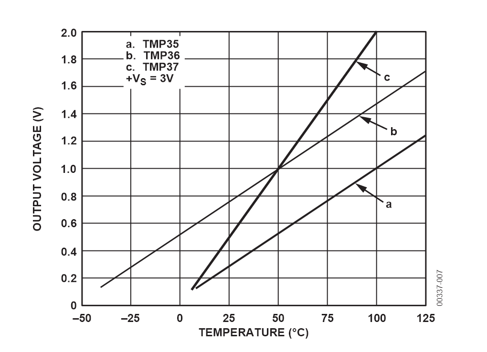

<!-- headingDivider: 2 -->

# TMP36 Analog Temperature Sensor


## TMP 36

* Analog temperature sensor
* Measures environment temperature and returns a voltage
* Output voltage is linearly proportional to temperature
  * What does this mean?


## TMP 36




## TMP 36 Datasheet

* What are the most important elements we should be looking for?
* [Datasheet](https://cdn.sparkfun.com/datasheets/Sensors/Temp/TMP35_36_37.pdf)

<!-- pin outs: 1=Vin, 2=Vout, 3=ground
orientation: flat part goes up
measurement range: -40 C -- 125 C (-40 F -- 257 F)
voltage range: 2.7 V to 5.5
scale factor: 10mV per C with a 500mv offset
accuracy: +- 1 C 
-->

## Conversion

* 10 mV / deg Celsius with a 500 mV offset (since voltage is 500 mv at 0 deg Celsius)
  <!-- found on page 8, table 4 AND page 5, figure 6 -->
* Try this: if **Vout** is 1.2V, what is the temperature in Celsius? in Fahrenheit?
* *Remember:*
  * `T(fahr) = T(cel) * (9/5) + 32`
  * `T(cel) = (T(fahr) - 32 ) * (5/9)`

<!-- consider offset: 
1.2v - 500mv = 1.2V - 0.5V = 0.7V
now handle conversion
 0.7 V * degC / 10mV = 0.7V * degC / 0.01V 
=0.7V * degC * 100 = 70 degC
Now to fahrenheit
158 degF
-->

## Important: C++ `int` and `float`

- Division with `ints` in C++ truncates decimals

```c++
int x = 3;
int y = 6;
float result = x / y; // 0 since 3/6 is truncated` 
```

  - Instead, make sure to **cast** (convert) one of the `int` values to be a `float`

```c++
int x = 3;
int y = 6;
float result = (float) x / y;
```

​    

## TMP36 Wiring


- Note that is **BOTTOM VIEW**

## Exercise Wiring


## Exercise

* Connect a TMP36 and output the current temperature to the serial monitor
* Consider what type of input is this signal? How will this value be read by Photon 2?

<!-- This also tests a few C++ features 
Variable types: analog read value is INT, but voltage and temperature need to be DOUBLE 
Division: C++ division (in Cel->Fahr) needs to be between doubles 
 Note: this picture is the BOTTOM VIEW, not top down
-->


## Credit

- [Analog datasheet](https://cdn.sparkfun.com/datasheets/Sensors/Temp/TMP35_36_37.pdf)
- [Sparkfun](https://www.sparkfun.com/products/10988)
- Images created with [Fritzing](https://fritzing.org/home/)


