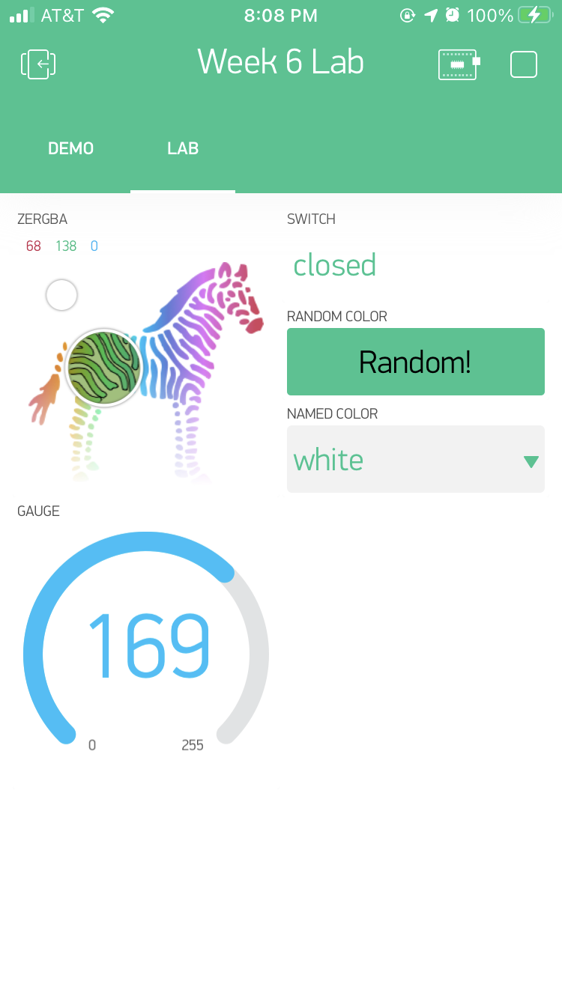
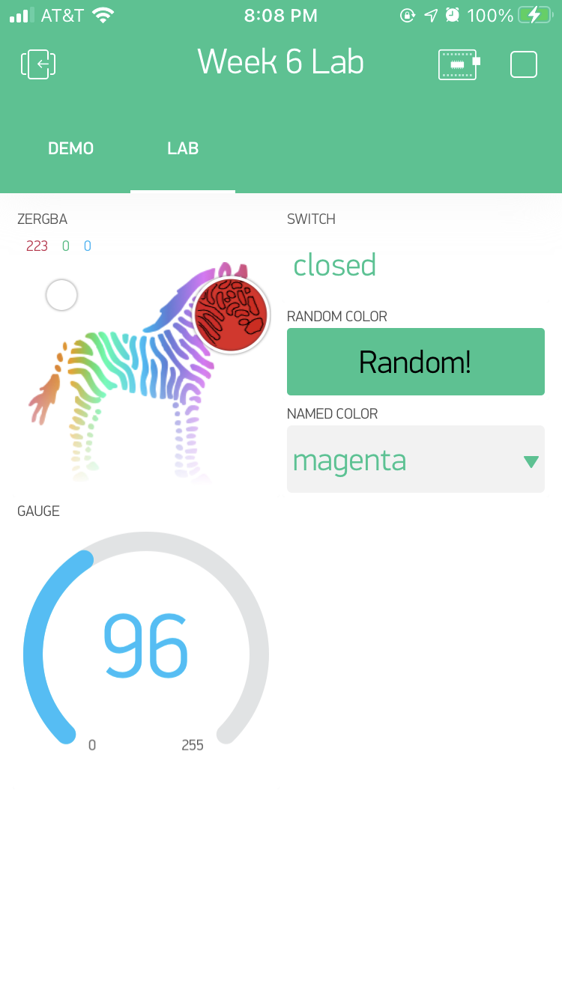

<!-- headingDivider: 2 -->
<!-- new version -->
<!--NB: need to create a new template for each project; need to create datastream for each variable ahead of time; need to create device for each project-->

# Blynk Overview and Configuration


	 

## What is Blynk?

* Blynk is a drag-and-drop, visual tool to build mobile apps
* Mobile apps can interact with, receive data from, and control IoT devices 
* You can develop add your own branding and package the app with your IoT device

## Blynk Functionality

- Data storage
- Display real-time sensor data and historical data
- Control IoT device from app
- Email / push notification when device is offline
- Custom webhooks

## Blynk Evaluation

| Advantages                                                   | Disadvantages                                    |
| ------------------------------------------------------------ | ------------------------------------------------ |
| Highly customizable                                          | Free version has limitations                     |
| Easier to integrate than other mobile dashboards (e.g. Losant) | Dashboard is limited (compared to Initial State) |
| Easy to design mobile app without coding                     | Requires modifying `loop()` logic                |
| Control IoT device better than with IFTTT                    | Mobile only (can't view on web)                  |

## Quick Blynk Definitions

- Template: store configuration settings for your project; need to create a new template for each project
- Device: represents your argon
- Datastream: channels that send data between the device and Blynk; each variable you send needs separate datastream 
- Virtual Pins

## Virtual Pins

- Use **virtual pins** to send and receive data from Argon
- These are not real hardware pins, but just a concept used by Blynk
- Virtual pins support `ints` and `Strings` (unlike hardware pins) 
- 32-128 pins are supported (label `V0`, `V1`, etc.)
- Note: You **can not** use `const int` to define virtual pins. If you want to define pin label, use `#define VPIN_LED V2` syntax

## Three Phases to Integrate Blynk

There are three places we need to configure to use Blynk

1. **Blynk Cloud website ([https://blynk.cloud](https://blynk.cloud))**
   This is where we configure the data that will be sent
2. **Workbench**
   This is where we write the Argon could to send data
3. **Blynk mobile app** 
   This is where we will design the interface

## Integration Phase 1: Blynk Cloud

Blynk Cloud website ([https://blynk.cloud](https://blynk.cloud))

- Create template (new template for every new project)
- Create datastreams (one for each piece of data to be sent to cloud)
- Create device (this represents your Argon)
- Copy config info / key into Workbench Sketch

## Integration Phase 1: Create template


## Integration Phase 1: Create datastreams


Click **Save**

 

## Integration Phase 1: Create new device


## Integration Phase 1: Configuration Info / Key

​	Copy this info to include in sketch

## Integration Phase 2: Workbench

- Create new sketch
- Install `blynk` library
- Start with template listed below
- Add your unique custom info / keys from Blynk Cloud

## Integration Phase 2: Create Sketch

Start with this template

```c++
#define BLYNK_TEMPLATE_ID "ADD_YOUR_OWN"
#define BLYNK_DEVICE_NAME "ADD_YOUR_OWN"

#define BLYNK_PRINT Serial 

#include <blynk.h>

#define BLYNK_IP IPAddress(64, 225, 16, 22)  // https://ny3.blynk.cloud/ – New York
char auth[] = "ADD_YOUR_OWN_AUTH_TOKEN";

void setup() {
    Serial.begin(9600);
    Blynk.begin(auth, BLYNK_IP);
}
void loop() { Blynk.run(); }
```


<!--Change `BLYNK_AUTH_TOKEN` to be a `char[]`
`#define BLYNK_AUTH_TOKEN "z31PRR2NbCeR91OvDzvNTEQzLC_Bezwg";`
to
`char auth[] = "z31PRR2NbCeR91OvDzvNTEQzLC_Bezwg";`
-->

## Integration Phase 2: Add Your Own Custom Keys

### Update values in sketch 

- `#define BLYNK_TEMPLATE_ID ...`
- `#define BLYNK_DEVICE_NAME ...`
- `char auth[]=...`

### Test

- Device should appear connected 


## Integration Phase 3: Blynk App

- Install Blynk app on your phone
- Switch to [Developer Mode](https://docs.blynk.io/en/getting-started/developer-mode) and select the template you created
- Build interface in Blynk mobile app

## How to build Blynk Sketches

## Three important rules about `loop()`

- `loop()` must include the following code

```c++
void loop(){
  Blynk.run();
}
```

- Do **not** use delay in `loop()` or it will interfere with cloud connection
- Must use a `millis()` or a timer to send data to app (limit to 10 values per second)

## App: Send data from Blynk App to Argon

.png).png)


## Syntax: Send data from Blynk App to Argon

- To send data FROM **app** TO **argon**, create a `BLYNK_WRITE(vPin)` function 
- This event handler will be called automatically when the app changes

```c++
BLYNK_WRITE(<<VIRTUAL_PIN>>){
    //code
}
```

## Example: Send data from Blynk App to Argon

```c++
BLYNK_WRITE(V0){
  //assign incoming value from pin V0 to a variable
  int pinValue = param.asInt(); //or param.asStr() or .asDouble()
  Serial.println("V0 Slider value is: " + String(pinValue));
}
```

## Syntax: Send data from Argon to Blynk App

- To send data from Argon to Blynk App, use 

```c++
Blynk.virtualWrite(<<PIN>>, <<VALUE>>);
```

## Example: Send data from Argon to Blynk App

```c++
unsigned long blynkDelay = 10000; //change this as needed

void loop() {
  unsigned long curMillis = millis();
  if (curMillis - prevMillis > blynkDelay) {
    double tempF = ...; //read a sensor
    Blynk.virtualWrite(V1, tempFermF);
    prevMillis = curMillis;
  }
 
  Blynk.run();
}
```

## App: Send data from Argon to Blynk App

.png)

## Exercise

* Install Blynk app on your phone
* Create Blynk template
* Create Blynk datastream


- Connect RGB led and magnetic switch 

* Build Blynk with the following features
  * Use button to control onboard LED via pin `V5` (app --> argon)
  * Send random number (0-255) to app and display on pin `V6` (argon --> app)
  * Use virtual LED to show random number on pin `V6` (argon --> app)

## Lab


## Lab

* Work in teams and create the following functionality in Blynk app

  * Use ZeRGBa to control LED on pins `V0 V1 V2` (app --> argon)
  * Use display to show if switch is `open` or `closed` on pin `V3` (argon --> app)
  * Create a button on `V4` to display a random color from an enumerated list

  ```c++
  enum Color { WHITE = 1, GREEN, MAGENTA, BLUE, YELLOW, RED, ORANGE };
  ```

  * Create a menu to display a named color from the enum options `Color`on pin `V5` (app --> argon)
  * Create gauge display the random number on pin `V6` (argon --> app)

* What happens if you put `Blynk.syncAll();` at the end of `setup()`? 

## Lab Blynk App

|                                                              |                                                              |
| ------------------------------------------------------------ | ------------------------------------------------------------ |
|  |  |


## Resources

- [Blynk example builder](https://examples.blynk.cc/?board=Particle%20Photon&shield=Particle%20WiFi&example=Widgets%2FTerminal)

## Credit

* Image from [Blynk](https://blynk.io/)

