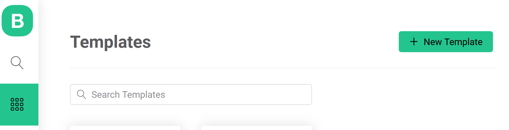
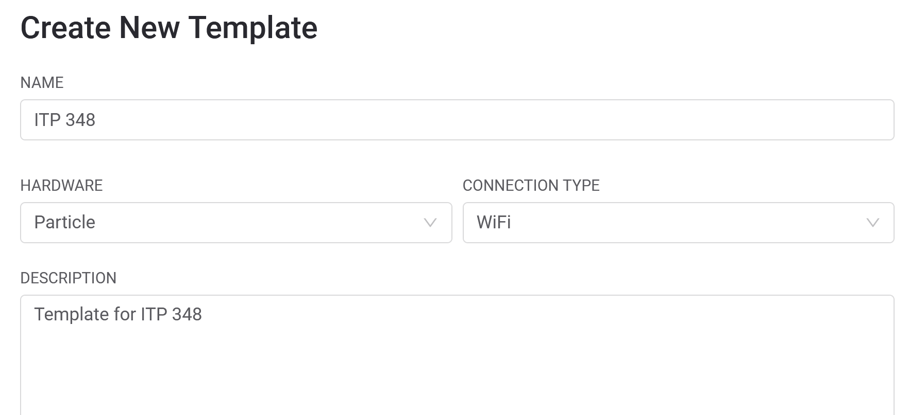
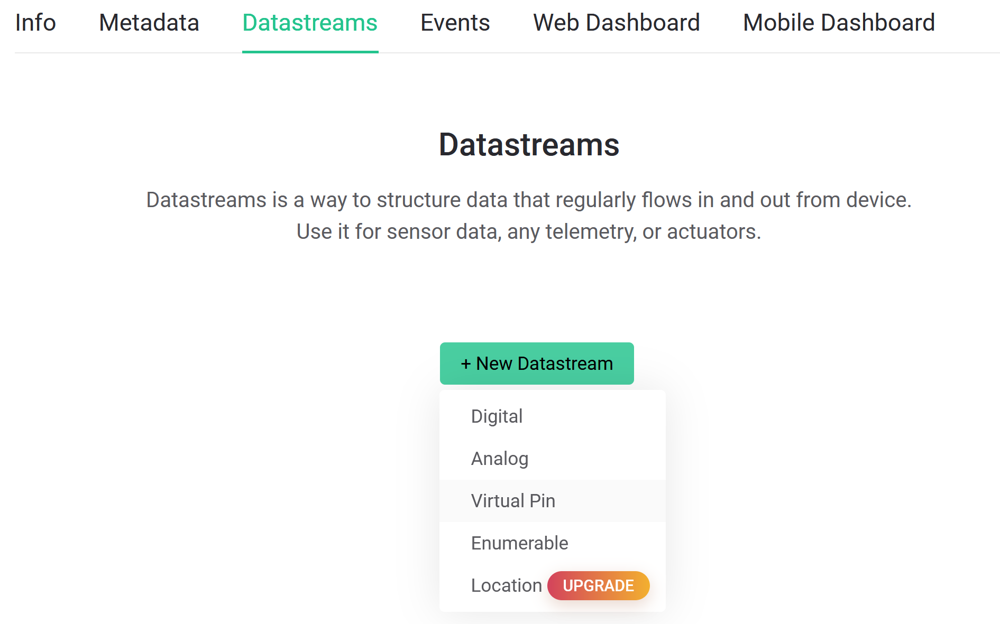
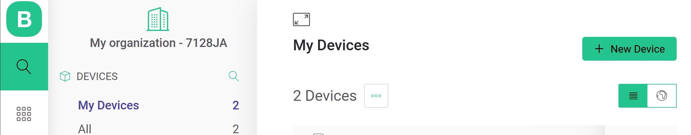
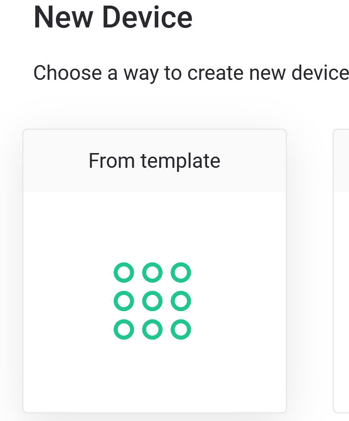
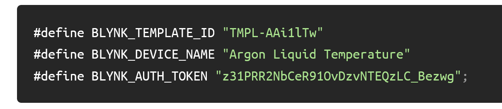
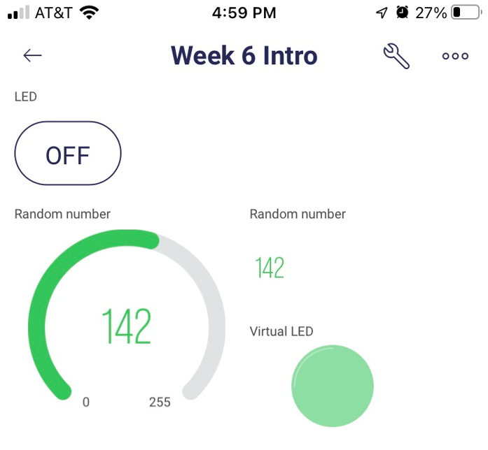
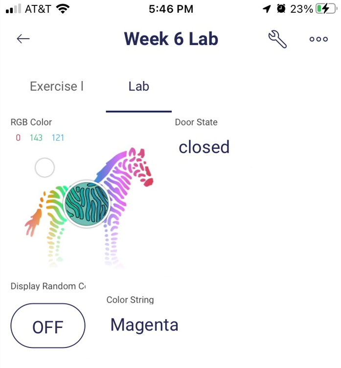

<!-- headingDivider: 2 -->
<!-- new version -->
<!--NB: need to create a new template for each project; need to create datastream for each variable ahead of time; need to create device for each project-->

# Blynk Overview 


	 

## What is Blynk?

* Blynk is a drag-and-drop, visual tool to build mobile apps
* Mobile apps can interact with, receive data from, and control IoT devices 
* You can develop add your own branding and package the app with your IoT device

## Blynk Functionality

- Data storage
- Display real-time sensor data and historical data
- Control IoT device from app
- Email / push notification when device is offline
- Custom webhooks

## Blynk Evaluation

| Advantages                                                   | Disadvantages                                    |
| ------------------------------------------------------------ | ------------------------------------------------ |
| Highly customizable                                          | Free version has limitations                     |
| Easier to integrate than other mobile dashboards (e.g. Losant) | Dashboard is limited (compared to Initial State) |
| Easy to design mobile app without coding                     | Requires modifying `loop()` logic                |
| Control IoT device better than with IFTTT                    | Mobile only (can't view on web)                  |

## Quick Blynk Definitions

- Template: store configuration settings for your project; need to create a new template for each project
- Device: represents your argon
- Datastream: channels that send data between the device and Blynk; each variable you send needs separate datastream 
- Virtual Pins

## Virtual Pins

- Use **virtual pins** to send and receive data from Argon
- These are not real hardware pins, but just a concept used by Blynk
- Virtual pins support `ints` and `Strings` (unlike hardware pins) 
- 32-128 pins are supported (label `V0`, `V1`, etc.)
- Note: You **can not** use `const int` to define virtual pins. If you want to define pin label, use `#define VPIN_LED V2` syntax

# Blynk Integation

## Three Phases to Integrate Blynk

There are three places we need to configure to use Blynk

1. **Blynk Cloud website ([https://blynk.cloud](https://blynk.cloud))**
   This is where we configure the data that will be sent
2. **Workbench**
   This is where we write the Argon could to send data
3. **Blynk mobile app** 
   This is where we will design the interface

## Integration Phase 1: Blynk Cloud

Blynk Cloud website ([https://blynk.cloud](https://blynk.cloud))

- Create template (new template for every new project)
- Create datastreams (one for each piece of data to be sent to cloud)
- Create device (this represents your Argon)
- Copy config info / key into Workbench Sketch

## Integration Phase 1: Create template






## Integration Phase 1: Create datastreams




Click **Save**

 

## Integration Phase 1: Create new device







## Integration Phase 1: Configuration Info / Key

Copy this info to include in sketch below (**Note: this is just an example--use the unique values for your template)**


## Integration Phase 2: Workbench

- Create new sketch
- Install `blynk` library
- Modify sketch with Blynk configuration
- Add your unique custom info / keys from Blynk Cloud

## Integration Phase 2: Modify sketch with Blynk configuration

1. Copy the lines from the template to the top of your sketch:

```c++
#define BLYNK_TEMPLATE_ID "ADD_YOUR_OWN"
#define BLYNK_DEVICE_NAME "ADD_YOUR_OWN"
#define BLYNK_AUTH_TOKEN "ADD_YOUR_OWN"
```

**Important:** Make sure to **delete** the **`;`** at the end of the line `#define BLYNK_AUTH_TOKEN` (it shouldn't be there)


2. Also add these lines beneath the template lines:

```c++
#define BLYNK_PRINT Serial 
#include <blynk.h>
```

<!-- as of Oct 2022, you don't need the BLYNK_IP -->


3. Add these line to the end of `setup()`

```c++
delay(5000);
Blynk.begin(BLYNK_AUTH_TOKEN);
```


4. Add this line to the top of `loop()`

```c++
Blynk.run();
```

<!--Change `BLYNK_AUTH_TOKEN` to be a `char[]`
`#define BLYNK_AUTH_TOKEN "z31PRR2NbCeR91OvDzvNTEQzLC_Bezwg";`
to
`char auth[] = "z31PRR2NbCeR91OvDzvNTEQzLC_Bezwg";`
-->


## Integration Phase 3: Blynk App

- Install Blynk app on your phone
- Switch to [Developer Mode](https://docs.blynk.io/en/getting-started/developer-mode) and select the template you created
- Build interface in Blynk app

# Building Blynk Projects

## Important notes about `loop()`

- Do **not** use `delay()` in `loop()` or it will interfere with cloud connection

- Instead, use a `millis()` or a timer to send data to app (limit to 10 values per second)

## App: Send data from Blynk App to Argon

.png).png)


## Syntax: Send data from Blynk App to Argon

- To send data FROM **app** TO **argon**, create a `BLYNK_WRITE(vPin)` function 
- This event handler will be called automatically when the app changes

```c++
BLYNK_WRITE(<<VIRTUAL_PIN>>){
    //code
}
```

## Example: Send data from Blynk App to Argon

```c++
BLYNK_WRITE(V0){
  //assign incoming value from pin V0 to a variable
  int pinValue = param.asInt(); //or param.asStr() or .asDouble()
  Serial.println("V0 Slider value is: " + String(pinValue));
}
```

## Syntax: Send data from Argon to Blynk App

- To send data from Argon to Blynk App, use 

```c++
Blynk.virtualWrite(<<PIN>>, <<VALUE>>);
```

## Example: Send data from Argon to Blynk App

```c++
unsigned long blynkDelay = 10000; //change this as needed

void loop() {
  unsigned long curMillis = millis();
  if (curMillis - prevMillis > blynkDelay) {
    double tempF = ...; //read a sensor
    Blynk.virtualWrite(V1, tempFermF);
    prevMillis = curMillis;
  }
 
  Blynk.run();
}
```

## App: Send data from Argon to Blynk App

.png)

## Wiring for Exercise and Lab


## Exercise

* Connect RGB led and magnetic switch 
* Install Blynk app on your phone
* Create Blynk template
* Create Blynk datastream

    | Datastream Name | Virtual Pin |
    | --------------- | ----------- |
    | `Onboard LED`   | `V5`        |
    | `Random Number` | `V6`        |


- Build Blynk with the following features


    - Use button to control onboard LED (`D7`) via pin `V5` (app --> argon)
    - Send random number (0-255) to app and display on pin `V6` (argon --> app)
    - Use virtual LED to show random number on pin `V6` (argon --> app)
    - Use a gauge to show random number on pin `V6`

## Exercise App Layout



## Lab

* Work in teams and create the following functionality in Blynk app

  | Datastream                    | Virtual Pin |
  | ----------------------------- | ----------- |
  | `RGB Red`                     | `V0`        |
  | `RGB Green`                   | `V1`        |
  | `RGB Blue`                    | `V2`        |
  | `Door State`                  | `V3`        |
  | `Button Display Random Color` | `V4`        |
  | `Displayed Color String`      | `V7`        |

  * Use **ZeRGBa** to control RGB LED on pins `V0 V1 V2` *(app --> argon)*
  * Use a display to show if magnetic switch is `open` or `closed` on pin `V3` *(argon --> app)*
  * Use a button on `V4` to trigger the RGB LED to display a random color (white, yellow, magenta, red) *(app --> argon)*
  * When one of the four random colors is displayed on the RGB LED, send a string representing that color to the app on pin `V7` *(argon --> app)*

* What happens if you put `Blynk.syncAll();` at the end of `setup()`? 

## Lab App Layout




## Resources

- [Blynk Documentation](https://docs.blynk.io/en/)

## Credit

* Image from [Blynk](https://blynk.io/)

