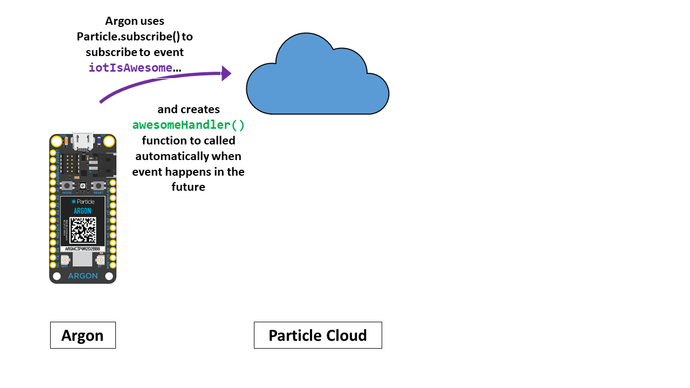

<!-- headingDivider: 2 -->

# Cloud Communication


## Review: Publishing Events

* Events are messages sent from an Argon to the cloud **as often as you choose**
* Events can private (viewable by only by you and devices in your account) 
* Events can be public (viewing by anyone in the world)
  * Public events should not include any confidential data
* Events can be accessed in [Particle console]([https://console.particle.io/](https://console.particle.io/)), app, or by other devices (subscribing)

## Events in Particle Console


## Publish Syntax

```c++
Particle.publish(<<EVENT_NAME>>, <<EVENT_VALUE>>, <<FLAGS>>); 
```

Example

```c++
Particle.publish("lightValue", "bright", PUBLIC); 
Particle.publish("tempFahr", String(85.9), PRIVATE);
```

* Names and values must always be strings
* Should only publish 1 event / sec (or burst of 4 events in 1 sec)

## Events Part 2: Subscribing to Events 

* Argon can by notified when a particular event published
  * This is called **subscribing** to an event
* When the notification arrives, the Argon can then call a function
  * This function is called an **event handler**
  * Performs any action in response to the event
* Can subscribe to any public events, or any private event generated by devices in your account

## Event-Driven Programming Overview

* Argon tell the cloud,  "I want to listen for something called an **event**"
* Later, Cloud  tells Argon, "The **event** just happened, and here is some  **data** (variables)"
* Argon then **automatically** executes the **event handler function**
  * This seems confusing--WE DO NOT call the event handler function
  * We just define the function body, and Argon calls it when the event arrives

## Illustration - Subscription Setup


## Illustration - Subscription Setup



## Illustration - Event Published


## Illustration - Subscription Notification


## Illustration - Event Handler Function


## Subscribing Process

1. Create an event handler (regular C++ function) to be called when the event arrives 
2. Call `Particle.subscribe` within `setup()` to register the subscription

## Review: Publish Syntax

```c++
Particle.publish(<<EVENT_NAME>>, <<EVENT_VALUE>>, <<FLAGS>>); 
```

Example

```c++
Particle.publish("lightValue", "bright", PUBLIC); 
Particle.publish("tempFahr", String(85.9), PRIVATE);
```


## Subscribing Syntax: Event Handler

```C++
void <<EVENT_HANDLER>>(const char* event, const char* data) {
```

Example
```C++
void tempEventHandler(const char* event, const char* data) {
    Serial.println("Just received the event called " +
                   String(event) + " with the value " + 
                   String(data));
```

## Subscribing Syntax: Event Handler

```C++
void tempEventHandler(const char* event, const char* data) {
```

* `event` is the parameter that will be the event name
* `data` is the parameter that will be the data sent by the event
* Technically, these are pointers to C-style arrays. For our purposes, we will convert them to `String` 

## Subscribing Syntax: Subscribing to an Event 

```C++
Particle.subscribe(<<EVENT_NAME>>,
                   <<EVENT_HANDLER_C++_FUNCTION>>,
                   <<FLAGS>>);
```
Example 
```C++
void setup() {
    Particle.subscribe("tempFahr", tempEventHandler,MY_DEVICES);
```
* `MY_DEVICES` subscribes to PRIVATE events
* `ALL_DEVICES` subscribes to PUBLIC events

## Lab Goal

* Working in pairs, have an "open door" on one student's device
  change the LED color on the other student's device

## Lab Part 1:

* Publish **public** cloud event with state `doorOpen` or `doorClosed` when switch is opened
* Event name should be 
  `ITP348/Door/<<YOUR_INITIALS>>`


## Lab Part 2:

* Create event handler
* Register subscriber for the *other* student's event
  `ITP348/Door/<<THEIR_INITIALS>>`

* Red means "door is open"
* White means "door is closed"

## Documentation

* [Particle Cloud API](https://docs.particle.io/reference/device-os/firmware/argon/#cloud-functions)
* [Publishing Events](https://docs.particle.io/reference/device-os/firmware/argon/#particle-publish-)
* [Cloud Variables](https://docs.particle.io/reference/device-os/firmware/argon/#particle-variable-)
* [Cloud Functions](https://docs.particle.io/reference/device-os/firmware/argon/#particle-function-)
* [Subscribing to Events](https://docs.particle.io/reference/device-os/firmware/argon/#particle-subscribe-)
