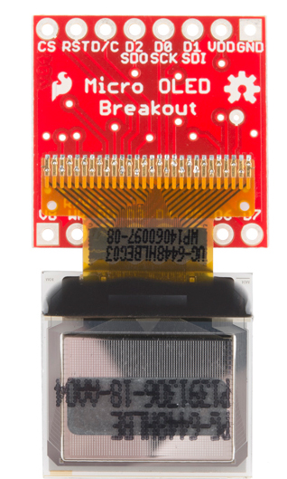
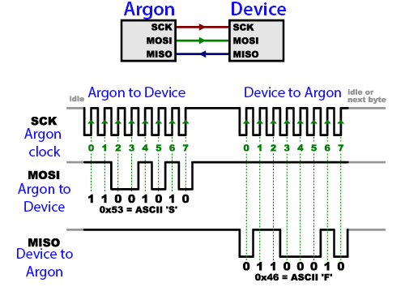

<!-- headingDivider: 2 -->

<!-- reference for library api
https://learn.sparkfun.com/tutorials/micro-oled-breakout-hookup-guide#using-the-arduino-library -->

# SPI OLED

## Improving Output
* Serial monitor is fine for debugging, but we need better output to build device

* Let's introduce one output device

  
  
  ## Organic Light-Emitting Diode

## OLEDs

* OLEDs are like regular LEDs, but they can be manufactured to be thin and bendable
* OLEDs are used in high end TVs, monitors, and phones
* OLEDs are more expensive than LED

## Our Micro OLED has two components

## OLED Screen

## OLED screen

* Blue text on black screen
* 64 pixels (H) x 48 pixels (W)
* Operates at 3.3v
* Controlled via I2C or SPI (more on this later)
* 31 pins (!) 

## Breakout Board

## Breakout Board

* Custom circuit board that provides access to ("breaks out") the small pins on the screen
* This breakout board allows us to connect to 16 pins of the screen, but we only need to worry about the top 8 pins

## Breakout Board Pins

## 

| OLED | Argon    | SPI Function | Notes                                                        |
| --------- | ------------ | ------------ | ------------------------------------------------------------ |
| GND       | GND          | Ground       | Ground                                                       |
| 3V3       | 3V3          | Power        | 3.3v                                                         |
| D1 (SDI)  | MO           | MOSI         | Serial data in                                               |
| D0 (SCK)  | SCK          | SCK          | SPI clock                                                    |
| D2 (SDO)  | -            | MISO         | Unused                                                       |
| D/C       | Digital Pin | Data / Command | Specify incoming byte as command or screen data |
| RST       | Digital Pin | Reset        | Active-low reset (3.3v to enable)          |
| CS        | Digital Pin | CS           | SPI chip select (active-low)                                 |

## Communication

* Communicating with the screen directly is complicated but we can use a library
* Argon can communicate with the screen using two different protocols: **SPI** or **I2C**

## Serial Peripheral Interface (SPI)

* Means of sending and receiving data between devices
* **Synchronous:** data is sent on regular intervals controlled by a clock
* **Serial:** one bit at time is sent / received

## What is Synchronous Communication?

## What is Synchronous Communication?

* Data pin and clock pin

* Clock is an oscillating square wave
* On rising (low to high) or falling (high to low) edge, the receiver samples ("read") data line 

## SPI

## 

| OLED | Argon    | SPI Function | Notes                                                        |
| --------- | ------------ | ------------ | ------------------------------------------------------------ |
| GND       | GND          | Ground       | Ground                                                       |
| 3V3       | 3V3          | Power        | 3.3v                                                         |
| D1 (SDI)  | MO           | MOSI         | Serial data in                                               |
| D0 (SCK)  | SCK          | SCK          | SPI clock                                                    |
| D2 (SDO)  | -            | MISO         | Unused                                                       |
| D/C       | Digital Pin | Data / Command | Specify incoming byte as command or screen data |
| RST       | Digital Pin | Reset        | Active-low reset (3.3v to enable)          |
| CS        | Digital Pin | CS           | SPI chip select (active-low)                                 |

## Challenge

* Use notes and guides to connect OLED. Get "Hello world!" to appear.
* Then, use two potentiometers (to draw) and one button (to reset), create an [Etch A Sketch](https://www.youtube.com/watch?v=vVA9wdiIlN4)
* [Library code](https://github.com/sparkfun/Micro_OLED_Breakout/tree/V_1.0)
* [Hookup guide](https://learn.sparkfun.com/tutorials/micro-oled-breakout-hookup-guide)
* [Datasheet](https://cdn.sparkfun.com/assets/learn_tutorials/3/0/8/SSD1306.pdf)

## Credit

- [Sparkfun](https://learn.sparkfun.com/tutorials/micro-oled-breakout-hookup-guide)
- [Sparkfun](https://learn.sparkfun.com/tutorials/serial-peripheral-interface-spi/all)
- Images created with [Fritzing](https://fritzing.org/home/)

