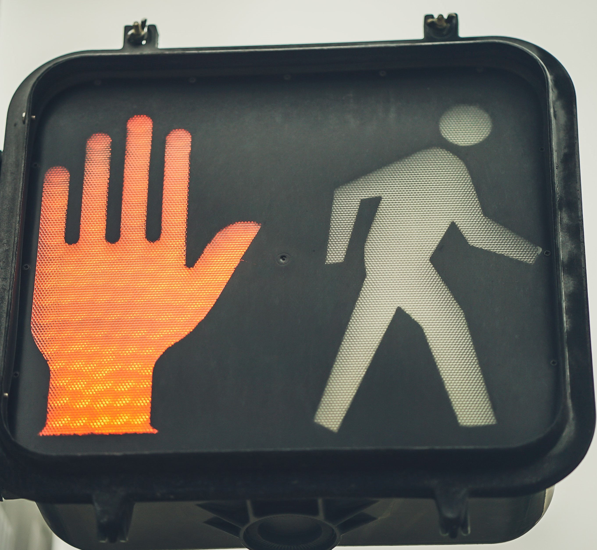

<!-- headingDivider: 2 -->

# State Machines
### ITP 348 - Introduction to Physical Computing


## Learning Objectives
* Understand what a state machine is
* Describe situations where a state machine is useful
* Analyze a real-world situation to create states, transitions, and input
* Implement a state machine in Argon firmware

## What's the main point?

* Our devices should operate remotely without constant user intervention
* Our devices can receive various sensor data (**input**) in different situations (**states**), which results in different actions (**outputs**)
* Tracking and organizing all these possibilities can become very complicated
* **State machines** provide a way of thinking about and designing for the various situations that arise

## State Machine

* A state machine (or *finite state machine*) is mental **model** to help us make decisions
  * It is not just hardware or just software code
* Examine
  * What has happened previously (**state**)
  * What is happening currently (**input**)

* Then generate
  * Next **output**
  * Next **state** (transition)

## Example #1 Stoplight


## Example #1 Stoplight

* Consider a simplified stoplight without any pedestrians
* Lights changed after a fixed time
* What states are there?
* How do we transition to new states?

## Example #1 Stoplight Diagram


<!-- draw state diagram
-->

## Example #1 Stoplight

| State            | Output (Stoplight Color) |
| ---------------- | ------------------------ |
| Traffic Flows    | Green                    |
| Traffic Stopping | Yellow                   |
| Traffic Stopped  | Red                      |

## Example #2 Sprinkles Cupcake ATM 


<!--

-->

<!-- draw state diagram
idle +start+ display 
display +select+ process
display -cancel- idle
display |selection empty| display 
process +credit card valid+ dispense
process |credit card valid| process
dispense |cupcake remains| dispense
dispense +cupcake taken| idle
-->

## Example #2 Sprinkles Cupcake ATM Diagram
* Similar to soft drink vending machine
* What states are there?
* How do we transition to new states?

## Example #2 Sprinkles Cupcake ATM

| State               | Input              | Next State          |
| ------------------- | ------------------ | ------------------- |
| Idle                | None               | Idle                |
| Idle                | Start button       | Display choices     |
| Display choices     | Choice available   | Process credit card |
| Display choices     | Choice unavailable | Display choices     |
| Display choices     | Cancel             | Idle                |
| Process credit card | Card valid         | Dispense cupcake    |
| Process credit card | Card invalid       | Process credit card |
| Dispense cupcake    | Cupcake taken      | Idle                |
| Dispense cupcake    | Cupcake remains    | Dispense cupcake    |

## State Machines in Argon

* In order to implement this in our firmware, what elements / functions to we need to create?
  * inputs 
  * outputs
  * state 
  * state transition logic 
* How would we implement these in firmware?


## State Machines in Argon

* inputs (e.g. `millis()` timer, `digitalRead`, `analogRead`)

* outputs (e.g. LED, speaker, OLED screen)

* state (create `enum` to track current state and next state)

* state transition logic
  * typically a function with conditional logic like `switch` or `if`
  * use current state and any input to determine the next state 

## State Transition Logic Example
* Let's look at just one piece of the Sprinkles vending machine, namely processing valid and invalid credit cards

| State               | Input        | Next State          |
| ------------------- | ------------ | ------------------- |
| Process credit card | Card valid   | Dispense cupcake    |
| Process credit card | Card invalid | Process credit card |

## State Transition Logic Example
* Input: credit card valid or invalid
  * global variable `bool cardValid`
* States: describe all possible states and track current state
  * `enum State {...}`
  * `State currentState;`
```c++
//Global variables
bool cardValid;   //is customer card valid
enum State {IDLE, DISPLAY, PROCESS, DISPENSE }; //all possible states
State currentState;   //state the machine is in right now 
```

## State Transition Logic Example
* State transition: conditional logic to move to next state based on `currentState` and `cardValid`
```c++
void updateNextState() {
   switch(currentState) { 
      case PROCESS:                 //current state is processing credit card
         if (cardValid == true) {   //credit cart is valid so start dispensing
            currentState = DISPENSE;
         }
         //if cardValid == false, remain in PROCESS state
         //no else block is needed
   }
}
```


## In class Lab - Stoplight and Pedestrian Signal

 

## In class Lab - Stoplight and Pedestrian Signal

* We are going to build a stoplight for a two way intersection with a diagonal pedestrian crossing (meaning all traffic stops)
  * also known as a pedestrian scramble
* Here is how this type of intersection works

## 


## 


## 


## 


## 


## In class Lab - Stoplight and Pedestrian Signal


* Download starting code
  * Go to [https://bit.ly/ProjectZip](https://bit.ly/ProjectZip)
  * Paste the following link into the top right
    https://github.com/reparke/ITP348-Physical-Computing/tree/master/_exercises/week07/stop_light_start
* Wire device as shown below

## Wiring Diagram

You'll need
* 2 green LEDs
* 2 yellow LEDs
* 3 red LEDs
* 1 white LED
* 6 330 Ohm resistors

<!--  -->

## Wiring Diagram

| LED                   | Argon Pins |
| ---------------------------- | ---- |
| NorthSouth Red LED      | D2     |
| NorthSouth Yellow LED  | D3      |
| NorthSouth Green LED  | D4      |
| WestEast Red LED    |   A0   |
| WestEast Yellow LED  |     A1 |
| WestEast Green LED   | D5     |
| Walk White LED     |  D6    |
| Don't Walk Red LED   |  D7    |

## Lab Stages
1. North South stop light
2. Add Pedestrian Walk / Don't Walk light
3. Make Don't Walk light blink
4. Add West East stop light

* We will work through stage 1 together
* You will work in pairs implement stages 2-4, and we will review together as a class after each stage

## General Approach

* We will need to create a way to represent the states using `enum`
* We will need to track state transitions with **variables** for state
* We will need to control timing with `millis()`

* What does `loop()` do
  * calculate new state
  * output traffic signal LEDs based on state
  * independently flash walk signal *(later)*

## Credits

* [Bill Siever](http://siever.info) - [CS132 FSM](http://siever.info/cse132/guides/intro-to-FSMs.html)  (Washington University at St. Louis) 
* [Bill Siever](http://siever.info) - [CS132 Delta Timing](http://siever.info/cse132/weeks/3/)  (Washington University at St. Louis) 
* [USC EE109 State Machines](http://bits.usc.edu/files/ee109/)
* Photo by Laurie Parke
* Photo by [Michael Olsen](https://unsplash.com/@mganeolsen)</a> on [Unsplash](https://unsplash.com/)
* Photo by [Free To Use Sounds](https://unsplash.com/@freetousesoundscom?utm_source=unsplash&utm_medium=referral&utm_content=creditCopyText) on [Unsplash](https://unsplash.com/?utm_source=unsplash&utm_medium=referral&utm_content=creditCopyText)
* Photo by [NON](https://unsplash.com/@non_creation?utm_source=unsplash&utm_medium=referral&utm_content=creditCopyText) on [Unsplash](https://unsplash.com/?utm_source=unsplash&utm_medium=referral&utm_content=creditCopyText)