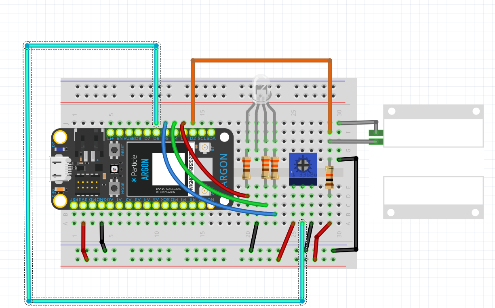
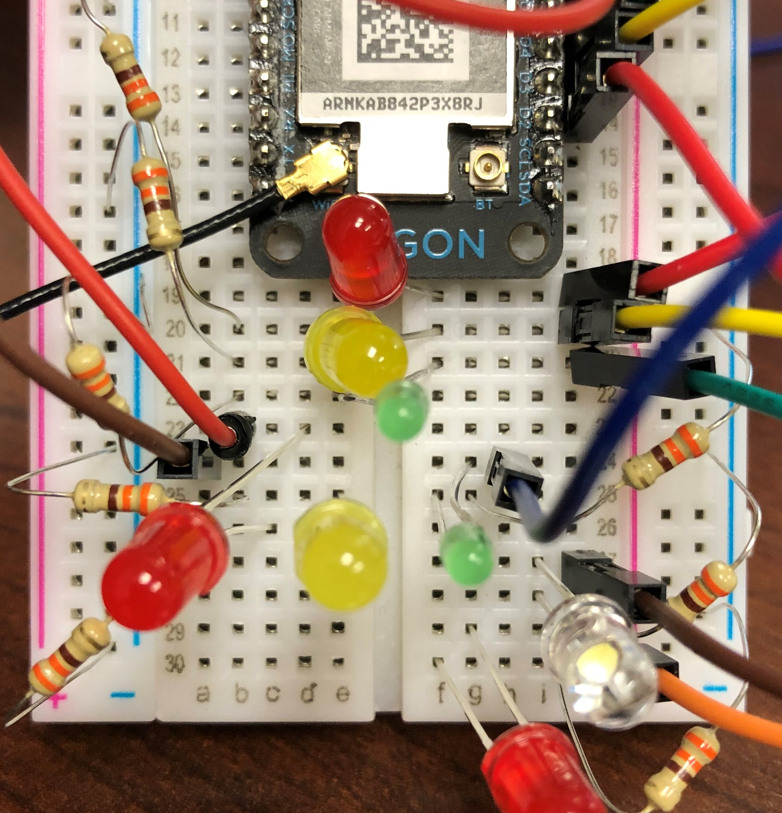

<!-- headingDivider: 2 -->

# State Machines
## In class Lab - Dishwashing Machine


## In class Lab - Dishwashing Machine

* We are going to build a simple dish washing machine with three cycles
  * Economy
  * Deluxe
  * Super Deluxe
* Each cycle will wash and dry the dishes in some manner
* The washer has a knob to change cycle (pot), a light to show the current state (RGB), and it starts automatically when the door is closed (magnetic switch)

## Cycles and States

| Cycles          | States                  |
| --------------- | ----------------------- |
| **Economy**     | **Idle** (white)        |
| **Deluxe**      | **HotWash** (red)       |
| **SuperDeluxe** | **ColdWash** (blue)     |
|                 | **RegularDry** (orange) |
|                 | **ExtraDry** (yellow)   |

## Transitions

- The potentiometer position determine the state by divide the potentiometer into 3 ranges
- The first state will start when the / switch is closed, and the next states will happen automatically on a `millis` timer

## Transitions

| Economy                          | Deluxe                           | SuperDeluxe                      |
| -------------------------------- | -------------------------------- | -------------------------------- |
| **Idle** if until button pressed | **Idle** if until button pressed | **Idle** if until button pressed |
| **ColdWash** for 2 min           | **HotWash** for 2 min            | **HotWash** for 4 min            |
| **RegularDry** for 2 min         | **RegularDry** for 2 min         | **ExtraDry** for 4 min           |
| **Idle**                         | **Idle**                         | **Idle**                         |


## In class Lab - Dishwashing Machine


* Download starting code
  * Go to [https://bit.ly/ProjectZip](https://bit.ly/ProjectZip)
  * Paste the following link into the top right
  ```https://github.com/reparke/ITP348-Physical-Computing/tree/master/_exercises/week07/washer_start```
* Wire device as shown below

## Wiring Diagram


## Wiring Diagram

You'll need

* 1 RGB
* 1 potentiometer
* 1 magnetic switch (pushbutton will work too)


<!--  -->

## Wiring Pin Guide

| LED                   | Argon Pins |
| ---------------------------- | ---- |
| Magnetic Switch | D5 |
| RGB Red LED      | D2   |
| RGB Green LED | D3    |
| RGB Blue LED | D4    |
| Potentiometer |   A5   |

## General Approach

* We will need to create a way to represent the states and cycles using `enum`
* We will need to track state transitions with **variables** for state
* We will need to control timing with `millis()`

* What does `loop()` do
  * calculate new state
  * update the timing of the new state
  * update the RGB light for the new state
## State Transition Diagram

- State transitions can often be represented with circle for the state
- Arrows represent the flow from one state to another
- Next to each arrow are the conditions that start the transition

## Diagram

## Credits

* [Bill Siever](http://siever.info) for the lab idea
* Photo by [Nathan Dumlao](https://unsplash.com/@nate_dumlao?utm_source=unsplash&utm_medium=referral&utm_content=creditCopyText) on [Unsplash](https://unsplash.com/s/photos/dishes?utm_source=unsplash&utm_medium=referral&utm_content=creditCopyText)
* Photo by Laurie Parke