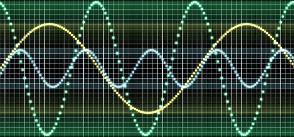
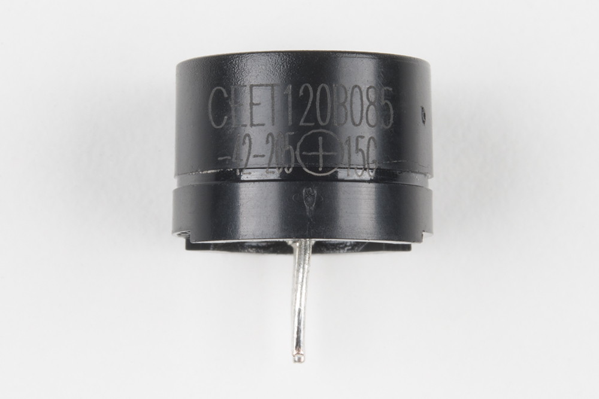

<!-- headingDivider: 2 -->

# Sound and Piezo Buzzers
   


## Quick Review: Sound Frequencies

  

* Sound is created by vibrations in air pressure (sound waves)
* Commonly we measure the amplitude (volume) and the frequency (perceived pitch)

## Piezo Buzzer

  

## Piezo Buzzer
* Uses magnetic coil to vibrate a metal disc to produce sound
* Control the pitch by a form of pulse width modulation (PWM)

## Uses of piezo buzzers

* Buzzer are small and cost-effective
* Can be used for alarms, games, toys
* Can produce tones and simulate single notes

## Limitations of Buzzer

* Frequency
  * Human hearing is roughly 20 Hz to 20,000 KHz 
  * Hertz (Hz) is cycles per second
  * Piezo buzzer operates up to 2.048 KHz
* Sound Quality
  * Only generate tones through square waves

## Connecting Buzzers


## Connecting Buzzers

  

* Buzzers are polarized so look for the **+**
* Negative pin to **gnd** and positive pin to Argon output

## Producing Sound

Syntax

```c++
tone(<<PIN>>, <<FREQUENCY>>, <<DURATION>>);
```

* `tone()` generates a square wave using PWM (50% duty cycle)

* `pin` is connected the speaker

* `frequency` is sound frequency in Hz (20Hz to 20KHz)

* `duration` is the length of tone in milliseconds 

## Producing Sound

  Example


```c++
tone(D6, 500, 1000);	// play 500Hz tone for 1000ms (1 sec)
tone(D2, 2000, 3000);	// play 2KHz tone for 3000 ms (3 sec)
tone(D2, 1000, 0);		// play 1KHz tone (don't stop)
```

## A Note on Argon and `tone()`

* `tone()` requires a pin that supports PWM
* PWM pins are assigned to one of three groups
* A group must produce the same tone (so maximum three tones at once)

	1. Pins D4, D5, D6, D8
	2. Pins A0, A1, A2, A3
	3. Pins D2, D3, A4, A5

## Stopping Sound
Syntax

```cpp
noTone(<<PIN>>);
```

* To stop a continuous tone or stop tone before duration is over

## Playing Melodies

* Musical notes can represented as constants ([code link](pitches.h))

## Optional: Controlling Volume


## Optional: Controlling Volume

* All tones will be at the same volume since Argon can change only frequency (not amplitude)
* To control volume, connect a potentiometer between `negative` and `gnd`
* Potentiometer acts a current limit resistor to control volume

## Finding Notes of Popular Songs

* [Notes for some popular songs](https://dragaosemchama.com/en/2019/02/songs-for-arduino/) (note that the format for playing notes is different in this code, but you can still extract the notes and duration from these examples)
* [MIDI to C converter](https://projects.neutonfoo.com/mc-piezo/) allows you convert a MIDI file directly into 

## References

* Images created with [Fritzing](https://fritzing.org/home/)
* [Pixabay](https://pixabay.com/illustrations/banner-header-sound-wave-music-1571999/)
* [Sparkfun](https://learn.sparkfun.com/tutorials/sparkfun-inventors-kit-experiment-guide---v40/circuit-2a-buzzer)
* [Neuton Foo](https://projects.neutonfoo.com/mc-piezo/)
