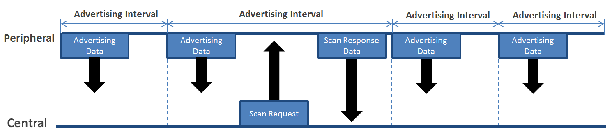
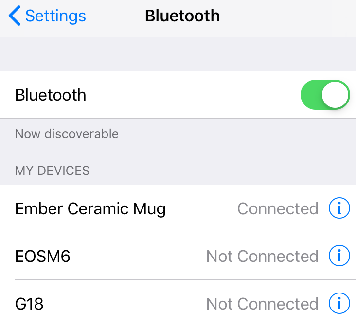
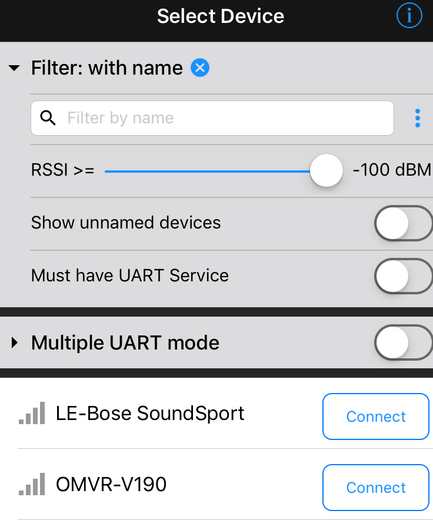
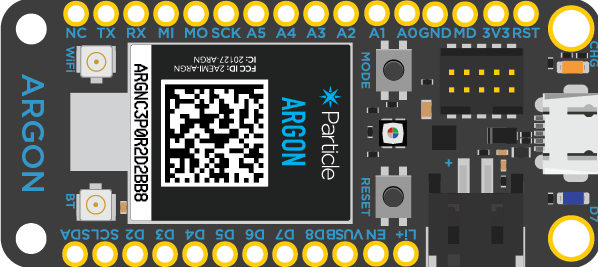
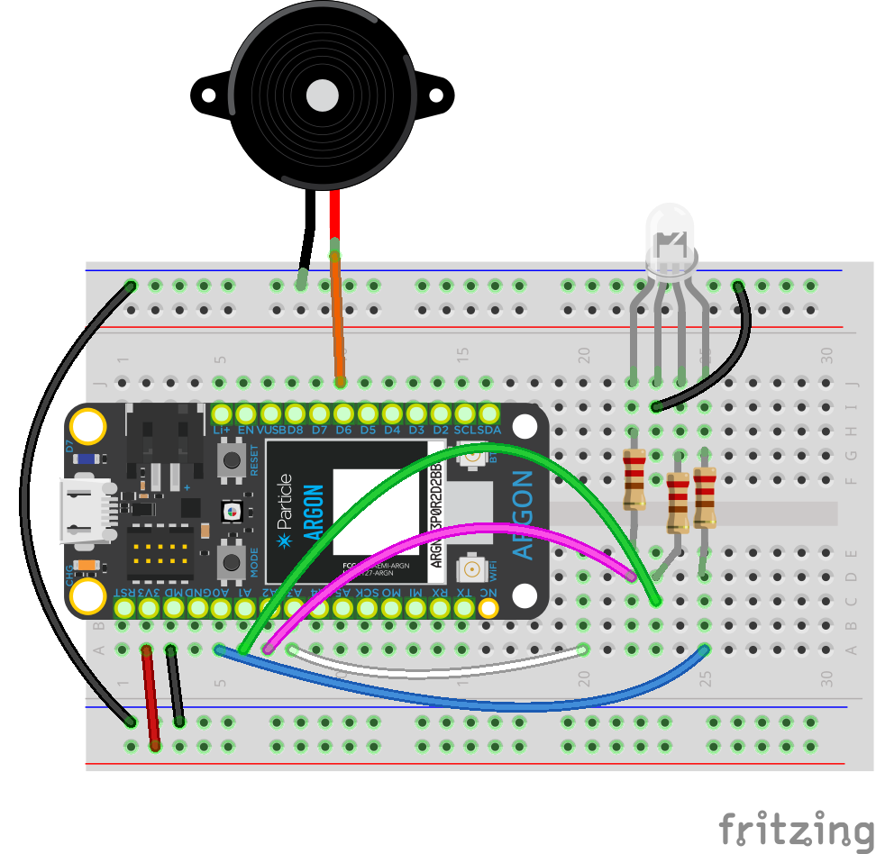
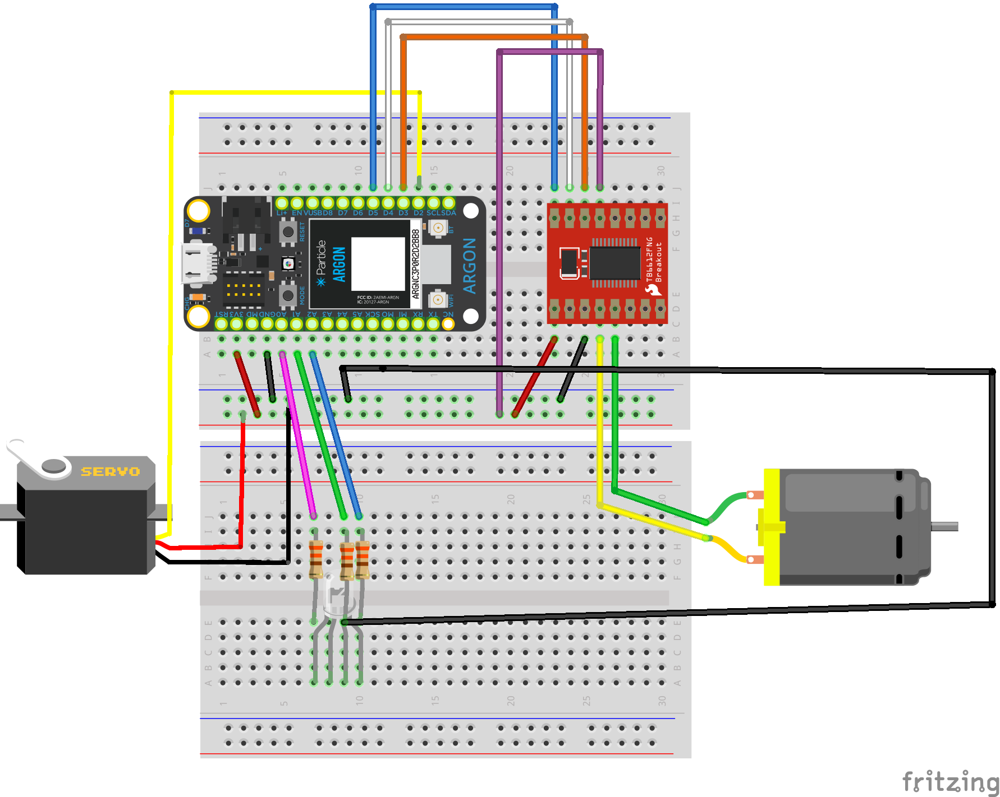
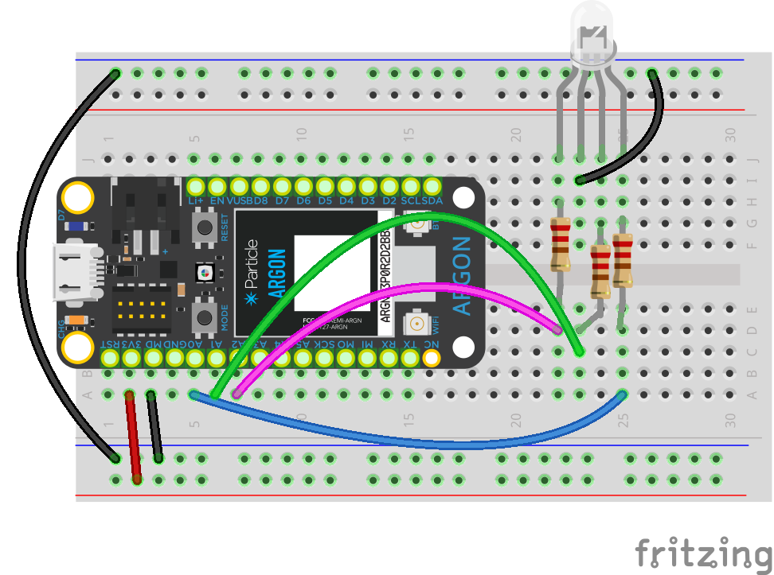
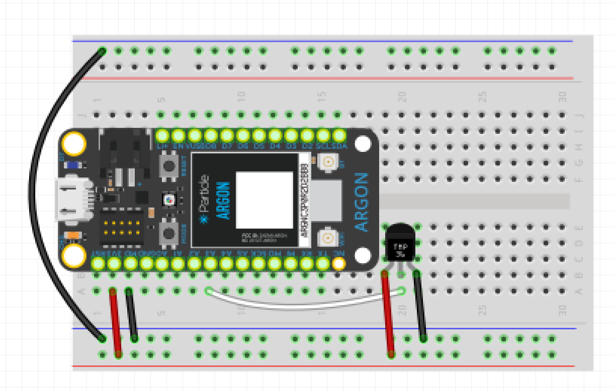

<!-- headingDivider: 2 -->

# Bluetooth

  

## What is Bluetooth?

 

## Review: Communication 

- WiFi and Cellular
- Bluetooth Low Energy (BLE)
  - Ex: Communication between smart watch and phone; wireless headphones
  - Range: ~1200+ ft
- Near-Field Communication (NFC) 
  - Ex: Contact-less payment like Apple Pay
  - Range: 4 inches

## Bluetooth

* Set of protocols / standards for communicating wirelessly on 2.4 GHz frequency (same as WiFi)
* Ubiquitous: uses include headphones, game controller, stylus, keyboard / mouse, speakers, mobile phones
* We will focus on Bluetooth Low Energy (BLE)
  * Subset of Bluetooth that is low-cost, low power
  * Also called "Bluetooth 4.0" or "Bluetooth Smart"

## Fun Fact!

 

* Bluetooth is named for **Harald Bluetooth**, a 10th Scandanavian king who unified parts of Denmark and Norway
* Bluetooth logo is a combination of his initials
  *   [](https://en.wikipedia.org/wiki/File:Runic_letter_ior.svg) (Hagall) and [](https://en.wikipedia.org/wiki/File:Runic_letter_berkanan.svg) (Bjarkan)

## Device Roles

* Each device has a **General Access Profile** (GAP) which defines how it operates in relation to other devices
* **Central** devices typically have more computing power and battery life such as phones and computers
* **Peripheral** devices are lower cost and lower power such as a heart rate sensor or microcontroller like Argon

## Example: Device Roles

1. Single mobile phone triggers LEDs or motor connected to Argon
   * Phone is **central** and Argon is **peripheral**
   * Phone can connect to multiple peripherals
   * This is how we will use BLE


## Example: Device Roles

2. Broadcast messages to many phones when people enter a concert
   * Many phone are **central** and Argon is **peripheral**


## Example: Device Roles

3. Using Argon to read signal from Bluetooth heartrate sensor
   * Argon is **central** and sensor is **peripheral** 

4. Using Argon to communicate with another Argon over Bluetooth

   * Argon is designated **central** and the other is **peripheral**
   * This is how **mesh** networking works

## Advertising

  

* Peripheral devices broadcast messages announcing their presence and what services they support
* Intervals are 20 ms to 10 s

## Connecting to Peripherals

* Connection between central and peripheral devices is managed through a **General Attribute Profile** (GATT)
* Devices advertise **Services** and **Characteristics**
* **Services** are collections of related objects called characteristics that describe a device functionality
* **Characteristics** are specific values for data from the device
* Each is identified by either a 16 bit or 128 bit UUID (unique ID)

## Sample Services

* Glucose monitoring
* Health thermometer
* Heart rate
* Pulse oximter
* Weight scale

## Sample Characteristics

* Last name
* Longitude
* Rainfall
* Resting heart rate
* Glucose measurement

## Specific Example

* **Service**: Health thermometer (ID: 6153 or  0x1809)
  * Used for communication of temperature value from sensor
* **Characteristics**: Temperature measurement (ID:10870 or 0x2A1C)
  * Temperature (actual temperature)
  * Temperature type (e.g. mouth, armpit, ear, etc.)
  * Interval (time between reading)

## Making the Connection: Custom Mobile Apps 

 

## Making the Connection: Mobile Testing Apps
 


## Making the Connection

  *  Argon
     *  Use as central device to connect to sensors and other Argons
     *  Use as peripheral device to receive connections from mobile devices

 

## Connecting with Mobile Apps

* There are many great resources and tools online to create iOS and Androids to communicate over BLE

* This is definitely the best option for a commercial product

* Building a mobile app is beyond the scope of this class, but we can use free testing apps to explore BLE functionality

## Adafruit Bluefruit

|                                                              |                                                              |
| ------------------------------------------------------------ | :----------------------------------------------------------- |
|  | [Adafruit Bluefruit](https://learn.adafruit.com/bluefruit-le-connect) <br />Receive and graph sensor data <br /><br />Send pre-defined commands over UART (button press and release) <br /><br />Color picker |

## Nordic nRF Toolbox

|                                                              |                                                              |
| ------------------------------------------------------------ | :----------------------------------------------------------- |
|  | [Nordic nRF Toolbox](https://www.nordicsemi.com/Software-and-Tools/Development-Tools/nRF-Toolbox)  <br />Test specific BLE services such as temperature and glucose monitor<br /><br />Send arbitrary string commands over UART (button press only; not press and release) |


<!--Diagnostic issue with nRF toolbox
Sometimes the argon doesn't properly disconnect from app. When app is then opened (iOS), it crashes. One fix is to exit nRF Toolbox, open Bluefruit app and connect / then disconnect from argon. Then open nRF toolbox again
-->

## Lab #1: Controlling Argon via UART (part 1)

* Use Bluefruit app to control an RGB LED and a buzzer 
* Send commands **from** app **to** argon, interpret them in Argon, and perform an action
* Getting started
  * Download starting code: Go to [https://bit.ly/ProjectZip](https://bit.ly/ProjectZip)
  * Paste the following link into the top right
    https://github.com/reparke/ITP348-Physical-Computing/tree/master/_exercises/week10/ble_uart_control_start
* In Bluefruit app, connect to over UART (listed as "controller")

## Lab #1: Controlling Argon via UART (part 2)

* Specifications
  * When "1" is pressed down, on-board LED D7 will blink twice
  * When "2" is pressed down, on-board LED D7 will turn on
  * When "2" is released, on-board LED D7 will turn off
  * When "4" is pressed, play a tone
* Reference:  [Adafruit Bluefruit Guide](https://learn.adafruit.com/bluefruit-le-connect/controller)

##  Lab #1: Wiring Guide

```
RGB LED
 R              A2
 G              A1
 B              A0

Buzzer          D6

On-board LED    D7
```


## 



## Lab #2: Control Fan (part 1)

* Use Bluefruit app to control a servo and motor
* Send commands **from** app **to** argon, interpret them in Argon, and perform an action
* Getting started
  * Download project: Go to [http://kinolien.github.io/gitzip/](http://kinolien.github.io/gitzip/)
  * Paste the following link into the top right
    https://github.com/reparke/ITP348-Physical-Computing/tree/master/_exercises/week10/ble_uart_control_start
* In Bluefruit app, connect to over UART (listed as "controller")

## Lab #2: Control Fan (part 2)

* Specifications
  * When "RIGHT" is pressed down, rotate servo (by fixed amount) clockwise
  * When "LEFT" is pressed down, rotate servo (by fixed amount)  counter clockwise
  * When "UP" is pressed down, speed up motor (by fixed amount)
  * When "DOWN" is pressed down, slow motor(by fixed amount)
  * When "3" is pressed down, change direction of fan
* Reference:  [Adafruit Bluefruit Guide](https://learn.adafruit.com/bluefruit-le-connect/controller)

##  Lab #2: Wiring Guide

```
Servo           D2

Motor Controller
 PWMA           D5 
 AIN2           D4 
 AIN1           D3 
 VCC            3v3
 GND            GND
 VM             3v3
 STBY           3v3
```

## 



## Demo Projects

* The following two completed projects are provided
* Each involves using a phone app to communicate with Argon via Bluetooth
* The coding in these examples is much more complicated than the previous exercises

## Demo #1: Control RGB LED with Phone Accelerometers (part 1)

* Use Bluefruit app to send accelerometer data from phone to Argon
* Control RGB LED colors with accelerometer data
* Getting started
  * Download code: Go to [http://kinolien.github.io/gitzip/](http://kinolien.github.io/gitzip/)
  * Paste the following link into the top right
    https://github.com/reparke/ITP348-Physical-Computing/tree/master/_exercises/week10/ble_uart_rgb_accel_example

## Demo #1: Control RGB LED with Phone Accelerometers (part 2)

* Using Bluefruit, connect to over UART (listed as "controller") in app
* Enable "accelerometer" in app
* Argon sketch will receive accelerometer data (X, Y, Z) from phone, convert readings to PWM (0-255), and change LED color
* Reference:  [Adafruit Bluefruit Guide](https://learn.adafruit.com/bluefruit-le-connect/controller)

##  




## Demo #2: Read Health Thermometer Service (part 1)

* Send temperature data **from** Argon **to** phone via nRF Toolbox 

* Argon is using Bluetooth health thermometer service

* Getting started

  * Download code: Go to [http://kinolien.github.io/gitzip/](http://kinolien.github.io/gitzip/)

  * Paste the following link into the top right
    https://github.com/reparke/ITP348-Physical-Computing/tree/master/_exercises/week10/ble_health_temp_final

## Demo #2: Read Health Thermometer Service (part 2)

* Using nRF Toolbox app, connect to over HTM ("health thermometer")
* Argon sketch will send temperature data to app
* Reference: [Particle Guide](https://docs.particle.io/tutorials/device-os/bluetooth-le/#body-temperature-thermometer)

##  




## References

* [Adafruit Bluefruit Guide](https://learn.adafruit.com/bluefruit-le-connect/controller)
* [List of Official Bluetooth Services](https://www.bluetooth.com/specifications/gatt/services/)
* [List of Official Bluetooth Characteristics](https://www.bluetooth.com/specifications/gatt/characteristics/)

## Credits

* [Sparkfun](https://learn.sparkfun.com/tutorials/bluetooth-basics/all)
* [Bluetooth](https://en.wikipedia.org/wiki/Bluetooth)
* [Nordic Semiconductor](https://devzone.nordicsemi.com/nordic/nordic-blog/b/blog/posts/bluetooth-smart-and-the-nordics-softdevices-part-1)

* Images created with [Fritzing](https://fritzing.org/home/)