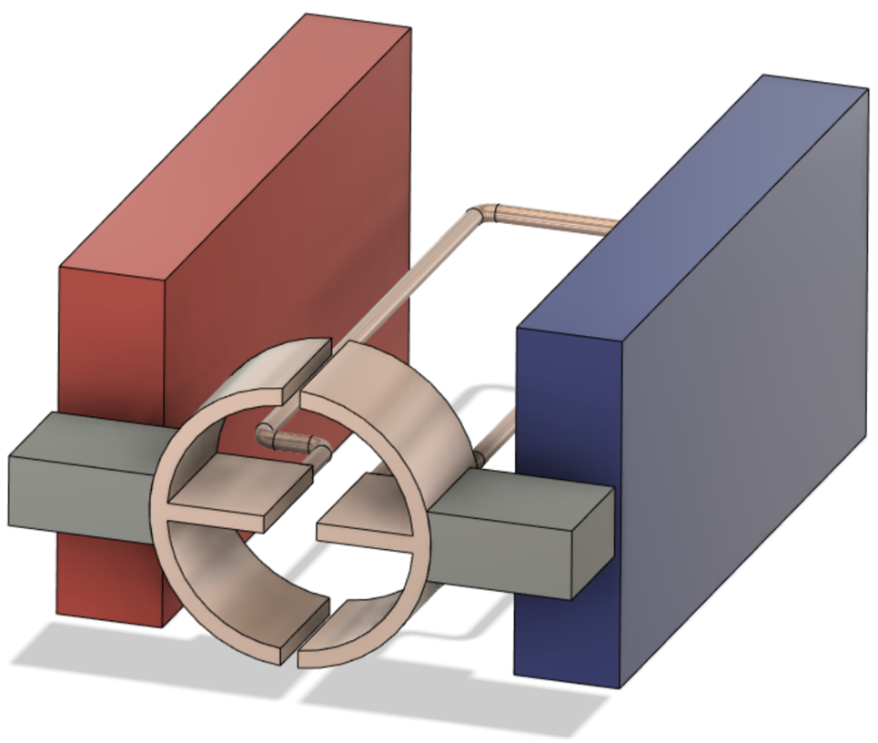
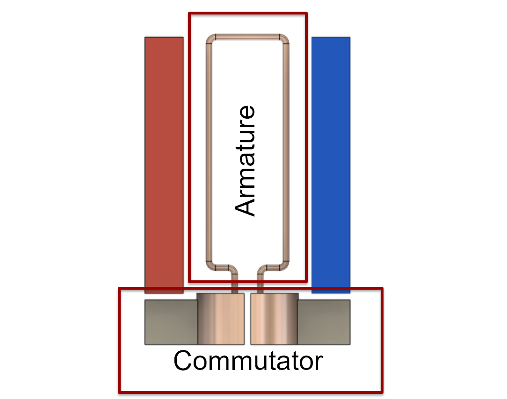
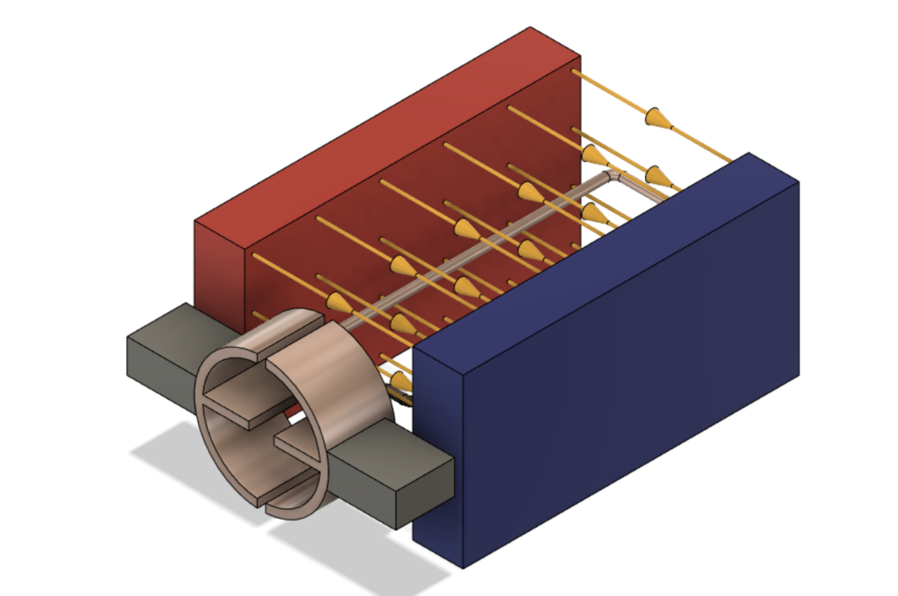
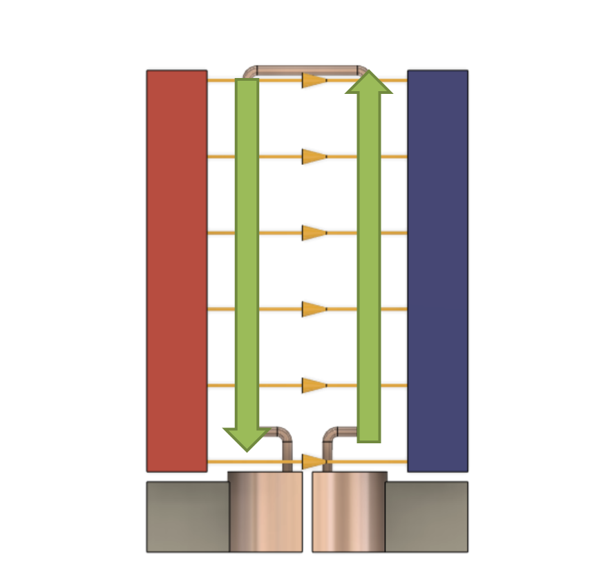

<!-- headingDivider: 2 -->

# DC Motors
## Goals

1. Discuss the different types of motors used in small electronic devices

2. Introduce DC motors

3. DC motor power considerations

4. DC motor applications

## DC Motor Composition

* Every DC motor has the same basic main:
  * Armature
  * Stator
  * Commutator

## DC Motor Types

* Brushed DC Motor
  * Uses physical contact points in the commutator to switch the direction of current
* Brushless DC Motor
  * Electronically commutated motor (ECM or EC motor)
  * Synchronous DC motor
  * Uses an inverter which electrically switches the DC power supply to an alternating current (AC) power supply

## DC Motor Types

* Brushed
  * Pro: Relatively inexpensive
  * Con: Parts wear out over time
* Brushless
  * Pro: Less wear on moving parts
  * Con: More expensive

## DC Motor Applications

* Hobby motors
  * Small electronics
  * Low-torque applications
* Large DC motors
  * Electric scooters
  * High-torque applications

## DC Motor Construction

## DC Motor Construction

## DC Motor Construction

## Electricity and Magnetism

* The guiding principle behind electric motors is the **Lorentz Force**

* A current in a magnetic field produces a physical force
  * Force direction is given by the “right-hand rule”
    * Current direction along your index
    * Magnetic field along your middle
    * Force direction is along your thumb

## Lorentz Force

## Lorentz Force

## Lorentz Force

* When the armature rotates 90 degrees, the two contacts then reverse the current

* This doesn’t change the direction of the current relative to the magnetic field
  * The Lorentz Force is acting in the SAME direction all the time
  * Keeps the motor spinning in the same direction

## Lorentz Force

## Exercise

* Attach fan blade to motor
* Connect red wire on motor to 3v3; connect black wire to ground
  * What happens?
* Reverse the wires
  * What happens?
* Was the speed the same in either case?

## Motors

* Motors can generate electricity
  * Generators
  * Alternators
* Spin is controlled by current direction
* If direction is reversed, the motor spins in the opposite direction
* It is not practical to have to reverse the wires to change motor direction
* Also, we have no way to control speed

## Motor Controller

## Motor Driver

* Motor (*motor controller*) provide greater control over motors 
* Motor drivers don’t give a (+) or (-) connection
* Just have an IN1 or IN2 because we can change polarity
* Motor drivers also provide circuit protection
* Motor drivers can control two different motors independently

<!-- Having a spinning motor attached to a circuit generates an electromotive force so this could damage argon-->

## Motor Controller Wiring Guide

| Motor Controller         | Explanation                                           |
| ------------------------ | ----------------------------------------------------- |
| PWMA                     | Motor A speed (PWM)                                   |
| AI1, AI2                 | Motor A direction control (connect to Argon)          |
| AO1, AO2                 | Motor A output (connect to motor)                     |
| PWMB, BI1, BI2, BO1, BO2 | Controls for motor B                                  |
| VCC                      | Power for chip (3v3)                                  |
| VM                       | Power for motors (3v3, or higher for powerful motors) |
| STBY                     | Enable motor (3v3)                                    |
| GND                      | Ground                                                |

## Controlling the Motor Direction

* Setting the direction is done by changing the two input pins to HIGH and LOW separately
  * Ex: AI1 = HIGH; AI2 = LOW is one direction
  * Ex: AI1 = LOW; AI2 = HIGH is one direction
* Setting them both to LOW means stopping the motor
* Setting them both to HIGH can damage the motor

## Controlling the Motor Speed

* The PWM method of controlling motor speed operates on this range: **[0-255]**
* Typically the PWM must be somewhat greater than 0 before it starts to spin

## Wiring Diagram

## Wiring Guide

| Motor Controller | Argon |
| ---------------- | ----- |
| PWMA             | D5    |
| AIN2             | D3    |
| AIN1             | D4    |
| VCC              | 3v3   |
| GND              | GND   |
| VM               | 3v3   |
| STBY             | 3v3   |

## Exercise

* Attach the fan blade to the DC motor
* The theoretical PWM values are 0 to 255. Write a sketch to determine the min and max values.
* Write a sketch that powers up the fan from the practical minimum (the value we established in the previous exercise) to the maximum
* There should be a ramp up in speed, getting progressively faster until it maxes out

## Credits

* Images created with [Fritzing](https://fritzing.org/home/)
* Original slides created by Ray Kim
* [Sparkfun](https://www.sparkfun.com/products/14451)