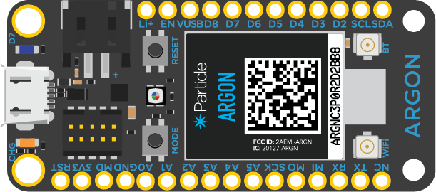
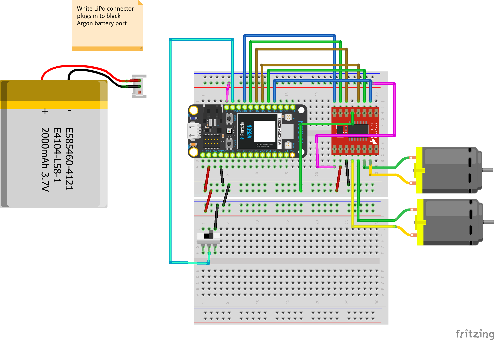

<!-- headingDivider: 2 -->

# Bluetooth Car and Battery

## Power Untethered

* Argon needs 3.3v to function
* DC hobby motors require 1-3v, but will handle up to 12v
* Best solution is to use LiPo battery which operates at 3.7v

## Lithium-Ion Polymer Battery (LiPo)

## Lithium-Ion Polymer Battery (LiPo)

* Operates at 3.7v (many other voltages available)
* Rechargeable
* Has a standard 2-pin JST-PH connector (also on Argon)
* Lightweight

## LiPo Capacity

* Besides voltage, batteries have a **capacity** rating
* **Capacity** is measured in **Amp hours**
* **Amp hours** are *"amount of current the battery can supply for an hour before it is drained"*
* Our batteries are **1800 mAh**
  * 1800 milliamp hours = 1.8 Amp hours
* Increased capacity --> increased size --> increased cost

## LiPo Special Cautions

* LiPo (like batteries in your cell phone) are generally safe
* However, please follow a few cautions:
  * Only charge with LiPo charger
  * Do not expose battery to water
  * Do not puncture
  * If punctured or swells, **stop using immediately**
  * Please **please** do not throw battery in the trash--it contains toxic metals that pollute the environment
  * You can drop the battery off at a [recycling center in your area](https://earth911.com/)

## LiPo and Argon

* Argon has built-in charging port for LiPo batteries
* Connect Argon to USB in order to charge battery

## New Argon Pins

* `EN` is a basically **on/off** for the Argon. Connect to **GND** to turn off Argon (and save battery power)
* `Li+` is internally-connected to the positive (+3.7v) of the battery

## Exercise: Wiring Chassis

* Getting started

  * Download project: Go to [https://bit.ly/ProjectZip](https://bit.ly/ProjectZip)
  * Paste the following link into the top right
    https://github.com/reparke/ITP348-Physical-Computing/tree/master/_exercises/week10/ble_car_start

  

## Motor Controller Wiring Guide

| Motor Controller | Argon |  -- | Motor Controller | Argon |
| --------- | ---- | ---- | ---- | ---- |
| PWMA  | D8   |   | VCC              | 3v3 |
| AIN2  | D7   |    | GND | GND |
| AIN1  |   D6   |      |   VM   |   Li+   |
| BIN1  |   D5   |      |   STBY   |   3v3   |
| BIN2  |    D4  |      |      |      |
| PWMB |    D3  |      |      |      |

## Wiring Diagram

## LiPo Battery Connection

## References

* [Sparkfun](https://www.sparkfun.com/products/13853)
* [Particle](https://docs.particle.io/datasheets/wi-fi/argon-datasheet/)

* Images created with [Fritzing](https://fritzing.org/home/)