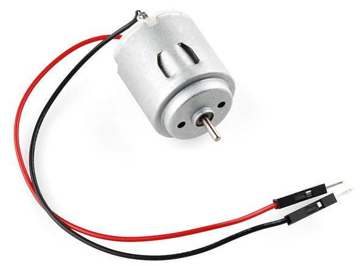
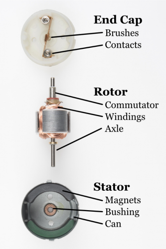
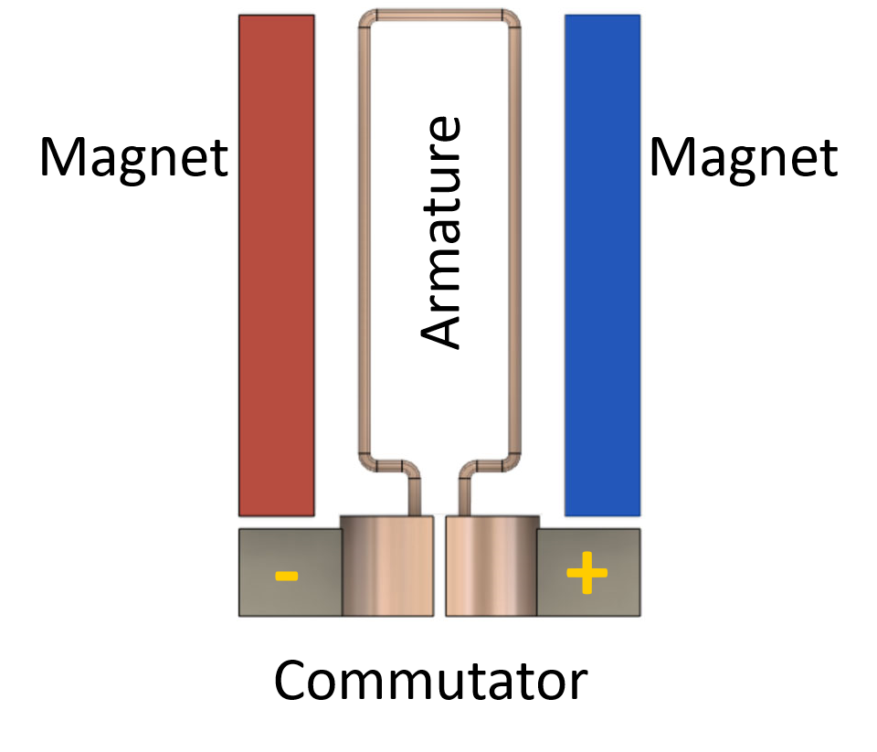

<!-- headingDivider: 2 -->

# DC Motors

## Goals

1. Discuss the different types of motors used in small electronic devices

2. Introduce DC motors

3. DC motor power considerations

4. DC motor applications

## DC Motor Applications

* Hobby motors
  * Small electronics
  * Low-torque applications
* Large DC motors
  * Electric scooters
  * High-torque applications
* Motors can also generate electricity (generators / alternators)

<!--Torque is a measure of force that causes an object to rotate about an axis-->

## How Do Brushed Motors Work?

- Electromagnetism!
- VERY brief physics aside

## Electromagnetism

* The guiding principle behind electric motors is the **Lorentz Force**

* **Electrical current in a magnetic field produces a physical force**
* Force direction is given by the “right-hand rule”
  * Current direction along your index
  * Magnetic field along your middle
  * Force direction is along your thumb

## Three Main Parts of DC Motor  

* Stator magnets (stationary)
* Armature / Windings (rotating wire)
* Commutator (supplies current to armature)

## Inside Simple DC Motor

 

## DC Motor Construction

## Illustration

<!-- force on right side of armature is INTO screen while force on left side of armature is OUT of screen (since current is opposite direction)-->

<!--
Lorentz Force:  When the armature rotates 90 degrees, the two contacts reverse the current. This doesn’t change the direction of the current relative to the magnetic field. The Lorentz Force is acting in the SAME direction all the time. Keeps the motor spinning in the same direction
-->

## DC Motor Types

| Brushed                                                      | Brushless (synchronous or electronically commutated motor)   |
| ------------------------------------------------------------ | ------------------------------------------------------------ |
| Physical contact points in the commutator to switch current direction | Inverter to electrically switches the DC power supply to AC power supply |
| Pro: Relatively inexpensive                                  | Pro: Less wear on moving parts                               |
| Con: Parts wear out over time                                | Con: More expensive                                          |

## Exercise

* Attach fan blade to motor
* Connect red wire on motor to 3v3; connect black wire to ground
  * What happens?
* Reverse the wires
  * What happens?
* Was the speed the same in either case?

## Motors

* Spin is controlled by current direction
* If direction is reversed, the motor spins in the opposite direction
* It is not practical to have to reverse the wires to change motor direction
* Also, we have no way to control speed

## Motor Controller

## Motor Driver

* Motor (*motor controller*) provide greater control over motors 
* Motor drivers don’t give a (+) or (-) connection
* Just have an IN1 or IN2 because we can change polarity
* Motor drivers also provide circuit protection
* Motor drivers can control two different motors independently

<!-- Having a spinning motor attached to a circuit generates an electromotive force so this could damage the Photon 2-->

## Motor Controller Wiring Guide

| Motor Controller         | Explanation                                           |
| ------------------------ | ----------------------------------------------------- |
| PWMA                     | Motor A speed (PWM)                                   |
| AI1, AI2                 | Motor A direction control (connect to Photon 2)       |
| AO1, AO2                 | Motor A output (connect to motor)                     |
| PWMB, BI1, BI2, BO1, BO2 | Controls for motor B                                  |
| VCC                      | Power for chip (3v3)                                  |
| VM                       | Power for motors (3v3, or higher for powerful motors) |
| STBY                     | Enable motor (3v3)                                    |
| GND                      | Ground                                                |

## Controlling the Motor Direction

* Setting the direction is done by changing the two input pins to HIGH and LOW separatel
  * Ex: `AI1 = HIGH` and `AI2 = LOW` is one direction
  * Ex: `AI1 = LOW` and `AI2 = HIGH` is other direction
* Setting them both to LOW means stopping the motor
* Setting them both to HIGH can damage the motor

## Controlling the Motor Speed

* The PWM method of controlling motor speed operates on this range: **[0-255]**
* Typically the PWM must be somewhat greater than 0 before it starts to spin
* Reminder: only certain pins support PWM
  * `D1` (`SCL` or `A4`)
  * `A2`
  * `A5`
  * `MISO` (`D16`)
  * `MOSI` (`D15`)

## Wiring Diagram

## Wiring Guide

| Motor Controller | Photon 2            |
| ---------------- | ------------------- |
| PWMA             | A5                  |
| AI2              | D4                  |
| AI1              | D3                  |
| AO1              | Motor wire (either) |
| AO2              | Motor wire (either) |
| VCC              | 3v3                 |
| GND              | GND                 |
| VM               | 3v3                 |
| STBY             | 3v3                 |

## Exercise

* Attach the fan blade to the DC motor
* The theoretical PWM values are 0 to 255. Write a sketch to determine the min and max values.
* Write a sketch that powers up the fan from the practical minimum (the value we established in the previous exercise) to the maximum
* There should be a ramp up in speed, getting progressively faster until it maxes out

## Credits

* Images created with [Fritzing](https://fritzing.org/home/)
* Original slides created by Ray Kim
* [Sparkfun](https://www.sparkfun.com/products/14451)
* For more in-depth discussion of motors, see this [page](https://learn.sparkfun.com/tutorials/motors-and-selecting-the-right-one/all)