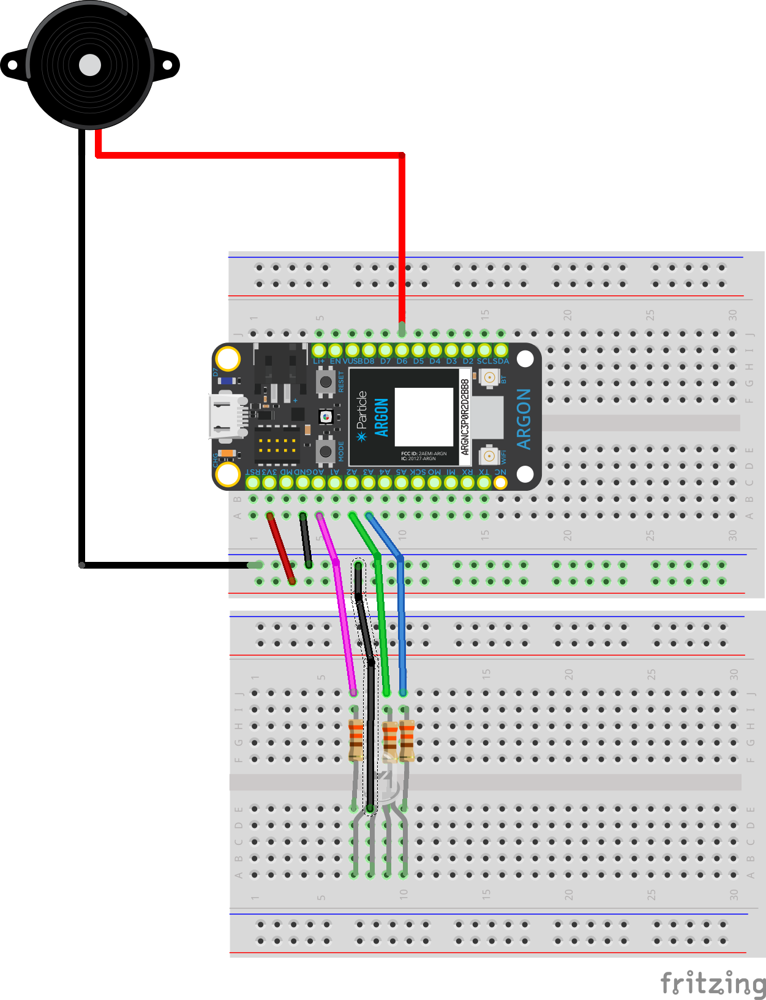

==**These are alternate labs that are using currently**==


## Lab #1: RGB LED and Buzzer (part 1)

* Use Bluefruit app to control an RGB LED and a buzzer 
* Send commands **from** app **to** Photon 2, interpret them in Photon 2, and perform an action

## Lab #1: RGB LED and Buzzer (part 1)

<!-- skip buzzer and/or RGB LED and go straight to motor if short on time -->

* Use Bluefruit app to control a RGB LED and buzzer
* Download starting code
  * Go to [https://bit.ly/ProjectZip](https://bit.ly/ProjectZip)
  * Paste the following link into the top right
    https://github.com/reparke/ITP348-Physical-Computing/tree/main/_exercises/week09/ble_uart_control_start
* In Bluefruit app, connect to over UART (listed as "controller")

## Lab #1:RGB LED and Buzzer (part 2)

* Specifications
  * When "1" is pressed down, on-board LED D7 will blink twice
  * When "2" is pressed down, on-board LED D7 will turn on
  * When "2" is released, on-board LED D7 will turn off
  * When "4" is pressed, play a tone
* Reference:  [Adafruit Bluefruit Guide](https://learn.adafruit.com/bluefruit-le-connect/controller)

##  Lab #1: Wiring Guide

```
RGB LED
 R              A2
 G              A5
 B              D15 // MO

Buzzer          D16 // MI

On-board LED    D7
```

##




## Lab #2: Control Fan (part 1)

* Use Bluefruit app to control a servo and motor
* Send commands **from** app **to** Photon 2, interpret them in Photon 2, and perform an action
* Download starting code

  * Go to [https://bit.ly/ProjectZip](https://bit.ly/ProjectZip)

  * Paste the following link into the top right
    https://github.com/reparke/ITP348-Physical-Computing/tree/main/_exercises/week09/ble_uart_control_start
* In Bluefruit app, connect to over UART (listed as "controller")

## Lab #2: Control Fan (part 2)

* Specifications
  * When "RIGHT" is pressed down, rotate servo (by fixed amount) clockwise
  * When "LEFT" is pressed down, rotate servo (by fixed amount)  counter clockwise
  * When "UP" is pressed down, speed up motor (by fixed amount)
  * When "DOWN" is pressed down, slow motor(by fixed amount)
  * When "3" is pressed down, change direction of fan
  * Optional challenge:  When "4" is pressed, turn on fan auto mode
* Reference:  [Adafruit Bluefruit Guide](https://learn.adafruit.com/bluefruit-le-connect/controller)

##  Lab #2: Wiring Guide

```
Servo           D2

Motor Controller
 PWMA           D5 
 AIN2           D4 
 AIN1           D3 
 VCC            3v3
 GND            GND
 VM             3v3
 STBY           3v3
```

## 


