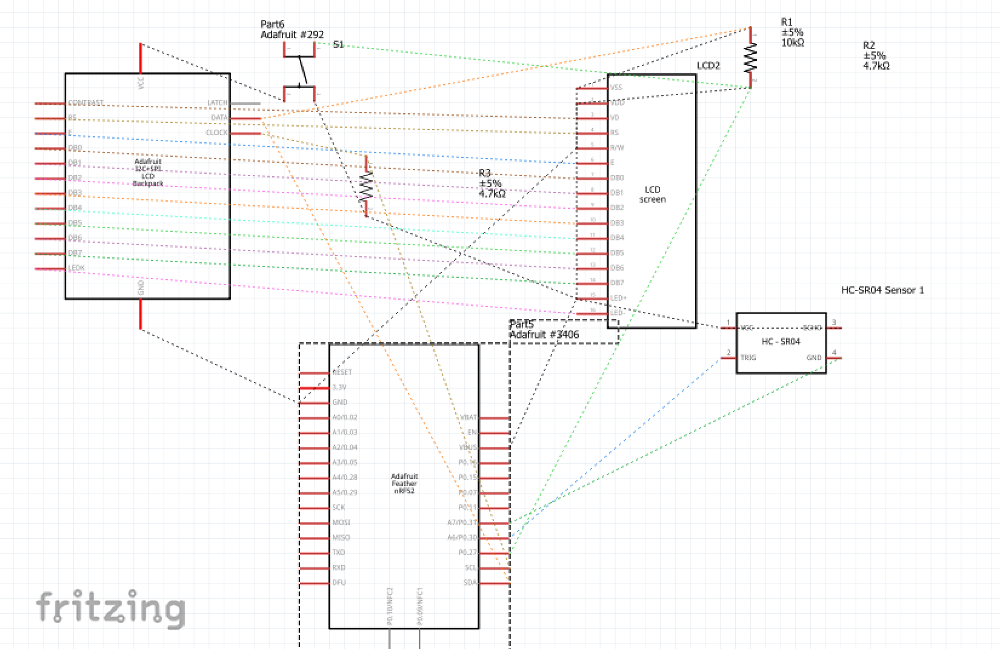

<!-- headingDivider: 2 -->

# Course Software Tools

## Tools

- Each of our projects will be created with a combination of software (code) and hardware (connecting physical components)
- There are two main programs we will use to created our projects

## Workbench

## Workbench

- Workbench is the IDE we use for our projects (just like PyCharm, Visual Studio, etc.)
- Workbench serves **two** purposes
  - Writing / debugging / compiling code (just like other IDEs)
  - Flashing code to device (i.e. "installing" the code you wrote onto the device)
- *Fun fact:* Workbench is built as a plugin for VS Code, a simple but powerful IDE that can be used for all kinds of other languages (e.g. python, C++, HTML)

## Fritzing

- Fritzing create visual diagrams of hardware projects
- Use this to plan out your design before actually building them
- This "prototyping" is the equivalent to writing pseudo-code before writing code

## Fritzing Breadboard Layout

## Actual Built Project

## Quick Note

There is a more formal way of describing circuits we won't use very often

