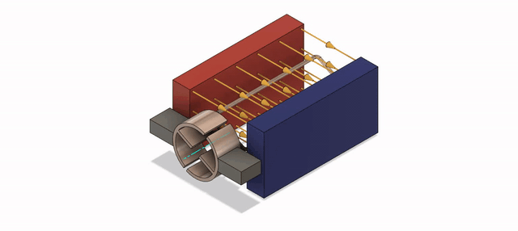

<!-- headingDivider: 2 -->

# DC Motors
## Goals

1. Discuss the different types of motors used in small electronic devices

2. Introduce DC motors

3. DC motor power considerations

4. DC motor applications

## DC Motor Composition

* Every DC motor has the same basic main:
  * Armature
  * Stator
  * Commutator

## DC Motor Types

* Brushed DC Motor
  * Uses physical contact points in the commutator to switch the direction of current
* Brushless DC Motor
  * Electronically commutated motor (ECM or EC motor)
  * Synchronous DC motor
  * Uses an inverter which electrically switches the DC power supply to an alternating current (AC) power supply

## DC Motor Types

* Brushed
  * Pro: Relatively inexpensive
  * Con: Parts wear out over time
* Brushless
  * Pro: Less wear on moving parts
  * Con: More expensive

## DC Motor Applications

* Hobby motors
  * Small electronics
  * Low-torque applications
* Large DC motors
  * Electric scooters
  * High-torque applications

## DC Motor Construction


## DC Motor Construction


## DC Motor Construction


## Electricity and Magnetism

* The guiding principle behind electric motors is the **Lorentz Force**


* A current in a magnetic field produces a physical force
  * Force direction is given by the “right-hand rule”
    * Current direction along your index
    * Magnetic field along your middle
    * Force direction is along your thumb

## Lorentz Force


## Lorentz Force


## Lorentz Force

* When the armature rotates 90 degrees, the two contacts then reverse the current

* This doesn’t change the direction of the current relative to the magnetic field
  * The Lorentz Force is acting in the SAME direction all the time
  * Keeps the motor spinning in the same direction

## Lorentz Force



## Motor Controllers

* Spin is controlled by current direction

* 
  If direction is reversed, the motor spins in the opposite direction

* Motor controllers don’t give a (+) or (-) connection
  * Just have an IN1 or IN2 because we can change polarity

## Motor Controller

* Motor controllers also provide circuit protection

* Motors can generate electricity
  * Generators
  * Alternators

<!-- Having a spinning motor attached to a circuit generates an electromotive force -->

## Wiring Diagram


## Motor Speed

* The PWM method of controlling motor speed operates on this range: **[0-255]**
* Setting the direction is done by changing the two input pins to HIGH and LOW separately
  * Setting them both to LOW means stopping the motor

## Motor Sketch

```C++
const int AIN1 = D3;
const int AIN2 = D4;
const int PWMA = D5;
const int STBY = D2;

void setup() {
  pinMode(AIN1, OUTPUT);
  pinMode(AIN2, OUTPUT);
  pinMode(PWMA, OUTPUT);
  pinMode(STBY, INPUT_PULLUP);
}
```

## Motor Sketch

```c++
void loop() {
  //set the direction one HIGH, one LOW
  digitalWrite(AIN1, HIGH);
  digitalWrite(AIN2, LOW);
  analogWrite(PWMA, 255); //full speed one way
  delay(1000); //run for 1 second
  analogWrite(PWMA,0); // stop
  delay(1000);

  //change direction
  digitalWrite(AIN1, LOW);
  digitalWrite(AIN2, HIGH);
  analogWrite(PWMA, 255); //full speed opposite way
  delay(1000);
  analogWrite(PWMA,0); //stop
  delay(1000);
```

## Exercise

* The theoretical PWM values are 0 to 255

* 
  What is the actual range of values for which the motor will turn over (start to spin)? 

## Exercise

* Attach the fan blade to the DC motor (if you haven’t already) and write a sketch that powers up the fan from the practical minimum (the value we established in the previous exercise) to the maximum

* 
  Write it so that it ramps up in speed, getting progressively faster until it maxes out at 255.


## Credits

* Images created with [Fritzing](https://fritzing.org/home/)
* Original slides created by Ray Kim