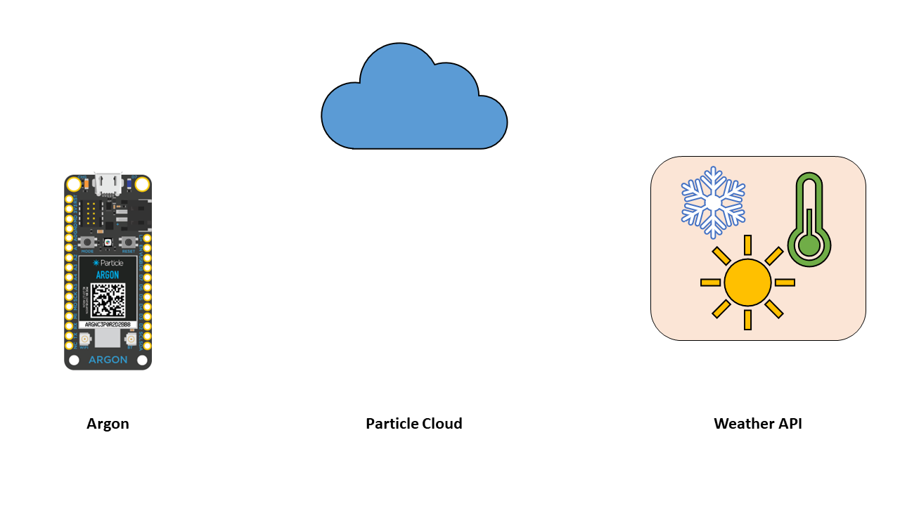
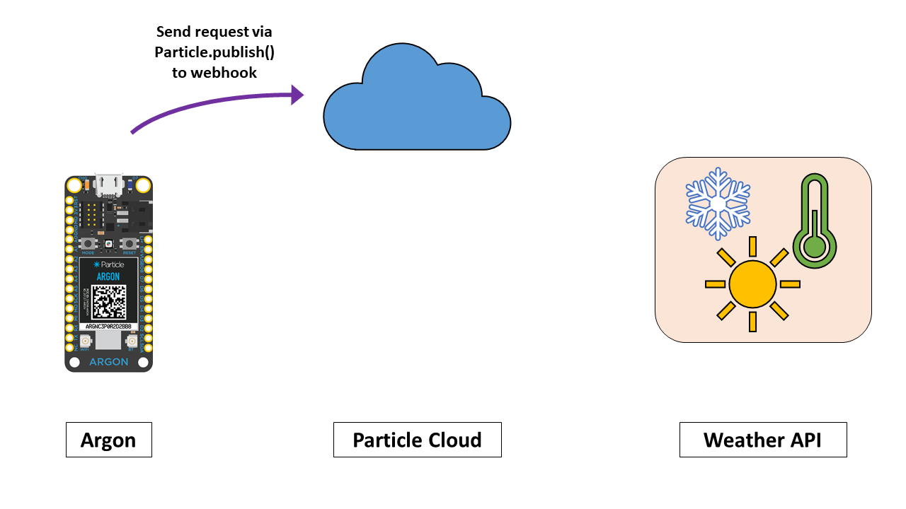
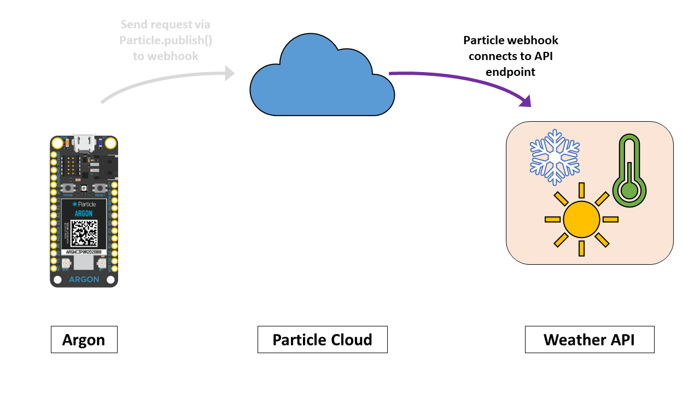
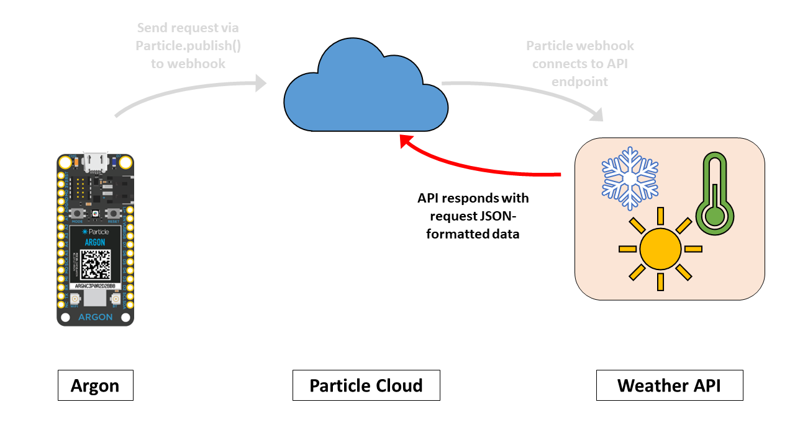
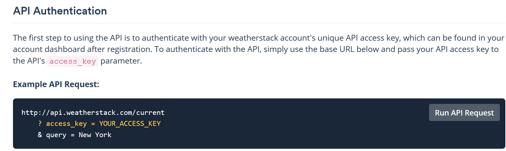
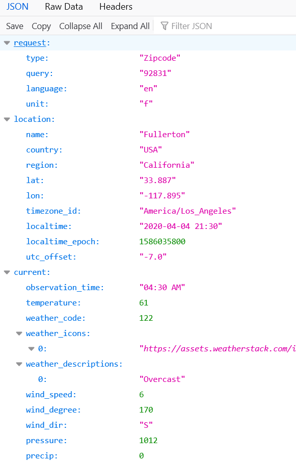
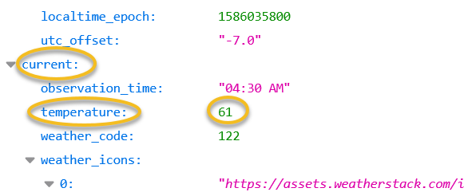

<!-- headingDivider: 2 -->

# Retrieving Data from APIs

## Overview

- APIs provide useful data we can use in our device (e.g. weather and location data)
- Each API will be configured slightly differently but the process to connect is generally similar

##  



##  



##  



##  



##  


## Steps to Connect Argon and API

0. Determine how to use the API
1. Create an integration -> webhook on [Particle console](https://console.particle.io/integrations) 
2. Use `Particle.publish` to trigger webhook
3. Use `Particle.subscribe` to "listen" for response from webhook
4. Create **function handler** that is used by `Particle.subscribe` to process JSON

## Step 0: How to use the API

- Each API is different, but they will usually have documentation that describes how to connect
- Typically, this will include
  - Endpoint (URL you communicate with)
  - Parameters to include in your request (e.g. name of city you want weather data for)
  - How to obtain an API key (if necessary)

## Step 0: How to Use the API

Example: WeatherStack



## Step 1: Create Webhook In Particle Console

**Particle integration settings**


## Part 2: Publish Event to Trigger Webhook

**Argon firmware**

```c++
void loop() {
  String data = "90089";	//USC zip code
  
   // Trigger the integration
  Particle.publish("JSONWeatherStack", data, PRIVATE);
 
   // Wait 60 seconds
  delay(60000);
}

```

## Part 3: Subscribe to JSON response from Weather Stack

**Argon firmware**

```c++
#include "JsonParserGeneratorRK.h"
JsonParser jsonParser;  // object to handle parsing

String response;	//stores JSON webhook response
double temp;		//stores temperature

void setup() {
  // Subscribe to the integration response event
  Particle.subscribe("hook-response/JSONWeatherStack", jsonSubscriptionHandler, MY_DEVICES);
}
```
## Weather Stack JSON Response

```json
{
  "request": {
    "type": "Zipcode",
    "query": "92831",
    "language": "en",
    "unit": "f"
  },
  "location": {
    "name": "Fullerton",
    "country": "USA",
    "region": "California",
    "lat": "33.887",
    "lon": "-117.895",
    "timezone_id": "America/Los_Angeles",
    "localtime": "2020-04-04 21:30",
    "localtime_epoch": 1586035800,
    "utc_offset": "-7.0"
  },
  "current": {
    "observation_time": "04:30 AM",
    "temperature": 61,
    "weather_code": 122,
    "weather_icons": [
      "https://assets.weatherstack.com/images/wsymbols01_png_64/wsymbol_0004_black_low_cloud.png"
    ],
    "weather_descriptions": [
      "Overcast"
    ],
    "wind_speed": 6,
    "wind_degree": 170,
    "wind_dir": "S",
    "pressure": 1012,
    "precip": 0,
    "humidity": 67,
    "cloudcover": 100,
    "feelslike": 61,
    "uv_index": 1,
    "visibility": 10,
    "is_day": "no"
  }
}
```
## Weather Stack JSON Response



## Weather Stack JSON Response (partial)
```json
{
  "current": {
    "observation_time": "04:30 AM",
    "temperature": 61,
    "weather_code": 122,
  }
}
```


## Part 4: Creating the function handler to receive and parse the JSON

* The last step is to create Argon code to handle / parse the JSON response
* While it is possible to manually parse JSON in C++, it is considered unsafe due to potential for security vulnerabilities
* **Instead, use one of the two popular Argon libraries below**
* [Instruction and examples for parsing JSON with `JsonParserGeneratorRK`](lecture_json_parsing_with_jsonparsergeneratorrk)


<!--Since JSON is `String` data, it is possible to parse it using C-language techniques like `strtok`, `strcpy`, `atoi` 
However Buffer overrun if the response from the webserver was larger than expected or malformed-->


## Resources

* [JsonParserGeneratorRK tutorial and overview](https://github.com/rickkas7/JsonParserGeneratorRK)
* [Mustache creation tool](http://rickkas7.github.io/mustache/) (helps with crafting response template)
* [JSON Validator and formatter](https://jsonformatter.org/) 
* [Weatherstack documentation](https://weatherstack.com/documentation)

## Credits

* Photo by [Inset Agency](https://unsplash.com/@inset_agency?utm_source=unsplash&utm_medium=referral&utm_content=creditCopyText) on [Unsplash](https://unsplash.com/s/photos/rain-umbrella?utm_source=unsplash&utm_medium=referral&utm_content=creditCopyText)


<!--Alternate weather integration service
http://303.itpwebdev.com/~molld/assignment6/list.html
http://303.itpwebdev.com/~molld/assignment6/main.js
 -->